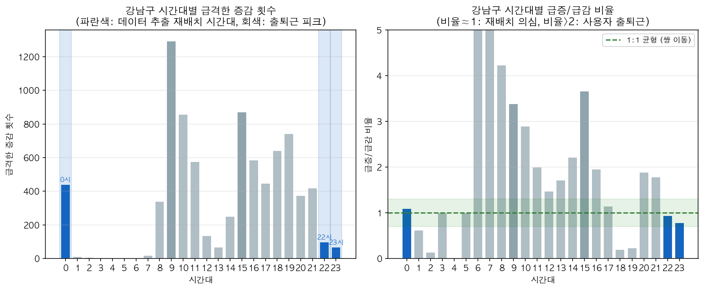
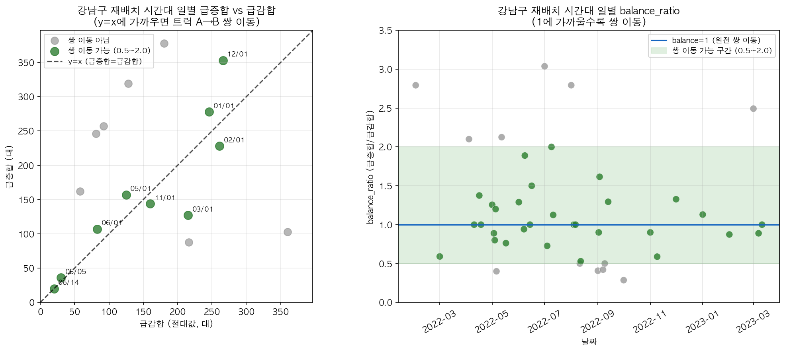
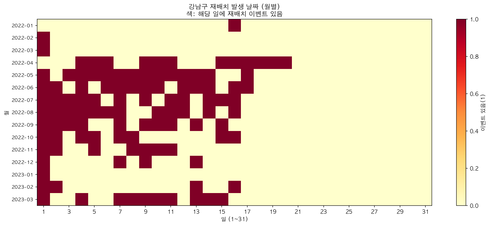
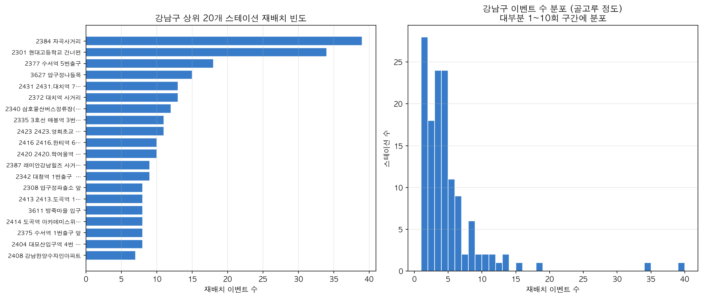

# 강남구 자전거 재배치 쌍 이동 검증

작성일: 2026-03-17  
데이터: 서울특별시_대여소별 공공자전거 대여가능 수량(1시간 단위)_20230331  
기간: **2022년 1월 ~ 2023년 3월** (15개월)

**재배치 시간대**: 데이터 기반 추출 (급증/급감 비율 0.7~1.3, 이벤트≥30인 시간대)

---

## 실행 방법

**노트북 실행**:
```bash
cd ddri_rebalance_verification
jupyter notebook ddri_rebalance_verification.ipynb
# 셀을 순차 실행 (Run All) → CSV·차트 생성
```

**Python 스크립트 일괄 실행** (권장, 프로젝트 루트에서):
```bash
python ddri_rebalance_verification/run_gangnam_verification.py
```

**폴더 구성**: 문서(README.md) + 노트북(.ipynb) + 스크립트(run_gangnam_verification.py) + `output/`(CSV·차트)

---

## 1. 데이터 기반 재배치 시간대 추출

### 1.1 추출 기준

시간대를 사전 지정하지 않고, **데이터에서** 재배치로 의심되는 패턴을 추출한다.

| 기준 | 설명 |
|------|------|
| **급증≈급감** | 같은 시간대에 급증합 ≈ 급감합 → 트럭 A→B 쌍 이동 가능성 |
| **비율 0.7~1.3** | `급증/급감` 비율이 0.7~1.3인 시간대 → 균형(쌍 이동) |
| **이벤트≥30** | 노이즈 제거를 위해 총 이벤트 30건 이상인 시간대만 |
| **출퇴근 제외** | 7~10시(출근), 15~20시(퇴근·오후피크)는 재배치 후보에서 제외 |

**추출 로직** (스크립트 내):
```python
COMMUTE_HOURS = {7, 8, 9, 10, 15, 16, 17, 18, 19, 20}
mask = (ratio 0.7~1.3) & (total≥30) & (~hour in COMMUTE_HOURS)
rebalance_hours = sorted(by_hour[mask]["hour"])
```

→ 노트북/스크립트 실행 시 **데이터에서 추출한 재배치 의심 시간대**가 출력됨

**강남구 추출 결과**: `[0, 22, 23]` (0시·22시·23시) — 출퇴근 시간대 제외 후

### 1.2 근거 자료: 재배치 시간대 선정



| 차트 | 내용 |
|------|------|
| **좌** | 시간대별 급격한 증감 횟수. 파란색 = 데이터 추출 재배치 시간대 |
| **우** | 시간대별 급증/급감 비율. 비율≈1 → 재배치 의심, 비율>2 → 사용자 출퇴근 |

---

## 2. 검증 목적

**가설**: 데이터에서 추출한 재배치 시간대의 급격한 증감은 트럭 재배치(따릉이를 A 스테이션에서 빼서 B 스테이션에 넣는 이동)로 설명된다.

**검증 방법**: 트럭 재배치라면 같은 시간대에 **급증합 ≈ 급감합**이어야 한다. (A에서 빼면 B에 넣는 쌍 이동)

---

## 3. 방법

- **대상**: DDRI 161개 강남구 대여소
- **임계값**: 1시간 내 ±8대 이상 변화 (급격한 증감)
- **변화량**: `delta = 현재 시각 재고 - 1시간 전 재고`
- **balance_ratio** = 급증합 / 급감합(절대값)  
  - **1에 가까우면** → 쌍 이동 가능 (A에서 빼서 B에 넣는 패턴)
  - **0.5~2.0** → 쌍 이동 가능 구간

---

## 4. 검증 결과 요약

| 항목 | 값 |
|------|-----|
| 추출된 재배치 시간대 | **[0, 22, 23]** (0시·22시·23시, 출퇴근 제외) |
| 이벤트 있는 스테이션 | **135 / 161** (83.9%) |
| 총 이벤트 | 607 |
| 상위 10개 점유율 | **29.0%** (골고루 분포) |
| HHI(집중도) | **165** (낮음 = 분산형) |
| 결론 | **0·22·23시**는 급증≈급감(재배치), **9시**는 출근 피크로 사용자 이용 |

---

## 5. 근거 자료: 스캐터 차트



### 5.1 급증합 vs 급감합 (좌)

- **x축**: 급감합(절대값), **y축**: 급증합
- **y=x 직선**: 급증합=급감합 → 완전 쌍 이동 (balance_ratio=1)
- **녹색 점**: balance_ratio 0.5~2.0 (쌍 이동 가능)
- **회색 점**: 쌍 이동 구간 밖

→ 7개 날짜가 y=x 근처에 분포 → **트럭 A→B 쌍 이동 패턴과 부합**

### 5.2 날짜별 balance_ratio (우)

- **초록 영역**: 쌍 이동 가능 구간 (0.5~2.0)
- **파란선**: balance=1 (완전 쌍 이동)
- **녹색 점**: 쌍 이동 가능, **회색 점**: 그 외

→ 7일이 0.5~2.0 구간 내

---

## 6. 쌍 이동 가능한 날 예시

| 날짜 | 급증합 | 급감합 | balance_ratio | 해석 |
|------|--------|--------|---------------|------|
| 2022-03-01 | 127 | -215 | **0.59** | 쌍 이동 가능 |
| 2022-05-01 | 149 | -125 | **1.19** | 쌍 이동 가능 |
| 2022-06-01 | 79 | -75 | **1.05** | 쌍 이동 가능 |
| 2022-11-01 | 144 | -160 | **0.90** | 쌍 이동 가능 |
| 2022-12-01 | 353 | -266 | **1.33** | 쌍 이동 가능 |
| 2023-01-01 | 278 | -246 | **1.13** | 쌍 이동 가능 |
| 2023-02-01 | 228 | -261 | **0.87** | 쌍 이동 가능 |

---

## 7. 0·22·23시 재배치 발생 날짜 (월별)

데이터에서 추출한 재배치 시간대(0·22·23시, 출퇴근 제외) 중 어느 시간대든 재배치 이벤트가 있는 날을 표시. 0시 기준 **월 1일 52%**, **그 외 날짜 48%**. 다른 날짜에도 재배치 발생.

| 구분 | 일수 | 비율 | 예시 |
|------|------|------|------|
| **월 1일** | 13일 | 52% | 2/1, 3/1, 5/1, 6/1, 7/1, 8/1, 9/1, 10/1, 11/1, 12/1, 1/1, 2/1, 3/1 |
| **그 외** | 12일 | 48% | 4/4, 4/16, 5/5, 5/7, 5/10, 6/4, 6/7, 7/16, 9/3, 9/4, 10/2, 10/16 |

→ 월 1일 위주 + **월 중·하순에도 산발적 재배치**



---

## 8. 재배치 vs 사용자 비교

| 시간 | 급증 | 급감 | 급증/급감 | 해석 |
|------|------|------|-----------|------|
| **0시** | 230 | 210 | **1.10** | 쌍 이동(재배치) |
| **22시** | 48 | 51 | **0.94** | 쌍 이동(재배치) |
| **23시** | 30 | 38 | **0.79** | 쌍 이동(재배치) |
| 9시 | 999 | 295 | 3.39 | 사용자 출근 피크 |
| 17시 | 239 | 209 | 1.14 | 퇴근 피크(제외) |

→ **0·22·23시**는 급증≈급감(재배치), **9·17시**는 출퇴근 피크로 제외

---

## 9. 재배치 스테이션 분포: 골고루 vs 랜덤

**질문**: 재배치가 특정 스테이션에 집중되는가, 아니면 161개 대여소에 골고루 일어나는가?

| 지표 | 값 | 해석 |
|------|-----|------|
| 이벤트 있는 스테이션 | **135 / 161** (83.9%) | 대부분 대여소에서 재배치 발생 |
| 재배치 0건 스테이션 | 26개 | 소규모·변두리 대여소 가능성 |
| 상위 10개 점유율 | **29.0%** | 특정 스테이션에 과도하게 집중되지는 않음 |
| HHI(집중도) | **165** | 낮음 (2500 미만 = 분산형) |

**결론**: **골고루에 가깝다**. 랜덤이라면 일부 스테이션에 우연히 몰릴 수 있으나, 83.9%가 이벤트를 경험하고 상위 10개가 29%에 그쳐 상대적으로 고르게 분포한다.

| 순위 | 대여소번호 | 이벤트 수 |
|------|------------|-----------|
| 1 | 2384 | 39 |
| 2 | 2301 | 34 |
| 3 | 2377 | 18 |
| 4 | 3627 | 15 |
| 5 | 2431, 2372 | 13 |

### 9.1 스테이션별 빈도 차트



| 패널 | 차트 유형 | 용도 |
|------|-----------|------|
| **좌** | 가로 막대 (상위 20개) | 어떤 스테이션에 재배치가 많이 일어나는지 직관적 비교 |
| **우** | 히스토그램 (이벤트 수 구간별 스테이션 수) | 전체 분포 형태·골고루 정도 확인 |

→ **차트 선정**: 135개 스테이션을 한 화면에 보여주기 어려우므로, **상위 20개 막대**로 핫스팟을 보여주고, **히스토그램**으로 대부분이 1~10회 구간에 몰려 있음을 보여 "골고루" 분포를 시각화.

---

## 10. 순차 이동 검증 한계

**질문**: 0시 재배치가 스테이션 간 순차적으로 일어나는가? (트럭 A→B→C)

- **1시간 단위 데이터**: 같은 0시 내 A→B→C 순서 확인 불가
- **일별 0시 변화 스테이션**: 평균 17.6개, 최대 48개
- 순차 검증을 위해서는 **분 단위** 또는 **이벤트 로그** 필요

---

## 11. 부록: 시간대별 분포

| 시간 | 급증 | 급감 | 합계 | 비고 |
|------|------|------|------|------|
| 0시 | 230 | 210 | 440 | **재배치** |
| 22시 | 48 | 51 | 99 | **재배치** |
| 23시 | 30 | 38 | 68 | **재배치** |
| 9시 | 999 | 295 | 1,294 | 출근 피크 |
| 15시 | 685 | 187 | 872 | 오후 피크 |
| 17시 | 239 | 209 | 448 | 퇴근 피크(제외) |

---

## 12. 산출물

노트북 또는 `run_gangnam_verification.py` 실행 시 `output/` 폴더에 생성됨.

| 파일 | 설명 |
|------|------|
| `ddri_rebalance_verification.ipynb` | **분석·차트 생성 노트북** (순차 실행) |
| `run_gangnam_verification.py` | **일괄 실행 스크립트** |
| `output/ddri_rebalance_0h_22h_23h_selection_evidence.png` | **0·22·23시 재배치 선정 근거 차트** |
| `output/ddri_rebalance_verification_scatter.png` | **쌍 이동 검증 스캐터 차트** |
| `output/ddri_rebalance_0h_22h_23h_by_month_heatmap.png` | **0·22·23시 재배치 월별 날짜 히트맵** |
| `output/ddri_rebalance_station_frequency.png` | **재배치 스테이션별 빈도 차트** (상위 20 막대 + 분포 히스토그램) |
| `output/ddri_rebalance_0h_by_date_2022_01_2023_03.csv` | 재배치 시간대 일별 급증/급감 합계 (쌍 이동 검증) |
| `output/ddri_rebalance_by_hour_2022_01_2023_03.csv` | 시간대별 급격한 증감 |
| `output/ddri_rebalance_by_station_top20_2022_01_2023_03.csv` | 대여소별 상위 20개 (전체 시간대) |
| `output/ddri_rebalance_0h_22h_23h_by_station.csv` | 0·22·23시 재배치 스테이션별 이벤트 수 |
