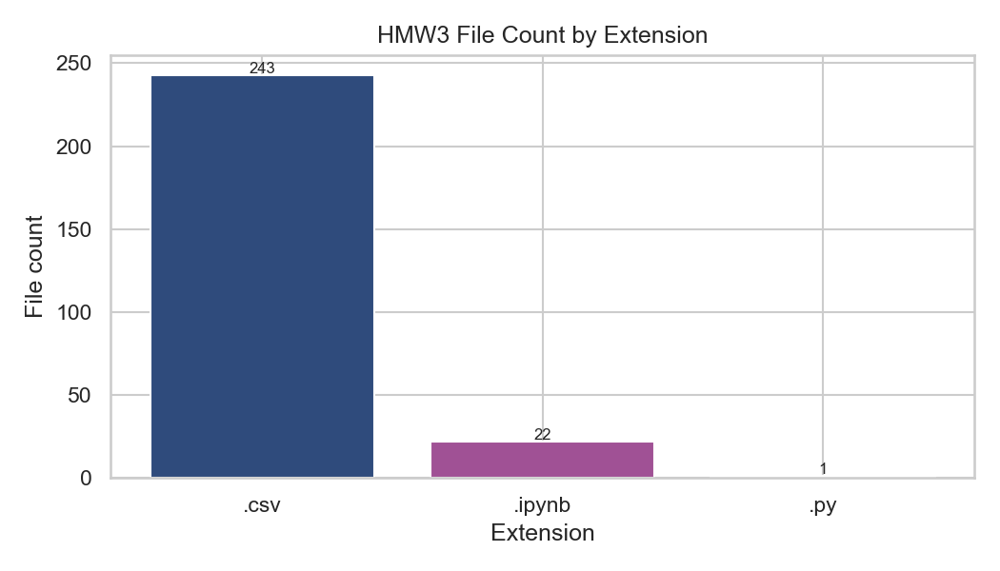
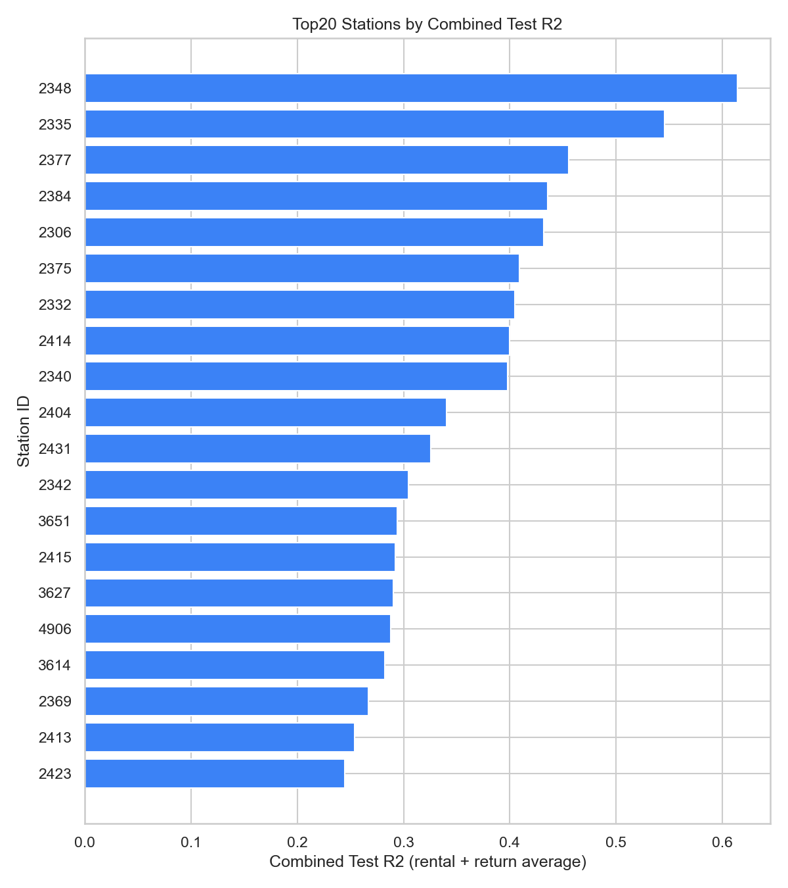
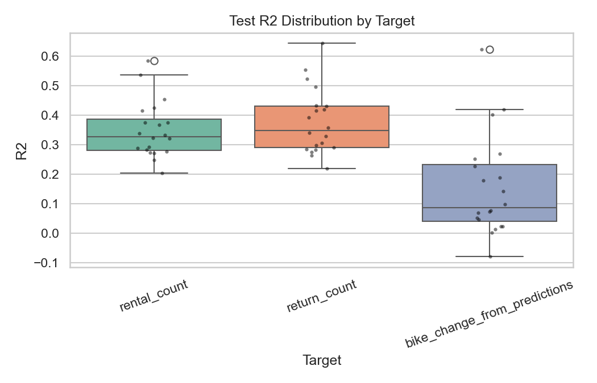
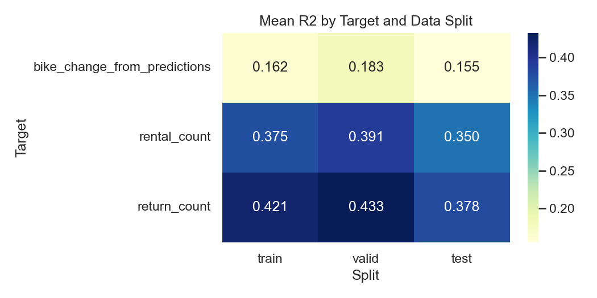
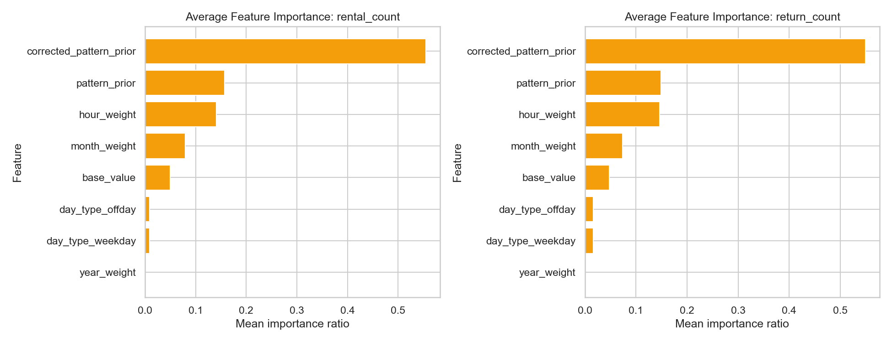
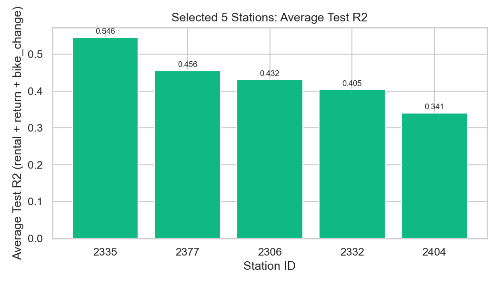

# HMW3 통합 보고서

작성 시각: 2026-03-19 21:58:46

## 1) 보고서 목적
이 보고서는 `hmw3` 폴더에 흩어진 자료를 하나로 통합해, 전체 작업 흐름을 한 번에 이해할 수 있도록 정리한 문서입니다.

핵심 목적은 다음과 같습니다.
- 데이터, 모델링, 평가, 비교 결과를 한 문서로 연결
- 상위 20개 대여소 분석 결과를 공통 기준으로 요약
- 성능 그래프와 표를 함께 제공해 빠르게 해석 가능하도록 구성

## 2) 자료 전체 현황
- 전체 파일 수: **266개**
- CSV 파일: **243개**
- 노트북(`.ipynb`): **22개**
- 스크립트(`.py`): **1개**
- 분석 대여소 수: **20개**
- 대여소별 시계열 길이: **26,304행** (`2023-01-01 00:00:00` ~ `2025-12-31 23:00:00`)

전체 파일 목록은 아래 파일에 포함했습니다.
- `source_inventory.csv` (hmw3 파일 전수 목록)

## 3) 실제로 수행한 작업
노트북과 스크립트를 종합하면 작업은 아래 순서로 진행되었습니다.

1. 대상 선정
- 원천 데이터에서 `rental_count + return_count` 기준 상위 대여소를 선정

2. 대여소별 모델링
- `weekday`와 `offday(주말+공휴일)`를 분리
- 시간대 패턴을 사인/코사인 회귀식으로 구성해 `base_value` 생성
- `month_weight`, `year_weight`, `hour_weight`로 규모/시간 보정
- Ridge 회귀로 최종 예측값 `prediction` 계산

3. 데이터 분할
- Train: 2023년
- Valid: 2024년
- Test: 2025년

4. 산출물 저장
- 패턴식 계수: `offday_hour_formulas`
- 튜닝/성능/계수: `offday_month_ridge_tuning`, `metrics`, `coefficients`
- 예측 상세: `predictions_long`
- 고오차 지점: `2025_high_error_points`
- 연도별 비교: `year_actual_vs_regression_vs_ml`
- 통합 순위: `top20_station_combined_test_r2_ranking`

## 4) 핵심 결과 요약
### 4-1. Top20 종합 순위 (Test R2 평균 기준)

상위 5개:
| rank | station_id | combined_test_r2 | combined_test_rmse | combined_test_mae |
| --- | --- | --- | --- | --- |
| 1 | 2348 | 0.614441 | 1.97168 | 1.150548 |
| 2 | 2335 | 0.545963 | 1.806116 | 1.222398 |
| 3 | 2377 | 0.455599 | 1.934291 | 1.326159 |
| 4 | 2384 | 0.435526 | 1.526692 | 1.065443 |
| 5 | 2306 | 0.431629 | 1.47379 | 1.002118 |

하위 5개:
| rank | station_id | combined_test_r2 | combined_test_rmse | combined_test_mae |
| --- | --- | --- | --- | --- |
| 16 | 4906 | 0.287838 | 1.408778 | 1.02959 |
| 17 | 3614 | 0.282545 | 1.27045 | 0.925681 |
| 18 | 2369 | 0.26719 | 1.220242 | 0.905311 |
| 19 | 2413 | 0.253736 | 1.351526 | 0.950925 |
| 20 | 2423 | 0.244447 | 1.349321 | 0.997068 |

### 4-2. 타깃별 Test 성능 분포

타깃별 요약:
| target | mean_r2 | median_r2 | min_r2 | max_r2 | mean_rmse | mean_mae |
| --- | --- | --- | --- | --- | --- | --- |
| bike_change_from_predictions | 0.155072 | 0.087605 | -0.078951 | 0.62289 | 1.720006 | 1.170635 |
| rental_count | 0.349788 | 0.328265 | 0.203998 | 0.584771 | 1.412432 | 0.988887 |
| return_count | 0.378061 | 0.349313 | 0.219088 | 0.64411 | 1.516141 | 1.056173 |

### 4-3. Split/타깃별 평균 R2

### 4-4. 평균 Feature 중요도 (20개 대여소 평균)

### 4-5. 선정 5개 대여소 성능

선정 5개 평균 Test R2:
| station_id | avg_test_r2 |
| --- | --- |
| 2335 | 0.545963 |
| 2377 | 0.455599 |
| 2306 | 0.431629 |
| 2332 | 0.404578 |
| 2404 | 0.340611 |

## 5) 이 결과의 의미
- 이 분석은 단순 블랙박스 예측이 아니라, 시간 패턴과 보정 가중치를 결합한 설명 가능한 구조를 사용했습니다.
- `2023/2024/2025` 연도 분할을 고정했기 때문에, 2025년 성능은 미래 구간 일반화 성능으로 해석할 수 있습니다.
- 대여소별 성능 차이를 통해 패턴 안정성 차이와 오차 민감 구간을 함께 파악할 수 있습니다.

## 6) 폴더 포함 결과물
- `report.md`: 통합 보고서 본문
- `images/*.png`: 보고서에 사용한 시각화 이미지
- `source_inventory.csv`: hmw3 전체 파일 목록
- `summary_test_metrics_by_target.csv`: 타깃별 테스트 성능 요약
- `summary_split_target_mean_r2.csv`: split x target 평균 R2
- `summary_feature_importance_mean_ratio.csv`: 평균 feature 중요도
- `selected5_station_avg_test_r2.csv`: selected5 평균 테스트 성능
