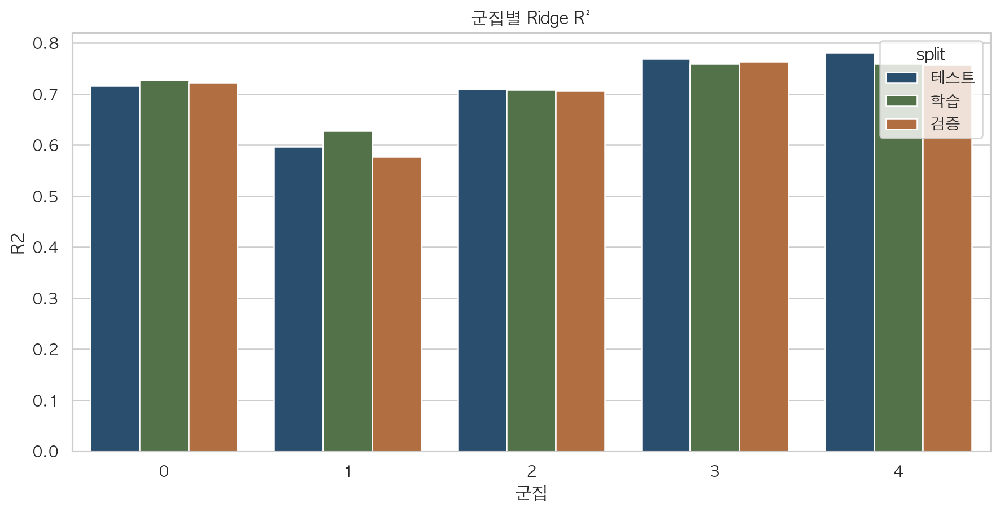
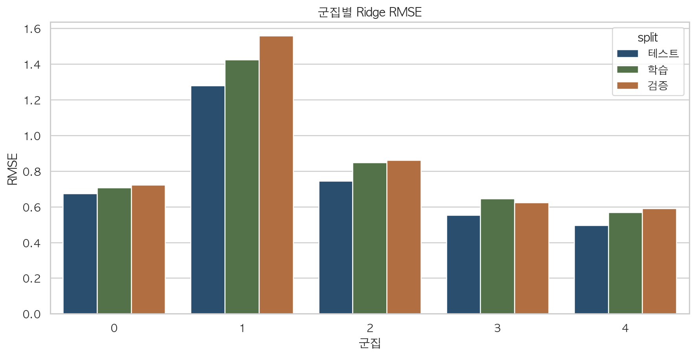

군집별 Ridge 회귀 결과 보고서

## 1. 실험 설정
- 모델: Ridge(alpha=2.0)
- 전처리: median imputation + standardization
- 학습 가중치: sample_weight 적용
- 분할: 2023=학습, 2024=검증, 2025=테스트
- 군집별 모델에서는 `cluster` 자체를 입력 feature에서 제외

## 2. 군집별 성능

|   cluster | split   |   rows |     rmse |      mae |       r2 |
|----------:|:--------|-------:|---------:|---------:|---------:|
|         0 | test    | 411720 | 0.674678 | 0.444958 | 0.716517 |
|         1 | test    |  26280 | 1.28032  | 0.833222 | 0.597371 |
|         2 | test    | 271560 | 0.743986 | 0.500475 | 0.709224 |
|         3 | test    | 534360 | 0.55388  | 0.394516 | 0.769746 |
|         4 | test    | 166440 | 0.495616 | 0.342718 | 0.781277 |
|         0 | train   | 411673 | 0.707902 | 0.474743 | 0.727554 |
|         1 | train   |  26277 | 1.42566  | 0.906979 | 0.627466 |
|         2 | train   | 271529 | 0.84883  | 0.561895 | 0.708962 |
|         3 | train   | 534299 | 0.644872 | 0.447759 | 0.759563 |
|         4 | train   | 166421 | 0.567856 | 0.377508 | 0.759377 |
|         0 | valid   | 412848 | 0.722132 | 0.476679 | 0.721616 |
|         1 | valid   |  26352 | 1.55819  | 0.942779 | 0.57663  |
|         2 | valid   | 272304 | 0.860342 | 0.569328 | 0.706416 |
|         3 | valid   | 535824 | 0.623939 | 0.435514 | 0.763951 |
|         4 | valid   | 166896 | 0.590129 | 0.383617 | 0.756883 |

## 3. 해석
- 검증 기준 최고 군집은 `군집 3`로 R²=0.763951였다.
- 테스트 기준 최고 군집은 `군집 4`로 R²=0.781277였다.
- 군집별 성능 차이가 존재하므로, 군집별 수요 패턴 차이를 반영하는 추가 피처 보강 여지가 있다.