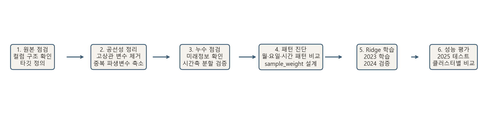
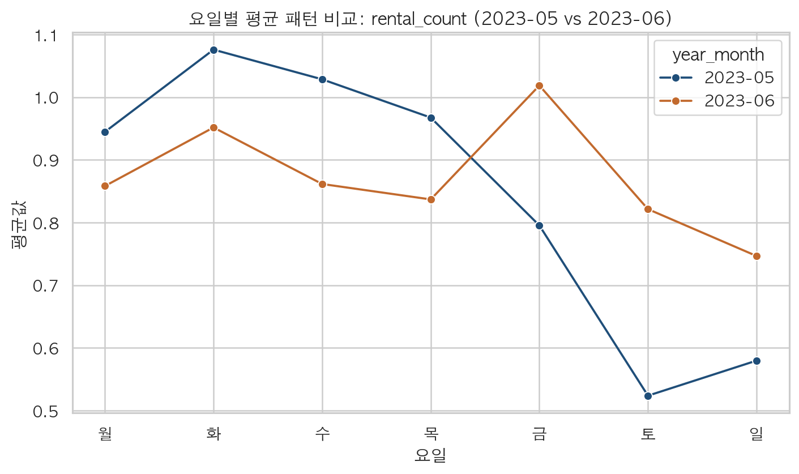

# Ridge 기반 End-to-End 분석 보고서

## 1. 분석 목적
- 목표는 `bike_change_raw`를 예측하는 해석 가능한 회귀모델을 만드는 것입니다.
- 발표에서는 `데이터 정제 -> 공선성 정리 -> 누수 점검 -> 시계열 패턴 진단 -> sample_weight 적용 -> Ridge 학습 -> 성능 검증` 순서로 설명합니다.

## 2. 데이터 구성
- 학습 데이터: `C:/Users/tj/Documents/GitHub/ddri_work/ksm_note/data/ddri_prediction_canonical_train_2023_2024_multicollinearity_removed_v3_with_sample_weight.csv`
- 테스트 데이터: `C:/Users/tj/Documents/GitHub/ddri_work/ksm_note/data/ddri_prediction_canonical_test_2025_multicollinearity_removed_v3.csv`
- 원본 canonical 컬럼 수: **26개**
- 최종 입력 변수 수: **16개**
- 최종 예측 타깃: `bike_change_raw`

### 최종 컬럼 의미
| 컬럼                     | 의미                                            |
|:-------------------------|:------------------------------------------------|
| station_id               | 대여소 고유 ID                                  |
| hour                     | 시간대(0~23시)                                  |
| rental_count             | 해당 시점 대여 건수                             |
| weekday                  | 요일 정보(월~일 인코딩)                         |
| month                    | 월 정보                                         |
| holiday                  | 공휴일 여부                                     |
| temperature              | 기온                                            |
| humidity                 | 습도                                            |
| precipitation            | 강수량                                          |
| wind_speed               | 풍속                                            |
| cluster                  | 대여소 군집 번호                                |
| bike_change_raw          | 예측 대상인 자전거 수요 변화량                  |
| bike_change_lag_1        | 직전 시점의 bike_change_raw                     |
| bike_change_rollmean_24  | 직전 24시간 bike_change_raw 평균                |
| bike_change_rollstd_24   | 직전 24시간 bike_change_raw 표준편차            |
| bike_change_rollmean_168 | 직전 168시간 bike_change_raw 평균               |
| bike_change_rollstd_168  | 직전 168시간 bike_change_raw 표준편차           |
| sample_weight            | 월별 유사패턴을 반영해 학습 시 곱해준 행 가중치 |

## 3. 데이터 정제와 공선성 정리
### 3-1. 왜 정리가 필요했는가
- 초기 데이터에는 원 변수와 계절조정 변수, 여러 시차·추세 파생변수가 함께 있어 상관관계가 높은 조합이 존재했습니다.
- 상관이 너무 높은 변수들을 동시에 넣으면 회귀계수 해석이 흔들리고, 학습 안정성이 떨어질 수 있습니다.

### 3-2. 근거 시각화
- 초기 공선성 점검 결과, `bike_change_raw`와 `bike_change_deseasonalized`의 절대 상관계수는 **0.9349**로 0.9를 넘었습니다.
- 이 값은 사실상 같은 정보를 두 컬럼이 나눠 들고 있다는 뜻이라 판단했습니다.

| feature_a       | feature_b                  |   correlation |   abs_correlation |
|:----------------|:---------------------------|--------------:|------------------:|
| bike_change_raw | bike_change_deseasonalized |      0.934864 |          0.934864 |

### 3-3. 어떤 조치를 했는가
| 제거 컬럼                                         | 원인                                          | 조치                          |
|:--------------------------------------------------|:----------------------------------------------|:------------------------------|
| bike_change_deseasonalized                        | bike_change_raw와 상관계수 0.9349로 매우 높음 | 중복 타깃 계열 변수 제거      |
| rental_count_deseasonalized                       | 원 변수와 계절조정 변수가 함께 존재           | 설명력이 겹치는 파생변수 제거 |
| bike_change_trend_1_24 / bike_change_trend_24_168 | bike_change 계열 추세 파생변수 중복           | 공선성 완화를 위해 제거       |
| bike_change_lag_24 / bike_change_lag_168          | 다중 시차 변수 과다로 공선성 우려             | 대표 lag만 남기고 제거        |
| seasonal_mean_2023                                | 계절성 요약값이 월·시간 변수와 의미 중첩      | 대표성 낮은 요약 변수 제거    |
| mapped_dong_code                                  | 지역 코드형 변수로 군집 변수와 역할 중첩      | 모델 단순화를 위해 제거       |

### 3-4. 조치 이후 결과
- 최종 입력 변수 기준 최대 절대 상관계수는 `bike_change_rollstd_24 ↔ bike_change_rollstd_168`의 **0.7772**였습니다.
- 즉, 초기처럼 0.9를 넘는 강한 중복 구조는 최종 입력 변수에서는 남지 않았습니다.

| feature_a               | feature_b                |   correlation |   abs_correlation |
|:------------------------|:-------------------------|--------------:|------------------:|
| bike_change_rollstd_24  | bike_change_rollstd_168  |      0.777213 |          0.777213 |
| bike_change_rollmean_24 | bike_change_rollmean_168 |      0.470136 |          0.470136 |
| bike_change_lag_1       | bike_change_rollmean_24  |      0.425102 |          0.425102 |
| bike_change_lag_1       | bike_change_rollmean_168 |      0.418752 |          0.418752 |
| rental_count            | bike_change_rollstd_168  |      0.355027 |          0.355027 |
| rental_count            | bike_change_rollstd_24   |      0.336581 |          0.336581 |
| temperature             | bike_change_rollstd_168  |      0.307824 |          0.307824 |
| temperature             | bike_change_rollstd_24   |      0.261253 |          0.261253 |
| hour                    | humidity                 |     -0.257373 |          0.257373 |
| humidity                | wind_speed               |     -0.253358 |          0.253358 |

## 4. 누수와 분할 오류 점검
### 4-1. 무엇을 의심했는가
- 높은 성능이 나왔을 때 가장 먼저 의심해야 하는 것은 타깃 누수, 미래정보 혼입, 잘못된 train/valid/test 분할입니다.
- 특히 `bike_change_lag_1`, `bike_change_rollmean_24`, `bike_change_rollstd_24`, `bike_change_rollmean_168`, `bike_change_rollstd_168`는 타깃의 과거값에서 파생된 변수라 생성 로직을 확인할 필요가 있었습니다.

### 4-2. 점검 결과
- 과거값 기준 재계산 검증 결과, 위 5개 파생변수는 모두 **현재값이나 미래값을 쓰지 않고** 생성된 것으로 확인됐습니다.
- train/valid/test는 `2023 -> 2024 -> 2025` 시간순으로 분리되어 겹치지 않았습니다.

| feature                  |   mismatch_count_vs_past_only_formula | past_only_verified   |
|:-------------------------|--------------------------------------:|:---------------------|
| bike_change_lag_1        |                                     0 | True                 |
| bike_change_rollmean_24  |                                     0 | True                 |
| bike_change_rollstd_24   |                                     0 | True                 |
| bike_change_rollmean_168 |                                     0 | True                 |
| bike_change_rollstd_168  |                                     0 | True                 |

| split   | min_date   | max_date   |    rows |
|:--------|:-----------|:-----------|--------:|
| train   | 2023-01-01 | 2023-12-31 | 1410360 |
| valid   | 2024-01-01 | 2024-12-31 | 1414224 |
| test    | 2025-01-01 | 2025-12-31 | 1410360 |

| left_split   | right_split   |   overlap_key_rows |
|:-------------|:--------------|-------------------:|
| train        | valid         |                  0 |
| train        | test          |                  0 |
| valid        | test          |                  0 |

## 5. 시계열 패턴 진단과 sample_weight 설계
### 5-1. 왜 이 단계가 필요했는가
- 시계열 데이터에서는 누수는 없어도, 서로 너무 비슷한 월 패턴이 반복되면 특정 구간이 학습에 과도하게 반영될 수 있습니다.
- 그래서 인접한 월끼리 24시간 평균선을 비교해, 패턴이 매우 비슷한 달은 학습 가중치를 낮추는 전략을 적용했습니다.

### 5-2. 월별 유사패턴 근거
- `rental_count`의 `2023-05`와 `2023-06`은 `corr=0.9947`, `NRMSE=0.1074`로 매우 유사했습니다.
- 이런 형태는 일부 변수에서 반복적으로 관찰됐고, 이는 같은 패턴을 여러 달이 거의 중복해서 보여준다는 뜻입니다.

| feature           | year_month_left   | year_month_right   |     corr |    nrmse |   similarity_score | similar_flag   |
|:------------------|:------------------|:-------------------|---------:|---------:|-------------------:|:---------------|
| weekday           | 2023-02           | 2023-03            | 1        | 0        |           1        | True           |
| rental_count      | 2023-05           | 2023-06            | 0.994728 | 0.107409 |           0.887885 | True           |
| humidity          | 2024-03           | 2024-04            | 0.995387 | 0.126415 |           0.869555 | True           |
| bike_change_lag_1 | 2024-05           | 2024-06            | 0.990595 | 0.136922 |           0.854961 | True           |
| rental_count      | 2023-12           | 2024-01            | 0.992545 | 0.153107 |           0.840579 | True           |
| rental_count      | 2024-05           | 2024-06            | 0.989127 | 0.155049 |           0.835763 | True           |
| rental_count      | 2024-04           | 2024-05            | 0.986511 | 0.164927 |           0.823809 | True           |
| rental_count      | 2024-07           | 2024-08            | 0.986366 | 0.17046  |           0.81823  | True           |
| bike_change_lag_1 | 2024-04           | 2024-05            | 0.985858 | 0.173726 |           0.814589 | True           |
| bike_change_lag_1 | 2024-01           | 2024-02            | 0.982876 | 0.187159 |           0.798923 | True           |
| rental_count      | 2023-07           | 2023-08            | 0.99599  | 0.198556 |           0.79823  | True           |
| bike_change_lag_1 | 2023-05           | 2023-06            | 0.984816 | 0.19737  |           0.790443 | True           |

### 5-3. 월별·일별·시간별 패턴 시각화
- 아래 그림은 대표 예시로 `rental_count`의 두 인접 월을 비교한 것입니다.
- 월 수준에서는 두 달의 전체 가중치가 비슷하게 낮아지고, 일 수준에서는 요일별 평균 패턴이 유사하며, 시간 수준에서는 24시간 평균선의 모양이 거의 겹칩니다.

### 5-4. 어떤 조치를 했는가
- 각 월에 대해 `sample_weight`를 부여했고, 실제 범위는 **0.889208 ~ 0.966489**였습니다.
- 패턴 유사도가 높은 달일수록 가중치를 조금 낮춰서, 중복되는 계절·시간 패턴이 학습을 과하게 지배하지 않도록 했습니다.

| year_month   |   overall_month_weight |   mean_adjacent_similarity |
|:-------------|-----------------------:|---------------------------:|
| 2023-07      |               0.889208 |                   0.221584 |
| 2023-08      |               0.894102 |                   0.211796 |
| 2023-03      |               0.90306  |                   0.19388  |
| 2024-05      |               0.903093 |                   0.193813 |
| 2024-01      |               0.905062 |                   0.189876 |

## 6. 데이터 분할과 모델링
- 분할 방식: `train=2023`, `valid=2024`, `test=2025`
- 모델: `Ridge(alpha=2.0)`
- 전처리: median imputation + standardization
- 학습 시 `sample_weight` 적용
- 평가 지표: `RMSE`, `MAE`, `R2`

## 7. 전체 Ridge 회귀 성능
| split   |     rmse |      mae |       r2 |
|:--------|---------:|---------:|---------:|
| train   | 0.726203 | 0.481299 | 0.726576 |
| valid   | 0.734183 | 0.480287 | 0.721155 |
| test    | 0.649735 | 0.433503 | 0.727374 |

### 성능 해석
- train R2=0.726576, valid R2=0.721155, test R2=0.727374로 split 간 차이가 크지 않았습니다.
- 즉, Ridge는 과적합이 심하지 않으면서도 설명 가능한 수준의 안정적인 성능을 보였습니다.

## 8. 회귀계수 해석
- 표준화 계수 기준 상위 변수는 `rental_count`, `bike_change_lag_1`, `bike_change_rollmean_24`, `bike_change_rollmean_168` 순으로 영향이 컸습니다.
| feature                  |   standardized_coefficient |   abs_standardized_coefficient |
|:-------------------------|---------------------------:|-------------------------------:|
| rental_count             |                  1.04008   |                      1.04008   |
| bike_change_lag_1        |                 -0.381124  |                      0.381124  |
| bike_change_rollmean_24  |                 -0.369743  |                      0.369743  |
| bike_change_rollmean_168 |                 -0.319655  |                      0.319655  |
| bike_change_rollstd_168  |                 -0.218623  |                      0.218623  |
| hour                     |                 -0.214313  |                      0.214313  |
| bike_change_rollstd_24   |                 -0.201558  |                      0.201558  |
| humidity                 |                  0.0571189 |                      0.0571189 |
| temperature              |                 -0.0392703 |                      0.0392703 |
| weekday                  |                  0.0225105 |                      0.0225105 |
| month                    |                 -0.0140298 |                      0.0140298 |
| precipitation            |                  0.0119273 |                      0.0119273 |

## 9. LightGBM 고성능에 대한 해석
- LightGBM은 매우 높은 R2를 보였지만, 타깃 이력 파생변수 제거 후 성능이 크게 하락했습니다.
- 따라서 LightGBM의 높은 점수는 순수한 일반화 능력만이 아니라 `강한 과거 이력 feature + 반복되는 시계열 패턴`의 영향이 크다고 해석했습니다.

| split   |   baseline_rmse |   new_rmse |   rmse_change |   baseline_mae |   new_mae |   mae_change |   baseline_r2 |   new_r2 |   r2_change |
|:--------|----------------:|-----------:|--------------:|---------------:|----------:|-------------:|--------------:|---------:|------------:|
| valid   |        0.354179 |   0.993907 |      0.639728 |       0.149206 |  0.635511 |     0.486305 |      0.935107 | 0.488971 |   -0.446136 |
| test    |        0.317459 |   0.911335 |      0.593876 |       0.131086 |  0.599049 |     0.467963 |      0.934917 | 0.463648 |   -0.471269 |

## 10. 클러스터별 Ridge 결과
|   cluster | split   |   rows |     rmse |      mae |       r2 |
|----------:|:--------|-------:|---------:|---------:|---------:|
|         0 | test    | 411720 | 0.674678 | 0.444958 | 0.716517 |
|         0 | train   | 411673 | 0.707902 | 0.474743 | 0.727554 |
|         0 | valid   | 412848 | 0.722132 | 0.476679 | 0.721616 |
|         1 | test    |  26280 | 1.28032  | 0.833222 | 0.597371 |
|         1 | train   |  26277 | 1.42566  | 0.906979 | 0.627466 |
|         1 | valid   |  26352 | 1.55819  | 0.942779 | 0.57663  |
|         2 | test    | 271560 | 0.743986 | 0.500475 | 0.709224 |
|         2 | train   | 271529 | 0.84883  | 0.561895 | 0.708962 |
|         2 | valid   | 272304 | 0.860342 | 0.569328 | 0.706416 |
|         3 | test    | 534360 | 0.55388  | 0.394516 | 0.769746 |
|         3 | train   | 534299 | 0.644872 | 0.447759 | 0.759563 |
|         3 | valid   | 535824 | 0.623939 | 0.435514 | 0.763951 |
|         4 | test    | 166440 | 0.495616 | 0.342718 | 0.781277 |
|         4 | train   | 166421 | 0.567856 | 0.377508 | 0.759377 |
|         4 | valid   | 166896 | 0.590129 | 0.383617 | 0.756883 |

- 검증 기준 최고 클러스터는 `cluster 3`로 R2=0.763951였습니다.
- 테스트 기준 최고 클러스터는 `cluster 4`로 R2=0.781277였습니다.
- `cluster 1`은 상대적으로 성능이 낮아 군집 특화 feature 보강이 필요한 구간으로 보입니다.

## 11. 결론
- 공선성 정리 단계에서는 고상관 변수와 중복 파생변수를 제거해 해석 가능한 회귀 구조를 확보했습니다.
- 누수 점검 단계에서는 미래정보 혼입과 잘못된 분할이 없음을 확인했습니다.
- 시계열 패턴 진단 단계에서는 월별·요일별·시간별 유사패턴이 반복되는 것을 확인했고, 이를 완화하기 위해 `sample_weight`를 적용했습니다.
- 그 결과 Ridge는 `R2 약 0.72` 수준의 안정적이고 설명 가능한 기준 모델로 정리할 수 있었습니다.

## 12. 참고 산출물
- 선형회귀 계수: `C:/Users/tj/Documents/GitHub/ddri_work/ksm_note/HMW_linear_regression_coefficients_20260318/outputs/linear_regression_coefficients.csv`
- 선형회귀 점수: `C:/Users/tj/Documents/GitHub/ddri_work/ksm_note/HMW_linear_regression_coefficients_20260318/outputs/linear_regression_scores.csv`
- 월 가중치 제안: `C:/Users/tj/Documents/GitHub/ddri_work/ksm_note/feature_weight/outputs/overall_month_weight_suggestions.csv`
- 누수/분할 점검 보고서: `C:/Users/tj/Documents/GitHub/ddri_work/ksm_note/lightgbm_reason/outputs/lightgbm_high_score_audit_report.md`
- LightGBM 재실험 보고서: `C:/Users/tj/Documents/GitHub/ddri_work/ksm_note/lightgbm_reason_1/outputs/lightgbm_without_history_report.md`
- 클러스터별 Ridge 점수: `C:/Users/tj/Documents/GitHub/ddri_work/ksm_note/HMW_cluster_ridge_regression_20260318/outputs/cluster_ridge_scores.csv`