---
pdf_options:
  format: A4
  landscape: true
---

<!-- markdownlint-disable MD013 -->

<link rel="stylesheet" href="../references/ddri_presentation_a4_landscape.css">

# 강남구 따릉이 통합 분석 보고서 v1

## 분석 목적

- 본 문서는 강남구 따릉이 대여소를 `공간 역할` 기준으로 군집화하고, 그 결과를 바탕으로 `station-hour` 수요 예측 분석까지 연결한 1차 통합본이다.
- 군집화 결과가 예측 분석으로 어떻게 이어지는지 한 문서 안에서 확인할 수 있도록 구성했다.

## 핵심 결과

- 군집화는 대여소를 `업무/상업형`, `주거형`, `생활·상권 혼합형`, `외곽형` 같은 공간 역할 기준으로 분류하기 위한 단계였다.
- 예측 분석에서는 자전거 수요 변화량(`bike_change_raw`)을 설명 가능한 방식으로 예측하기 위해 공선성 정리, 누수 점검, 시계열 패턴 진단, `sample_weight` 적용을 거친 Ridge 회귀를 구성했다.
- Ridge는 `train R2=0.726576`, `valid R2=0.721155`, `test R2=0.727374`로 split 간 편차가 크지 않은 안정적인 기준 모델로 정리됐다.

군집화의 역할 = 대여소의 공간 역할을 먼저 해석하고, 예측 단계에서는 그 구조를 설명 가능한 수요 모델로 연결하는 것이다.

# 1. 군집화 분석 개요

## 왜 군집화가 먼저였는가

- 단순한 대여량 규모만으로는 각 대여소의 역할을 설명하기 어렵기 때문에, 먼저 `station-level` 공간 역할 분류가 필요했다.
- 반납 시간대 비율, 순유입, 교통 접근성은 대여소가 `업무 중심지인지`, `주거지인지`, `생활·상권 혼합지인지`를 해석하는 근거가 된다.
- 이런 구조를 이해해야 이후 예측 단계에서 어떤 피처가 실제로 수요 변동을 설명하는지 더 명확하게 볼 수 있다.

## 군집화 분석 목적

- 기초 이용 패턴 분석 위에 지구판단 중심 피처를 결합해 최종 통합 군집화 결과를 도출
- 이후 날씨·생활인구·고저차 등 환경 피처를 선별해 `station-day` 또는 `station-hour` 수요 예측으로 연결

## 군집화 핵심 결과

- 기준 기간: `2023~2024 학습`, `2025 테스트`
- 기본 통합 군집화: `k = 5`
- 해석 중심: `업무/상업형`, `주거형`, `생활·상권 혼합형`, `외곽 주거형`
- 환경 보강 실험은 해석 보강에는 유효했지만, 메인 군집 구조는 기본 통합 군집화가 더 안정적

군집화 단계는 예측을 대체하는 작업이 아니라, 예측 모델이 어떤 공간 구조를 설명해야 하는지 정리하는 선행 단계였다.

# 2. 군집화 분석에서 사용한 기준

## 군집화 타겟과 활용 목적

- 타겟 단위: `station-level`
- 타겟 의미: 각 대여소를 `업무/상업형`, `주거형`, `생활·상권 혼합형`, `외곽형` 같은 공간 역할 기준으로 분류
- 활용 목적: 이후 수요 예측에서 군집별 환경 피처 또는 공간 피처 해석 기준으로 사용

## 메인 군집화 피처 7개

| 피처 1 | 피처 2 |
|------|------|
| 오전 반납 비율 (`arrival_7_10_ratio`) | 점심 반납 비율 (`arrival_11_14_ratio`) |
| 저녁 반납 비율 (`arrival_17_20_ratio`) | 아침 순유입 (`morning_net_inflow`) |
| 저녁 순유입 (`evening_net_inflow`) | 최근접 지하철 거리 (`subway_distance_m`) |
| 300m 내 버스정류장 수 (`bus_stop_count_300m`) |  |

## 데이터 기준과 전처리 요약

- 대여 이력: `서울 열린데이터광장 공공자전거 이용정보`
- 대여소 정보: `서울 열린데이터광장 공공자전거 대여소 정보`
- 기준 대여소: `2023~2025 공통 운영 대여소`
- 전체 원천 로그: `2,896,795건`
- 최종 분석 사용 로그: `2,663,938건`
- 전체 제외 행: `232,857건 (8.04%)`

## 전처리 해석 포인트

- 결측치보다 `이용시간/거리 비정상값`, `즉시 반납`, `공통 운영 대여소 기준 밖 데이터` 제거가 주요 정제 요인이었다.
- 이 단계에서 대여소별 공간 역할을 안정적으로 읽을 수 있는 기본 로그를 확보했다.

군집화 단계에서 먼저 공간 역할 기준을 정리해두면, 예측 단계에서는 모든 피처를 무작정 넣기보다 어떤 구조가 필요한지 설명 가능하게 접근할 수 있다.

## 군집 분리와 프로파일 요약

  

  

<ul class="compact-list">
  <li>PCA 산점도는 `k = 5` 군집이 완전히 겹치지 않고, 역할별로 분리되는 경향이 있음을 보여준다.</li>
  <li>히트맵은 각 군집에서 어떤 시간대 반납 비율과 순유입, 교통 접근성이 상대적으로 높은지 한 장으로 요약한다.</li>
  <li>즉 PCA는 `분리 정도`, 히트맵은 `무엇이 다른지`를 설명하는 역할이다.</li>
</ul>

군집 결과를 예측 피처로 활용하려면, 군집이 실제로 분리되고 서로 다른 프로파일을 가진다는 근거가 함께 제시되어야 한다.

## 군집 대표 대여소와 공간 분포

  

## 대표 예시

- 업무/상업 혼합형: `SB타워 앞`, `역삼지하보도 7번출구 앞`
- 아침 도착 업무 집중형: `수서역 5번출구`, `포스코사거리(기업은행)`
- 주거 도착형: `청담역 13번 출구 앞`, `현대아파트 정문 앞`
- 외곽 주거형: `더시그넘하우스 앞`, `세곡동 사거리`

지도와 대표 대여소를 함께 보면 군집이 단순 숫자 라벨이 아니라, 강남구 내 실제 공간 역할 분포를 반영한 결과임을 더 직관적으로 확인할 수 있다.

# 3. 예측 분석 문제 정의

## 군집화만으로는 부족한 점

- 군집화는 대여소의 `역할`은 설명하지만, 특정 시점의 수요 변화량을 직접 예측하지는 못한다.
- 실제 운영에서는 `어느 시간대에 어떤 대여소의 자전거 수요 변화가 커질지`를 알아야 재배치 판단에 쓸 수 있다.

## 예측 분석의 문제 정의

- 예측 타깃: 자전거 수요 변화량 (`bike_change_raw`)
- 예측 단위: `station-hour`
- 목적: 해석 가능한 회귀모델을 통해 `자전거 수요 변화량`을 설명하고 예측

## 예측 단계에서 중점적으로 본 것

- 공선성 제거
- 누수와 미래정보 혼입 여부
- 시간순 split의 타당성
- 반복되는 월 패턴의 과대반영 방지
- 설명 가능한 선형 기준 모델 구축

예측 단계의 핵심은 높은 점수 하나가 아니라, 누수 없이 설명 가능한 기준 모델을 확보하는 것이었다.

# 4. Ridge 회귀 분석 개요와 데이터 구성

## 분석 목적

- 목표는 자전거 수요 변화량(`bike_change_raw`)을 예측하는 해석 가능한 회귀모델을 만드는 것이다.

## 분석 단계 요약

- 데이터 정제와 입력 변수 구조 확정
- 공선성 정리와 중복 변수 제거
- 누수 및 시간순 분할 검증
- 월별 반복 패턴 진단과 `sample_weight` 적용
- Ridge 학습과 검증·테스트 성능 평가

## 데이터 구성

- 학습 구간: `2023~2024`
- 테스트 구간: `2025`
- 학습 데이터 행 수: **2,824,584건**
- 테스트 데이터 행 수: **1,410,360건**
- 학습 데이터는 월별 반복 패턴 보정을 위해 `sample_weight`가 반영된 구조를 사용
- 원본 canonical 컬럼 수: **26개**
- 최종 입력 변수 수: **16개**
- 최종 예측 타깃: 자전거 수요 변화량 (`bike_change_raw`)

  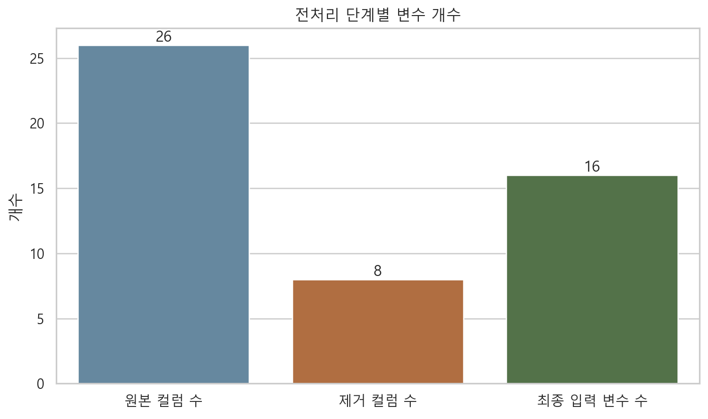

## 최종 컬럼 의미

| 컬럼 | 의미 | 컬럼 | 의미 |
|------|------|------|------|
| 대여소 고유 ID (`station_id`) | 대여소 식별자 | 풍속 (`wind_speed`) | 기상 변수 |
| 시간대 (`hour`) | 0~23시 시간 구간 | 대여소 군집 번호 (`cluster`) | 군집화 결과 라벨 |
| 해당 시점 대여 건수 (`rental_count`) | 해당 시간대 대여량 | 자전거 수요 변화량 (`bike_change_raw`) | 예측 대상 타깃 |
| 요일 정보 (`weekday`) | 월~일 인코딩 값 | 직전 시점 수요 변화량 (`bike_change_lag_1`) | 직전 시점의 `bike_change_raw` |
| 월 정보 (`month`) | 월 단위 계절성 정보 | 직전 24시간 평균 변화량 (`bike_change_rollmean_24`) | 직전 24시간 평균 |
| 공휴일 여부 (`holiday`) | 공휴일 여부 표시 | 직전 24시간 변동성 (`bike_change_rollstd_24`) | 직전 24시간 표준편차 |
| 기온 (`temperature`) | 기상 변수 | 직전 168시간 평균 변화량 (`bike_change_rollmean_168`) | 직전 168시간 평균 |
| 습도 (`humidity`) | 기상 변수 | 직전 168시간 변동성 (`bike_change_rollstd_168`) | 직전 168시간 표준편차 |
| 강수량 (`precipitation`) | 기상 변수 | 학습 가중치 (`sample_weight`) | 월별 유사패턴 반영 가중치 |

# 5. 데이터 정제와 공선성 정리

## 왜 정리가 필요했는가

- 초기 데이터에는 원 변수, 계절조정 변수, 시차·추세 파생변수가 함께 있어 상관이 높은 조합이 존재했다.
- 이런 변수를 동시에 넣으면 회귀계수 해석이 흔들리고, 학습 안정성도 떨어질 수 있다.

## 근거 시각화

- 자전거 수요 변화량(`bike_change_raw`)과 계절조정 수요 변화량(`bike_change_deseasonalized`)의 절대 상관계수는 **0.9349**로, 사실상 같은 정보를 나눠 가진 수준이었다.

<table class="compact-table">
<thead>
<tr>
<th>컬럼 A</th>
<th>컬럼 B</th>
<th>상관계수</th>
<th>절대값</th>
</tr>
</thead>
<tbody>
<tr>
<td>자전거 수요 변화량 (`bike_change_raw`)</td>
<td>계절조정 수요 변화량 (`bike_change_deseasonalized`)</td>
<td>0.934864</td>
<td>0.934864</td>
</tr>
</tbody>
</table>

  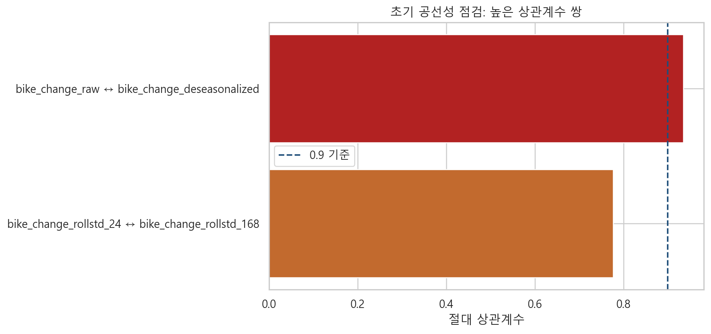

## 어떤 조치를 했는가

| 제거 컬럼 | 원인 | 조치 |
|------|------|------|
| 계절조정 수요 변화량 (`bike_change_deseasonalized`) | 자전거 수요 변화량과 상관계수 0.9349 | 중복 타깃 계열 변수 제거 |
| 계절조정 대여 건수 (`rental_count_deseasonalized`) | 원 변수와 계절조정 변수가 함께 존재 | 설명력이 겹치는 파생변수 제거 |
| 추세 파생변수 (`bike_change_trend_1_24 / bike_change_trend_24_168`) | 수요 변화량 계열 추세 파생변수 중복 | 공선성 완화를 위해 제거 |
| 장기 시차 변수 (`bike_change_lag_24 / bike_change_lag_168`) | 다중 시차 변수 과다 | 대표 lag만 남기고 제거 |
| 계절 평균 요약값 (`seasonal_mean_2023`) | 계절성 요약값과 월·시간 변수 의미 중첩 | 대표성 낮은 요약 변수 제거 |
| 행정동 코드 (`mapped_dong_code`) | 지역 코드형 변수로 군집 변수와 역할 중첩 | 모델 단순화를 위해 제거 |

## 조치 이후 결과

- 최종 입력 변수 기준 최대 절대 상관계수는 직전 24시간 변동성(`bike_change_rollstd_24`)과 직전 168시간 변동성(`bike_change_rollstd_168`)의 **0.7772**였다.
- 초기처럼 0.9를 넘는 강한 중복 구조는 최종 입력 변수에서는 남지 않았다.

  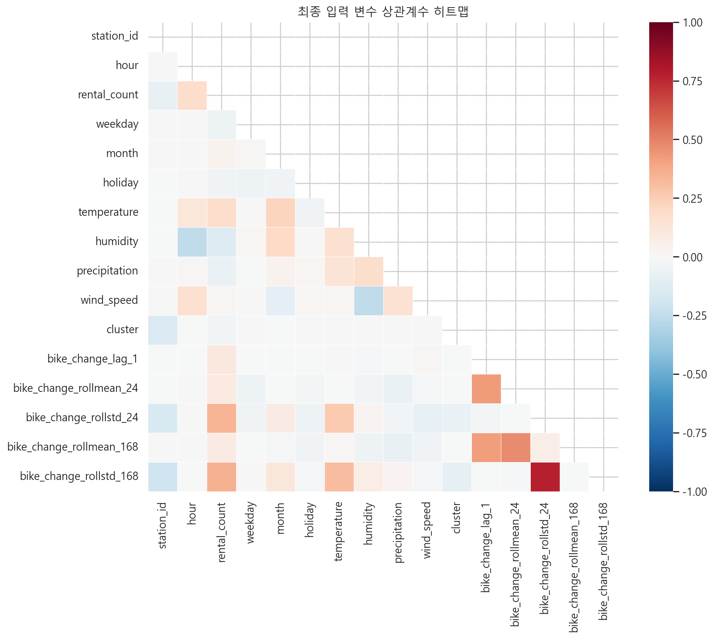

# 6. 누수 점검과 sample_weight 설계

## 누수와 분할 오류 점검

- 높은 성능이 나왔을 때 가장 먼저 의심해야 하는 것은 `타깃 누수`, `미래정보 혼입`, `잘못된 분할`이다.
- 직전 시점 수요 변화량(`bike_change_lag_1`), 직전 24시간 평균·표준편차, 직전 168시간 평균·표준편차는 모두 과거값 기반 파생변수라 생성 로직을 검증했다.

| 점검 변수 | 불일치 건수 | 과거값만 사용 검증 |
|------|------:|------|
| 직전 시점 수요 변화량 | 0 | 예 |
| 최근 24시간 평균 변화량 | 0 | 예 |
| 최근 24시간 변동성 | 0 | 예 |
| 최근 168시간 평균 변화량 | 0 | 예 |
| 최근 168시간 변동성 | 0 | 예 |

| 데이터 구간 | 시작일 | 종료일 | 행 수 |
|------|------|------|------:|
| 학습 | 2023-01-01 | 2023-12-31 | 1410360 |
| 검증 | 2024-01-01 | 2024-12-31 | 1414224 |
| 테스트 | 2025-01-01 | 2025-12-31 | 1410360 |

  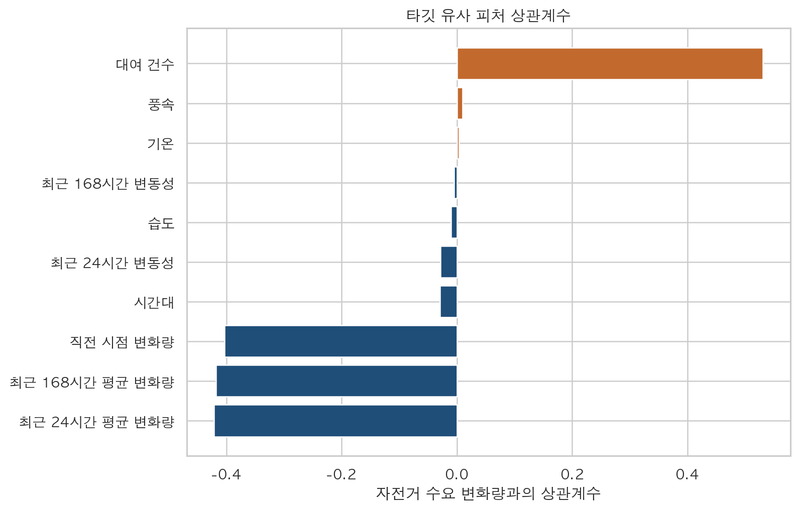

## 왜 sample_weight가 필요했는가

- 누수가 없어도 서로 너무 비슷한 월 패턴이 반복되면 특정 구간이 학습에 과도하게 반영될 수 있다.
- 그래서 인접 월의 24시간 평균선을 비교해, 패턴이 매우 비슷한 달은 학습 가중치를 낮추는 전략을 적용했다.

## 월별 유사패턴 근거

- 대여 건수(`rental_count`)의 `2023-05`와 `2023-06`은 `corr=0.9947`, `NRMSE=0.1074`로 매우 유사했다.
- 이는 같은 패턴을 여러 달이 거의 중복해서 보여준다는 뜻이다.

  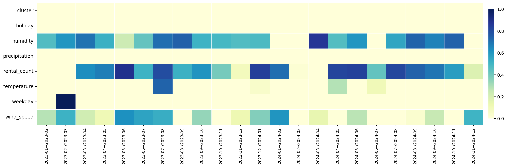

  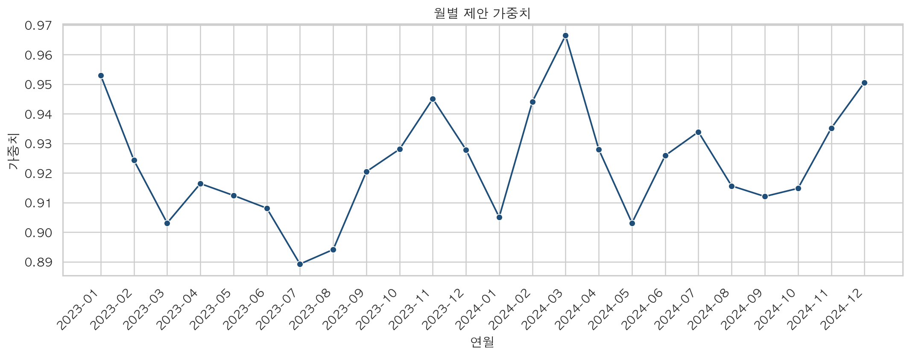

  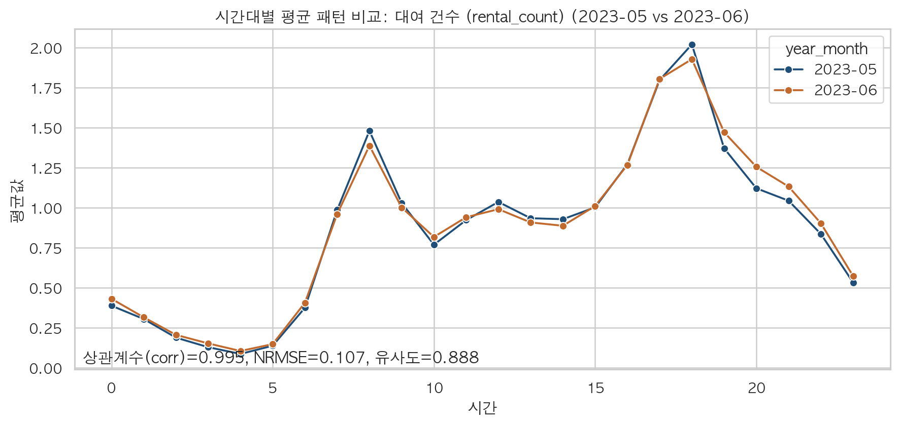

월별 유사패턴이 반복될수록 가중치를 조금 낮춰, 반복되는 계절·시간 구조가 학습을 과하게 지배하지 않도록 했다.

# 7. 모델링과 성능 결과

## 데이터 분할과 모델링

- 분할 방식: `train=2023`, `valid=2024`, `test=2025`
- 모델: `Ridge(alpha=2.0)`
- 전처리: median imputation + standardization
- 학습 시 `sample_weight` 적용
- 평가 지표: `RMSE`, `MAE`, `R2`

## 분할 규모와 전체 Ridge 회귀 성능

<table class="compact-table">
<thead>
<tr>
<th>분할</th>
<th>RMSE</th>
<th>MAE</th>
<th>R²</th>
</tr>
</thead>
<tbody>
<tr>
<td>학습</td>
<td>0.726203</td>
<td>0.481299</td>
<td>0.726576</td>
</tr>
<tr>
<td>검증</td>
<td>0.734183</td>
<td>0.480287</td>
<td>0.721155</td>
</tr>
<tr>
<td>테스트</td>
<td>0.649735</td>
<td>0.433503</td>
<td>0.727374</td>
</tr>
</tbody>
</table>

  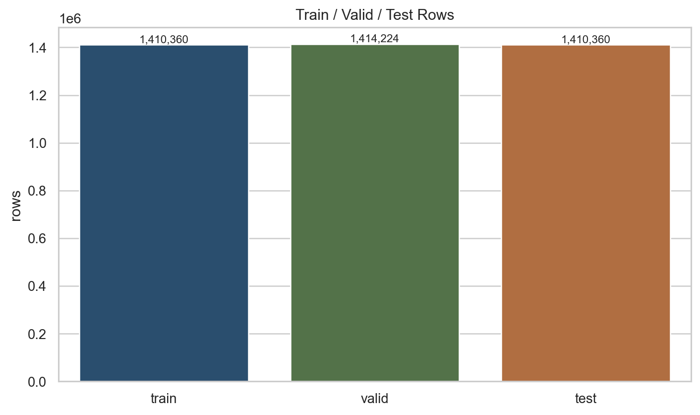

  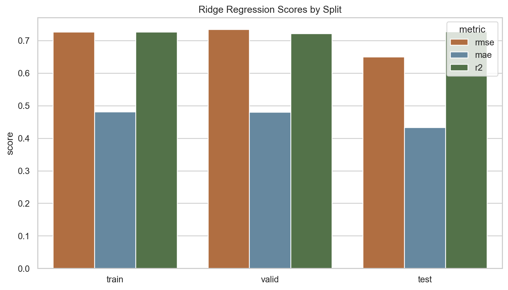

## 성능 해석

- `train R2=0.726576`, `valid R2=0.721155`, `test R2=0.727374`로 split 간 차이가 크지 않았다.
- Ridge는 과적합이 심하지 않으면서도 설명 가능한 수준의 안정적인 성능을 보였다.

이번 Ridge는 최고 점수 모델이 아니라, 누수 없이 설명 가능한 선형 기준 모델로서 의미가 있다.

# 8. 회귀계수, LightGBM 비교, 클러스터별 결과

## 회귀계수 해석

- 표준화 계수 기준 상위 변수는 대여 건수(`rental_count`), 직전 시점 수요 변화량(`bike_change_lag_1`), 직전 24시간 평균 변화량(`bike_change_rollmean_24`), 직전 168시간 평균 변화량(`bike_change_rollmean_168`) 순으로 영향이 컸다.

| 변수 | 계수 | 절댓값 |
|------|------:|------:|
| 대여 건수 | 1.040080 | 1.040080 |
| 직전 시점 변화량 | -0.381124 | 0.381124 |
| 최근 24시간 평균 변화량 | -0.369743 | 0.369743 |
| 최근 168시간 평균 변화량 | -0.319655 | 0.319655 |
| 최근 168시간 변동성 | -0.218623 | 0.218623 |
| 시간대 | -0.214313 | 0.214313 |
| 최근 24시간 변동성 | -0.201558 | 0.201558 |
| 습도 | 0.057119 | 0.057119 |

  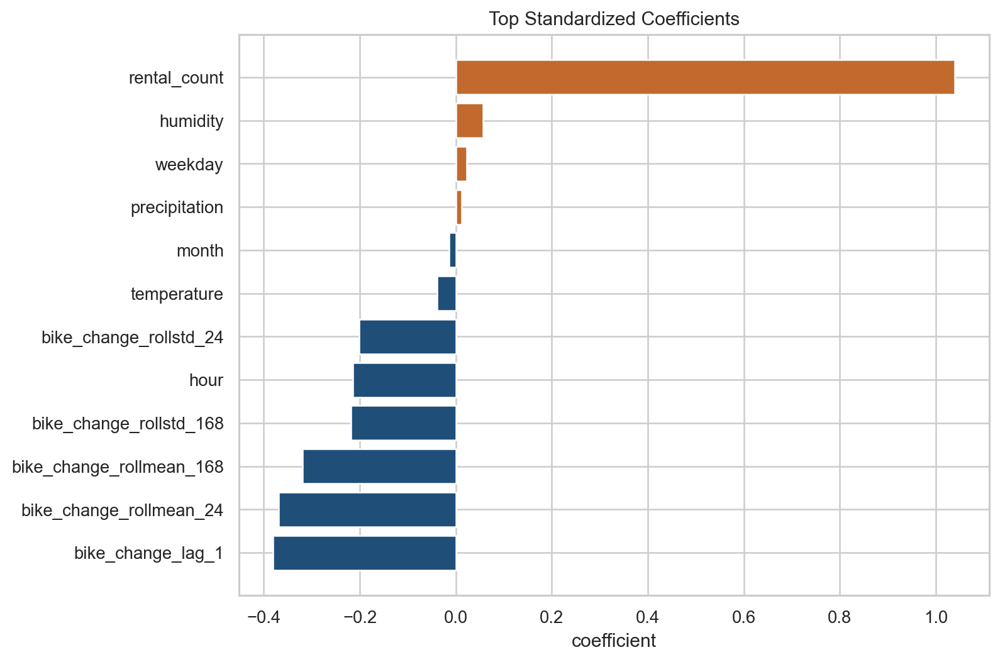

## LightGBM 고성능에 대한 해석

- LightGBM은 매우 높은 R2를 보였지만, 타깃 이력 파생변수 제거 후 성능이 크게 하락했다.
- 따라서 LightGBM의 높은 점수는 `강한 과거 이력 feature + 반복되는 시계열 패턴`의 영향이 크다고 해석했다.

| 분할 | 기준 RMSE | 재실험 RMSE | 기준 R² | 재실험 R² | R² 변화 |
|------|------:|------:|------:|------:|------:|
| 검증 | 0.354179 | 0.993907 | 0.935107 | 0.488971 | -0.446136 |
| 테스트 | 0.317459 | 0.911335 | 0.934917 | 0.463648 | -0.471269 |

  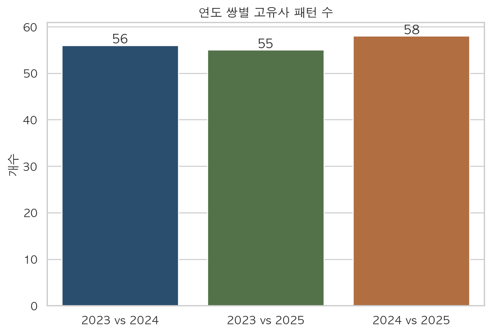

## 클러스터별 Ridge 결과

- 검증 기준 최고 클러스터와 테스트 기준 최고 클러스터를 별도로 비교해 군집별 난이도 차이를 확인했다.
- `cluster 1` 군집은 상대적으로 성능이 낮아 군집 특화 피처 보강이 필요한 구간으로 볼 수 있다.

  

  

# 9. 결론과 다음 단계

## 결론

- 군집화 단계에서는 대여소를 단순 규모가 아니라 `공간 역할` 기준으로 해석할 수 있는 구조를 확보했다.
- 예측 단계에서는 공선성 정리, 누수 점검, 시계열 패턴 진단을 거쳐 `설명 가능한 Ridge 기준 모델`을 구축했다.
- 그 결과 Ridge는 `검증 R² 0.721155`, `테스트 R² 0.727374` 수준의 안정적이고 해석 가능한 기준 모델로 정리할 수 있었다.

## 모델 성능 요약

<table class="compact-table">
<thead>
<tr>
<th>분할</th>
<th>RMSE</th>
<th>MAE</th>
<th>R²</th>
</tr>
</thead>
<tbody>
<tr>
<td>학습</td>
<td>0.726203</td>
<td>0.481299</td>
<td>0.726576</td>
</tr>
<tr>
<td>검증</td>
<td>0.734183</td>
<td>0.480287</td>
<td>0.721155</td>
</tr>
<tr>
<td>테스트</td>
<td>0.649735</td>
<td>0.433503</td>
<td>0.727374</td>
</tr>
</tbody>
</table>
