# ?댁슜???곸쐞 20媛?station ?듯빀 遺꾩꽍

???명듃遺곸? ?댁슜?됱씠 留롮? station 20媛쒕? ?€?곸쑝濡? ?먯쿇 ?곗씠???뺤씤遺€???꾩쿂由? ?⑦꽩 feature ?앹꽦, Ridge ?숈뒿, station蹂??깅뒫 鍮꾧탳, ?ㅼ감 吏꾨떒, 理쒖쥌 寃곕줎源뚯? ???먮쫫?쇰줈 ?뺣━???듯빀 遺꾩꽍 ?명듃?낅땲??

## 遺꾩꽍 ?먮쫫
1. 遺꾩꽍 ?€?곴낵 ?ъ슜 ?곗씠???뺣━
2. station ?좎젙 洹쇨굅 ?ㅻ챸
3. ?먯쿇 ?곗씠???덉쭏 ?먭?
4. ?꾩쿂由?諛??곗씠??遺꾪븷 諛⑹떇 ?뺣━
5. ?⑦꽩 湲곕컲 feature ?앹꽦 怨쇱젙 ?ㅻ챸
6. Ridge ?쒕떇 諛??깅뒫 鍮꾧탳
7. ?듯빀 ??궧, 以묒슂 feature, ?ㅼ감 援ш컙 ?댁꽍
8. 理쒖쥌 寃곕줎 ?뺣━


```python
from pathlib import Path

import numpy as np
import pandas as pd
import matplotlib as mpl
import matplotlib.pyplot as plt
import seaborn as sns
import folium
from matplotlib.ticker import MaxNLocator

plt.style.use('seaborn-v0_8-whitegrid')
pd.set_option('display.max_columns', 100)
pd.set_option('display.float_format', lambda x: f'{x:,.4f}')
sns.set_palette(['#1f4e79', '#2e8b57', '#d97a04', '#9c2f2f', '#6b4c9a'])
mpl.rcParams['figure.facecolor'] = 'white'
mpl.rcParams['axes.facecolor'] = '#fbfbf8'
mpl.rcParams['axes.edgecolor'] = '#c7c7c7'
mpl.rcParams['grid.color'] = '#d9d9d9'
mpl.rcParams['font.size'] = 11
mpl.rcParams['font.family'] = 'Malgun Gothic'
mpl.rcParams['axes.unicode_minus'] = False

ROOT = Path.cwd().resolve().parents[0]
DATA_DIR = ROOT / 'Data'
STATION_META_DIR = ROOT.parent / '3議?怨듭쑀?대뜑' / '媛뺣궓援??€?ъ냼 ?뺣낫 (2023~2025)'
TOP20_STATIONS = [2306, 2332, 2335, 2340, 2342, 2348, 2369, 2375, 2377, 2384, 2404, 2413, 2414, 2415, 2423, 2431, 3614, 3627, 3651, 4906]
TARGETS = ['rental_count', 'return_count']
SPLIT_ORDER = ['train', 'valid', 'test']
YEAR_TO_SPLIT = {2023: 'train', 2024: 'valid', 2025: 'test'}

def format_axis(ax, title=None, xlabel=None, ylabel=None, grid_axis='x'):
    if title is not None:
        ax.set_title(title, fontsize=13, fontweight='bold', pad=12)
    if xlabel is not None:
        ax.set_xlabel(xlabel)
    if ylabel is not None:
        ax.set_ylabel(ylabel)
    ax.grid(axis=grid_axis, alpha=0.22, linestyle='--')
    sns.despine(ax=ax, left=False, bottom=False)
    return ax

def annotate_barh(ax, fmt='{:.3f}', pad=0.01):
    max_width = max((patch.get_width() for patch in ax.patches), default=0)
    for patch in ax.patches:
        width = patch.get_width()
        y = patch.get_y() + patch.get_height() / 2
        ax.text(width + max_width * pad, y, fmt.format(width), va='center', ha='left', fontsize=9, color='#333333')

def annotate_bar(ax, fmt='{:.0f}', pad=0.02):
    max_height = max((patch.get_height() for patch in ax.patches), default=0)
    for patch in ax.patches:
        height = patch.get_height()
        x = patch.get_x() + patch.get_width() / 2
        ax.text(x, height + max_height * pad, fmt.format(height), va='bottom', ha='center', fontsize=9, color='#333333')

def make_station_label(station_id, station_name, max_len=18):
    station_name = str(station_name)
    short_name = station_name if len(station_name) <= max_len else station_name[:max_len - 1] + '??
    return f'{int(station_id)} | {short_name}'

```

## 1. 遺꾩꽍 ?€?곴낵 ?ъ슜 ?곗씠??

?듯빀 ?명듃??媛?station ?명듃?먯꽌 ?앹꽦???곗텧臾쇱쓣 ?ㅼ떆 紐⑥븘 鍮꾧탳?⑸땲?? ?먯쿇 ?쒓퀎???곗씠?? 怨듯쑕??湲곗??? ?쒓컙?€ ?⑦꽩 怨듭떇, 媛€以묒튂 ?뚯씠釉? Ridge ?쒕떇 濡쒓렇, ?됯? 吏€?? ?덉륫 寃곌낵, 以묒슂???? ?곕룄蹂??⑦꽩 鍮꾧탳?? 怨좎삤李??쒖젏 ?쒕? ?④퍡 ?ъ슜?⑸땲??


```python
station_meta_frames = []
for year in ['2023', '2024', '2025']:
    meta_path = STATION_META_DIR / f'{year}_媛뺣궓援??€?ъ냼.csv'
    meta_df = pd.read_csv(meta_path)
    meta_df['source_year'] = int(year)
    station_meta_frames.append(meta_df[['?€?ъ냼踰덊샇', '?€?ъ냼紐?, '?꾨룄', '寃쎈룄', '二쇱냼', 'source_year']])
station_meta_df = pd.concat(station_meta_frames, ignore_index=True)
station_meta_df['station_id'] = station_meta_df['?€?ъ냼踰덊샇'].astype(float).astype(int)
station_meta_df = station_meta_df.sort_values(['station_id', 'source_year']).drop_duplicates('station_id', keep='last')
station_meta_df = station_meta_df.rename(columns={'?€?ъ냼紐?: 'station_name', '?꾨룄': 'latitude', '寃쎈룄': 'longitude', '二쇱냼': 'address'})
station_meta_df['station_label'] = station_meta_df.apply(lambda row: make_station_label(row['station_id'], row['station_name']), axis=1)

raw_frames = []
formula_frames = []
weight_frames = []
tuning_frames = []
metric_frames = []
importance_frames = []
comparison_frames = []
error_frames = []
prediction_frames = []
holiday_frames = []

for station_id in TOP20_STATIONS:
    raw_df = pd.read_csv(DATA_DIR / f'station_{station_id}.csv')
    raw_df['station_id'] = station_id
    raw_frames.append(raw_df)

    formula_df = pd.read_csv(DATA_DIR / f'station_{station_id}_offday_hour_formulas.csv')
    formula_df['station_id'] = station_id
    formula_frames.append(formula_df)

    weight_df = pd.read_csv(DATA_DIR / f'station_{station_id}_month_weights.csv')
    weight_df['station_id'] = station_id
    weight_frames.append(weight_df)

    tuning_df = pd.read_csv(DATA_DIR / f'station_{station_id}_offday_month_ridge_tuning.csv')
    tuning_df['station_id'] = station_id
    tuning_frames.append(tuning_df)

    metric_df = pd.read_csv(DATA_DIR / f'station_{station_id}_offday_month_ridge_metrics.csv')
    metric_df['station_id'] = station_id
    metric_frames.append(metric_df)

    importance_df = pd.read_csv(DATA_DIR / f'station_{station_id}_feature_importance.csv')
    importance_df['station_id'] = station_id
    importance_frames.append(importance_df)

    comparison_df = pd.read_csv(DATA_DIR / f'station_{station_id}_year_actual_vs_regression_vs_ml.csv')
    comparison_df['station_id'] = station_id
    comparison_frames.append(comparison_df)

    error_df = pd.read_csv(DATA_DIR / f'station_{station_id}_2025_high_error_points.csv')
    error_df['station_id'] = station_id
    error_frames.append(error_df)

    pred_df = pd.read_csv(DATA_DIR / f'station_{station_id}_offday_month_ridge_predictions_long.csv')
    pred_df['station_id'] = station_id
    prediction_frames.append(pred_df)

    holiday_df = pd.read_csv(DATA_DIR / f'station_{station_id}_holiday_reference.csv')
    holiday_df['station_id'] = station_id
    holiday_frames.append(holiday_df)

raw_all_df = pd.concat(raw_frames, ignore_index=True)
formula_all_df = pd.concat(formula_frames, ignore_index=True)
weight_all_df = pd.concat(weight_frames, ignore_index=True)
tuning_all_df = pd.concat(tuning_frames, ignore_index=True)
metrics_df = pd.concat(metric_frames, ignore_index=True)
importance_all_df = pd.concat(importance_frames, ignore_index=True)
comparison_all_df = pd.concat(comparison_frames, ignore_index=True)
error_all_df = pd.concat(error_frames, ignore_index=True)
prediction_all_df = pd.concat(prediction_frames, ignore_index=True)
holiday_all_df = pd.concat(holiday_frames, ignore_index=True)

raw_all_df['time'] = pd.to_datetime(raw_all_df['time'])
raw_all_df['date'] = raw_all_df['time'].dt.normalize()
holiday_all_df['date'] = pd.to_datetime(holiday_all_df['date'])
shared_holiday_df = holiday_all_df[['date', 'holiday_name']].drop_duplicates().sort_values('date').reset_index(drop=True)
holiday_set = set(shared_holiday_df['date'])
raw_all_df['is_holiday'] = raw_all_df['date'].isin(holiday_set).astype(int)
raw_all_df['is_offday'] = ((raw_all_df['weekday'] >= 5) | (raw_all_df['is_holiday'] == 1)).astype(int)
raw_all_df['day_type'] = np.where(raw_all_df['is_offday'] == 1, 'offday', 'weekday')
raw_all_df['split'] = raw_all_df['year'].map(YEAR_TO_SPLIT)
raw_all_df = raw_all_df.merge(station_meta_df[['station_id', 'station_name', 'station_label', 'latitude', 'longitude', 'address']], on='station_id', how='left')

```

## 2. station ?좎젙 洹쇨굅

?대쾲 遺꾩꽍?먯꽌???⑥닚???댁슜?됱씠 留롮? station留?怨좊Ⅸ 寃껋씠 ?꾨땲?? **癒몄떊?щ떇 ?덉륫???곹빀?섎룄濡??댁슜?먭? 留롮? station??以묒뿉??2023~2025???쒓컙蹂??⑦꽩???ш쾶 踰쀬뼱?섏? ?딄퀬 鍮꾧탳??鍮꾩듂?섍쾶 ?좎??섎뒗 station**???곗꽑 ?좎젙?덉뒿?덈떎.

利? ?좎젙 湲곗??€ ?ㅼ쓬 ??媛€吏€?낅땲??
1. ?댁슜?됱씠 異⑸텇??留롮븘 ?⑦꽩???덉젙?곸쑝濡?愿€痢〓맆 寃?
2. ?곕룄蹂??쒓컙?€ ?⑦꽩??吏€?섏튂寃??붾뱾由ъ? ?딆븘 ?숈뒿???⑦꽩???ㅼ쓬 ?댁뿉???ы쁽??寃?


```python
station_usage_df = (
    raw_all_df.groupby('station_id', as_index=False)
    .agg(
        rental_total=('rental_count', 'sum'),
        return_total=('return_count', 'sum'),
    )
)
station_usage_df['total_usage'] = station_usage_df['rental_total'] + station_usage_df['return_total']
station_usage_df = station_usage_df.sort_values('total_usage', ascending=False).reset_index(drop=True)

year_hour_profile_df = (
    raw_all_df.groupby(['station_id', 'year', 'hour'], as_index=False)[['rental_count', 'return_count']]
    .mean()
)
year_hour_profile_df['total_flow'] = year_hour_profile_df['rental_count'] + year_hour_profile_df['return_count']
pattern_stability_df = (
    year_hour_profile_df.groupby(['station_id', 'hour'], as_index=False)['total_flow']
    .agg(['mean', 'std'])
    .reset_index()
)
pattern_stability_df['cv'] = np.where(pattern_stability_df['mean'] > 0, pattern_stability_df['std'] / pattern_stability_df['mean'], 0)
pattern_stability_df = (
    pattern_stability_df.groupby('station_id', as_index=False)
    .agg(
        mean_hourly_flow=('mean', 'mean'),
        mean_hourly_std=('std', 'mean'),
        mean_hourly_cv=('cv', 'mean'),
    )
)
selection_basis_df = station_usage_df.merge(pattern_stability_df, on='station_id', how='left')
selection_basis_df = selection_basis_df.merge(station_meta_df[['station_id', 'station_name', 'station_label', 'latitude', 'longitude']], on='station_id', how='left')
selection_basis_df = selection_basis_df.sort_values(['total_usage', 'mean_hourly_cv'], ascending=[False, True]).reset_index(drop=True)
display(selection_basis_df[['station_id', 'station_name', 'total_usage', 'mean_hourly_flow', 'mean_hourly_std', 'mean_hourly_cv']].round(4))

fig, axes = plt.subplots(1, 2, figsize=(18, 6))
usage_plot_df = selection_basis_df.sort_values('total_usage', ascending=False)
sns.barplot(data=usage_plot_df, x='total_usage', y='station_label', ax=axes[0], color='#1f4e79')
format_axis(axes[0], '?좎젙??20媛?station??珥??댁슜??, '2023~2025 珥??댁슜??, 'station')
annotate_barh(axes[0], fmt='{:.0f}', pad=0.008)

stability_plot_df = selection_basis_df.sort_values('mean_hourly_cv', ascending=True)
sns.barplot(data=stability_plot_df, x='mean_hourly_cv', y='station_label', ax=axes[1], color='#2e8b57')
format_axis(axes[1], '?곕룄蹂??쒓컙 ?⑦꽩 ?덉젙??鍮꾧탳', '?쒓컙?€ ?됯퇏 蹂€?숆퀎??CV)', 'station')
annotate_barh(axes[1], fmt='{:.3f}', pad=0.02)
plt.tight_layout()
plt.show()

top20_map = folium.Map(location=[selection_basis_df['latitude'].mean(), selection_basis_df['longitude'].mean()], zoom_start=13, tiles='CartoDB positron')
for _, row in selection_basis_df.iterrows():
    popup_html = f"<b>{row['station_name']}</b><br>station_id: {int(row['station_id'])}<br>珥??댁슜?? {row['total_usage']:.0f}<br>?됯퇏 CV: {row['mean_hourly_cv']:.3f}"
    folium.CircleMarker(location=[row['latitude'], row['longitude']], radius=6, color='#1f4e79', fill=True, fill_color='#2e8b57', fill_opacity=0.85, popup=popup_html, tooltip=row['station_label']).add_to(top20_map)
top20_map

```


<div>
<style scoped>
    .dataframe tbody tr th:only-of-type {
        vertical-align: middle;
    }


</style>
<table border="1" class="dataframe">
  <thead>
    <tr style="text-align: right;">
      <th></th>
      <th>station_id</th>
      <th>station_name</th>
      <th>total_usage</th>
      <th>mean_hourly_flow</th>
      <th>mean_hourly_std</th>
      <th>mean_hourly_cv</th>
    </tr>
  </thead>
  <tbody>
    <tr>
      <th>0</th>
      <td>2377</td>
      <td>?섏꽌??5踰덉텧援?/td>
      <td>111233</td>
      <td>4.2288</td>
      <td>0.3938</td>
      <td>0.1135</td>
    </tr>
    <tr>
      <th>1</th>
      <td>2335</td>
      <td>3?몄꽑 留ㅻ큺??3踰덉텧援ъ븵</td>
      <td>108398</td>
      <td>4.1208</td>
      <td>0.3223</td>
      <td>0.1147</td>
    </tr>
    <tr>
      <th>2</th>
      <td>2348</td>
      <td>?ъ뒪肄붿궗嫄곕━(湲곗뾽?€??</td>
      <td>102225</td>
      <td>3.8858</td>
      <td>0.6554</td>
      <td>0.1961</td>
    </tr>
    <tr>
      <th>3</th>
      <td>2340</td>
      <td>?쇳샇臾쇱궛踰꾩뒪?뺣쪟??23370) ??/td>
      <td>95011</td>
      <td>3.6119</td>
      <td>0.4965</td>
      <td>0.1601</td>
    </tr>
    <tr>
      <th>4</th>
      <td>2404</td>
      <td>?€紐⑥궛?낃뎄??4踰?異쒓뎄 ??/td>
      <td>93814</td>
      <td>3.5664</td>
      <td>0.4481</td>
      <td>0.1321</td>
    </tr>
    <tr>
      <th>5</th>
      <td>2306</td>
      <td>?뺢뎄?뺤뿭 2踰?異쒓뎄 ??/td>
      <td>89475</td>
      <td>3.4014</td>
      <td>0.4497</td>
      <td>0.1789</td>
    </tr>
    <tr>
      <th>6</th>
      <td>2332</td>
      <td>?좊쫱??踰덉텧援?/td>
      <td>88519</td>
      <td>3.3651</td>
      <td>0.3636</td>
      <td>0.1191</td>
    </tr>
    <tr>
      <th>7</th>
      <td>2431</td>
      <td>?€移섏뿭 7踰덉텧援?/td>
      <td>87802</td>
      <td>3.3378</td>
      <td>0.5343</td>
      <td>0.1768</td>
    </tr>
    <tr>
      <th>8</th>
      <td>2384</td>
      <td>?먭끝?ш굅由?/td>
      <td>86743</td>
      <td>3.2975</td>
      <td>0.4597</td>
      <td>0.1527</td>
    </tr>
    <tr>
      <th>9</th>
      <td>2414</td>
      <td>?꾧끝???꾩뭅?곕??ㅼ쐞????/td>
      <td>85664</td>
      <td>3.2564</td>
      <td>0.4636</td>
      <td>0.2005</td>
    </tr>
    <tr>
      <th>10</th>
      <td>2342</td>
      <td>?€泥?뿭 1踰덉텧援???/td>
      <td>82749</td>
      <td>3.1459</td>
      <td>0.4748</td>
      <td>0.1573</td>
    </tr>
    <tr>
      <th>11</th>
      <td>2423</td>
      <td>?곹씗珥덇탳 ?ш굅由??섎??덇컻?щ（泥댄븯??</td>
      <td>80644</td>
      <td>3.0656</td>
      <td>0.4969</td>
      <td>0.1625</td>
    </tr>
    <tr>
      <th>12</th>
      <td>4906</td>
      <td>?ъ쑀?쇳꽣 ??/td>
      <td>76386</td>
      <td>2.9038</td>
      <td>0.3923</td>
      <td>0.1458</td>
    </tr>
    <tr>
      <th>13</th>
      <td>2375</td>
      <td>?섏꽌??1踰덉텧援???/td>
      <td>76190</td>
      <td>2.8963</td>
      <td>0.4375</td>
      <td>0.1524</td>
    </tr>
    <tr>
      <th>14</th>
      <td>3614</td>
      <td>?€留덉븘?뚰듃 ?낃뎄 ?ш굅由?/td>
      <td>75452</td>
      <td>2.8683</td>
      <td>0.4708</td>
      <td>0.1814</td>
    </tr>
    <tr>
      <th>15</th>
      <td>2369</td>
      <td>KT?좊쫱?€??/td>
      <td>69773</td>
      <td>2.6523</td>
      <td>0.3833</td>
      <td>0.1536</td>
    </tr>
    <tr>
      <th>16</th>
      <td>2413</td>
      <td>?꾧끝??1踰?異쒓뎄</td>
      <td>65525</td>
      <td>2.4908</td>
      <td>0.3324</td>
      <td>0.1621</td>
    </tr>
    <tr>
      <th>17</th>
      <td>3651</td>
      <td>媛쒗룷?숈뿭 4踰덉텧援?/td>
      <td>64633</td>
      <td>2.4572</td>
      <td>0.1983</td>
      <td>0.1059</td>
    </tr>
    <tr>
      <th>18</th>
      <td>2415</td>
      <td>?쒗떚??濡?뜲諛깊솕????/td>
      <td>61136</td>
      <td>2.3242</td>
      <td>0.3277</td>
      <td>0.1740</td>
    </tr>
    <tr>
      <th>19</th>
      <td>3627</td>
      <td>?뺢뎄?뺣굹?ㅻぉ</td>
      <td>58794</td>
      <td>2.2351</td>
      <td>0.2607</td>
      <td>0.1744</td>
    </tr>
  </tbody>
</table>
</div>


    
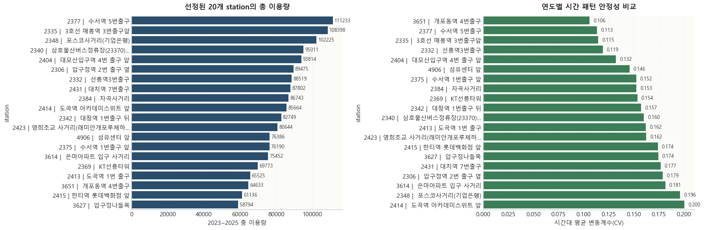
    


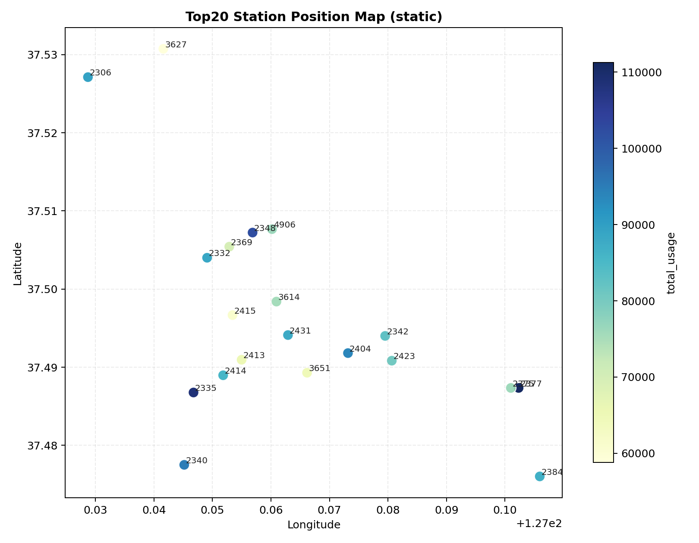


```python
asset_summary_df = pd.DataFrame([
    {'asset': 'station ?먯쿇 csv', 'count': len(raw_frames)},
    {'asset': '怨듯쑕??湲곗? csv', 'count': len(holiday_frames)},
    {'asset': '?⑦꽩 怨듭떇 csv', 'count': len(formula_frames)},
    {'asset': '媛€以묒튂 csv', 'count': len(weight_frames)},
    {'asset': '?쒕떇 寃곌낵 csv', 'count': len(tuning_frames)},
    {'asset': '?깅뒫 吏€??csv', 'count': len(metric_frames)},
    {'asset': 'feature 以묒슂??csv', 'count': len(importance_frames)},
    {'asset': '?곕룄蹂?鍮꾧탳 csv', 'count': len(comparison_frames)},
    {'asset': '怨좎삤李?吏€??csv', 'count': len(error_frames)},
    {'asset': '?덉륫 long csv', 'count': len(prediction_frames)},
])
display(asset_summary_df)

scope_summary_df = pd.DataFrame([
    {'item': 'station 媛쒖닔', 'value': raw_all_df['station_id'].nunique()},
    {'item': '?꾩껜 row ??, 'value': len(raw_all_df)},
    {'item': '?쒖옉 ?쒖젏', 'value': raw_all_df['time'].min()},
    {'item': '醫낅즺 ?쒖젏', 'value': raw_all_df['time'].max()},
    {'item': '怨듯쑕??媛쒖닔', 'value': len(shared_holiday_df)},
])
display(scope_summary_df)

station_scope_df = (
    raw_all_df.groupby('station_id', as_index=False)
    .agg(
        rows=('time', 'size'),
        rental_sum=('rental_count', 'sum'),
        return_sum=('return_count', 'sum'),
        start_time=('time', 'min'),
        end_time=('time', 'max'),
    )
    .sort_values('rental_sum', ascending=False)
)
station_scope_df = station_scope_df.merge(station_meta_df[['station_id', 'station_name', 'station_label']], on='station_id', how='left')
station_scope_df.head(10)

```


<div>
<style scoped>
    .dataframe tbody tr th:only-of-type {
        vertical-align: middle;
    }


</style>
<table border="1" class="dataframe">
  <thead>
    <tr style="text-align: right;">
      <th></th>
      <th>asset</th>
      <th>count</th>
    </tr>
  </thead>
  <tbody>
    <tr>
      <th>0</th>
      <td>station ?먯쿇 csv</td>
      <td>20</td>
    </tr>
    <tr>
      <th>1</th>
      <td>怨듯쑕??湲곗? csv</td>
      <td>20</td>
    </tr>
    <tr>
      <th>2</th>
      <td>?⑦꽩 怨듭떇 csv</td>
      <td>20</td>
    </tr>
    <tr>
      <th>3</th>
      <td>媛€以묒튂 csv</td>
      <td>20</td>
    </tr>
    <tr>
      <th>4</th>
      <td>?쒕떇 寃곌낵 csv</td>
      <td>20</td>
    </tr>
    <tr>
      <th>5</th>
      <td>?깅뒫 吏€??csv</td>
      <td>20</td>
    </tr>
    <tr>
      <th>6</th>
      <td>feature 以묒슂??csv</td>
      <td>20</td>
    </tr>
    <tr>
      <th>7</th>
      <td>?곕룄蹂?鍮꾧탳 csv</td>
      <td>20</td>
    </tr>
    <tr>
      <th>8</th>
      <td>怨좎삤李?吏€??csv</td>
      <td>20</td>
    </tr>
    <tr>
      <th>9</th>
      <td>?덉륫 long csv</td>
      <td>20</td>
    </tr>
  </tbody>
</table>
</div>


<div>
<style scoped>
    .dataframe tbody tr th:only-of-type {
        vertical-align: middle;
    }


</style>
<table border="1" class="dataframe">
  <thead>
    <tr style="text-align: right;">
      <th></th>
      <th>item</th>
      <th>value</th>
    </tr>
  </thead>
  <tbody>
    <tr>
      <th>0</th>
      <td>station 媛쒖닔</td>
      <td>20</td>
    </tr>
    <tr>
      <th>1</th>
      <td>?꾩껜 row ??/td>
      <td>526080</td>
    </tr>
    <tr>
      <th>2</th>
      <td>?쒖옉 ?쒖젏</td>
      <td>2023-01-01 00:00:00</td>
    </tr>
    <tr>
      <th>3</th>
      <td>醫낅즺 ?쒖젏</td>
      <td>2025-12-31 23:00:00</td>
    </tr>
    <tr>
      <th>4</th>
      <td>怨듯쑕??媛쒖닔</td>
      <td>56</td>
    </tr>
  </tbody>
</table>
</div>


<div>
<style scoped>
    .dataframe tbody tr th:only-of-type {
        vertical-align: middle;
    }


</style>
<table border="1" class="dataframe">
  <thead>
    <tr style="text-align: right;">
      <th></th>
      <th>station_id</th>
      <th>rows</th>
      <th>rental_sum</th>
      <th>return_sum</th>
      <th>start_time</th>
      <th>end_time</th>
      <th>station_name</th>
      <th>station_label</th>
    </tr>
  </thead>
  <tbody>
    <tr>
      <th>0</th>
      <td>2335</td>
      <td>26304</td>
      <td>51418</td>
      <td>56980</td>
      <td>2023-01-01</td>
      <td>2025-12-31 23:00:00</td>
      <td>3?몄꽑 留ㅻ큺??3踰덉텧援ъ븵</td>
      <td>2335 |  3?몄꽑 留ㅻ큺??3踰덉텧援ъ븵</td>
    </tr>
    <tr>
      <th>1</th>
      <td>2377</td>
      <td>26304</td>
      <td>50004</td>
      <td>61229</td>
      <td>2023-01-01</td>
      <td>2025-12-31 23:00:00</td>
      <td>?섏꽌??5踰덉텧援?/td>
      <td>2377 |  ?섏꽌??5踰덉텧援?/td>
    </tr>
    <tr>
      <th>2</th>
      <td>2404</td>
      <td>26304</td>
      <td>46276</td>
      <td>47538</td>
      <td>2023-01-01</td>
      <td>2025-12-31 23:00:00</td>
      <td>?€紐⑥궛?낃뎄??4踰?異쒓뎄 ??/td>
      <td>2404 |  ?€紐⑥궛?낃뎄??4踰?異쒓뎄 ??/td>
    </tr>
    <tr>
      <th>3</th>
      <td>2348</td>
      <td>26304</td>
      <td>45092</td>
      <td>57133</td>
      <td>2023-01-01</td>
      <td>2025-12-31 23:00:00</td>
      <td>?ъ뒪肄붿궗嫄곕━(湲곗뾽?€??</td>
      <td>2348 |  ?ъ뒪肄붿궗嫄곕━(湲곗뾽?€??</td>
    </tr>
    <tr>
      <th>4</th>
      <td>2340</td>
      <td>26304</td>
      <td>44362</td>
      <td>50649</td>
      <td>2023-01-01</td>
      <td>2025-12-31 23:00:00</td>
      <td>?쇳샇臾쇱궛踰꾩뒪?뺣쪟??23370) ??/td>
      <td>2340 |  ?쇳샇臾쇱궛踰꾩뒪?뺣쪟??23370)??/td>
    </tr>
    <tr>
      <th>5</th>
      <td>2306</td>
      <td>26304</td>
      <td>44154</td>
      <td>45321</td>
      <td>2023-01-01</td>
      <td>2025-12-31 23:00:00</td>
      <td>?뺢뎄?뺤뿭 2踰?異쒓뎄 ??/td>
      <td>2306 |  ?뺢뎄?뺤뿭 2踰?異쒓뎄 ??/td>
    </tr>
    <tr>
      <th>6</th>
      <td>2384</td>
      <td>26304</td>
      <td>42408</td>
      <td>44335</td>
      <td>2023-01-01</td>
      <td>2025-12-31 23:00:00</td>
      <td>?먭끝?ш굅由?/td>
      <td>2384 |  ?먭끝?ш굅由?/td>
    </tr>
    <tr>
      <th>7</th>
      <td>2431</td>
      <td>26304</td>
      <td>41893</td>
      <td>45909</td>
      <td>2023-01-01</td>
      <td>2025-12-31 23:00:00</td>
      <td>?€移섏뿭 7踰덉텧援?/td>
      <td>2431 | ?€移섏뿭 7踰덉텧援?/td>
    </tr>
    <tr>
      <th>8</th>
      <td>2332</td>
      <td>26304</td>
      <td>41382</td>
      <td>47137</td>
      <td>2023-01-01</td>
      <td>2025-12-31 23:00:00</td>
      <td>?좊쫱??踰덉텧援?/td>
      <td>2332 |  ?좊쫱??踰덉텧援?/td>
    </tr>
    <tr>
      <th>9</th>
      <td>2342</td>
      <td>26304</td>
      <td>41368</td>
      <td>41381</td>
      <td>2023-01-01</td>
      <td>2025-12-31 23:00:00</td>
      <td>?€泥?뿭 1踰덉텧援???/td>
      <td>2342 |  ?€泥?뿭 1踰덉텧援???/td>
    </tr>
  </tbody>
</table>
</div>


## 3. ?먯쿇 ?곗씠???덉쭏 ?먭?

紐⑤뜽 寃곌낵瑜??댁꽍?섍린 ?꾩뿉 媛?station ?쒓퀎?댁씠 異⑸텇??湲몄씠瑜?媛€吏€?붿?, 寃곗륫??留롮?吏€, ?쒓컙 以묐났???덈뒗吏€, ?뚯닔泥섎읆 鍮꾩젙??媛믪씠 ?덈뒗吏€瑜?癒쇱? ?뺤씤?⑸땲??


```python
quality_df = (
    raw_all_df.groupby('station_id', as_index=False)
    .agg(
        rows=('time', 'size'),
        unique_time=('time', 'nunique'),
        rental_missing=('rental_count', lambda s: int(s.isna().sum())),
        return_missing=('return_count', lambda s: int(s.isna().sum())),
        min_rental=('rental_count', 'min'),
        min_return=('return_count', 'min'),
    )
)
quality_df['duplicate_time_rows'] = quality_df['rows'] - quality_df['unique_time']
quality_df['negative_rental_exists'] = quality_df['min_rental'] < 0
quality_df['negative_return_exists'] = quality_df['min_return'] < 0
quality_df = quality_df.merge(station_meta_df[['station_id', 'station_name']], on='station_id', how='left')
quality_df.sort_values('station_id')

```


<div>
<style scoped>
    .dataframe tbody tr th:only-of-type {
        vertical-align: middle;
    }


</style>
<table border="1" class="dataframe">
  <thead>
    <tr style="text-align: right;">
      <th></th>
      <th>station_id</th>
      <th>rows</th>
      <th>unique_time</th>
      <th>rental_missing</th>
      <th>return_missing</th>
      <th>min_rental</th>
      <th>min_return</th>
      <th>duplicate_time_rows</th>
      <th>negative_rental_exists</th>
      <th>negative_return_exists</th>
      <th>station_name</th>
    </tr>
  </thead>
  <tbody>
    <tr>
      <th>0</th>
      <td>2306</td>
      <td>26304</td>
      <td>26304</td>
      <td>0</td>
      <td>0</td>
      <td>0</td>
      <td>0</td>
      <td>0</td>
      <td>False</td>
      <td>False</td>
      <td>?뺢뎄?뺤뿭 2踰?異쒓뎄 ??/td>
    </tr>
    <tr>
      <th>1</th>
      <td>2332</td>
      <td>26304</td>
      <td>26304</td>
      <td>0</td>
      <td>0</td>
      <td>0</td>
      <td>0</td>
      <td>0</td>
      <td>False</td>
      <td>False</td>
      <td>?좊쫱??踰덉텧援?/td>
    </tr>
    <tr>
      <th>2</th>
      <td>2335</td>
      <td>26304</td>
      <td>26304</td>
      <td>0</td>
      <td>0</td>
      <td>0</td>
      <td>0</td>
      <td>0</td>
      <td>False</td>
      <td>False</td>
      <td>3?몄꽑 留ㅻ큺??3踰덉텧援ъ븵</td>
    </tr>
    <tr>
      <th>3</th>
      <td>2340</td>
      <td>26304</td>
      <td>26304</td>
      <td>0</td>
      <td>0</td>
      <td>0</td>
      <td>0</td>
      <td>0</td>
      <td>False</td>
      <td>False</td>
      <td>?쇳샇臾쇱궛踰꾩뒪?뺣쪟??23370) ??/td>
    </tr>
    <tr>
      <th>4</th>
      <td>2342</td>
      <td>26304</td>
      <td>26304</td>
      <td>0</td>
      <td>0</td>
      <td>0</td>
      <td>0</td>
      <td>0</td>
      <td>False</td>
      <td>False</td>
      <td>?€泥?뿭 1踰덉텧援???/td>
    </tr>
    <tr>
      <th>5</th>
      <td>2348</td>
      <td>26304</td>
      <td>26304</td>
      <td>0</td>
      <td>0</td>
      <td>0</td>
      <td>0</td>
      <td>0</td>
      <td>False</td>
      <td>False</td>
      <td>?ъ뒪肄붿궗嫄곕━(湲곗뾽?€??</td>
    </tr>
    <tr>
      <th>6</th>
      <td>2369</td>
      <td>26304</td>
      <td>26304</td>
      <td>0</td>
      <td>0</td>
      <td>0</td>
      <td>0</td>
      <td>0</td>
      <td>False</td>
      <td>False</td>
      <td>KT?좊쫱?€??/td>
    </tr>
    <tr>
      <th>7</th>
      <td>2375</td>
      <td>26304</td>
      <td>26304</td>
      <td>0</td>
      <td>0</td>
      <td>0</td>
      <td>0</td>
      <td>0</td>
      <td>False</td>
      <td>False</td>
      <td>?섏꽌??1踰덉텧援???/td>
    </tr>
    <tr>
      <th>8</th>
      <td>2377</td>
      <td>26304</td>
      <td>26304</td>
      <td>0</td>
      <td>0</td>
      <td>0</td>
      <td>0</td>
      <td>0</td>
      <td>False</td>
      <td>False</td>
      <td>?섏꽌??5踰덉텧援?/td>
    </tr>
    <tr>
      <th>9</th>
      <td>2384</td>
      <td>26304</td>
      <td>26304</td>
      <td>0</td>
      <td>0</td>
      <td>0</td>
      <td>0</td>
      <td>0</td>
      <td>False</td>
      <td>False</td>
      <td>?먭끝?ш굅由?/td>
    </tr>
    <tr>
      <th>10</th>
      <td>2404</td>
      <td>26304</td>
      <td>26304</td>
      <td>0</td>
      <td>0</td>
      <td>0</td>
      <td>0</td>
      <td>0</td>
      <td>False</td>
      <td>False</td>
      <td>?€紐⑥궛?낃뎄??4踰?異쒓뎄 ??/td>
    </tr>
    <tr>
      <th>11</th>
      <td>2413</td>
      <td>26304</td>
      <td>26304</td>
      <td>0</td>
      <td>0</td>
      <td>0</td>
      <td>0</td>
      <td>0</td>
      <td>False</td>
      <td>False</td>
      <td>?꾧끝??1踰?異쒓뎄</td>
    </tr>
    <tr>
      <th>12</th>
      <td>2414</td>
      <td>26304</td>
      <td>26304</td>
      <td>0</td>
      <td>0</td>
      <td>0</td>
      <td>0</td>
      <td>0</td>
      <td>False</td>
      <td>False</td>
      <td>?꾧끝???꾩뭅?곕??ㅼ쐞????/td>
    </tr>
    <tr>
      <th>13</th>
      <td>2415</td>
      <td>26304</td>
      <td>26304</td>
      <td>0</td>
      <td>0</td>
      <td>0</td>
      <td>0</td>
      <td>0</td>
      <td>False</td>
      <td>False</td>
      <td>?쒗떚??濡?뜲諛깊솕????/td>
    </tr>
    <tr>
      <th>14</th>
      <td>2423</td>
      <td>26304</td>
      <td>26304</td>
      <td>0</td>
      <td>0</td>
      <td>0</td>
      <td>0</td>
      <td>0</td>
      <td>False</td>
      <td>False</td>
      <td>?곹씗珥덇탳 ?ш굅由??섎??덇컻?щ（泥댄븯??</td>
    </tr>
    <tr>
      <th>15</th>
      <td>2431</td>
      <td>26304</td>
      <td>26304</td>
      <td>0</td>
      <td>0</td>
      <td>0</td>
      <td>0</td>
      <td>0</td>
      <td>False</td>
      <td>False</td>
      <td>?€移섏뿭 7踰덉텧援?/td>
    </tr>
    <tr>
      <th>16</th>
      <td>3614</td>
      <td>26304</td>
      <td>26304</td>
      <td>0</td>
      <td>0</td>
      <td>0</td>
      <td>0</td>
      <td>0</td>
      <td>False</td>
      <td>False</td>
      <td>?€留덉븘?뚰듃 ?낃뎄 ?ш굅由?/td>
    </tr>
    <tr>
      <th>17</th>
      <td>3627</td>
      <td>26304</td>
      <td>26304</td>
      <td>0</td>
      <td>0</td>
      <td>0</td>
      <td>0</td>
      <td>0</td>
      <td>False</td>
      <td>False</td>
      <td>?뺢뎄?뺣굹?ㅻぉ</td>
    </tr>
    <tr>
      <th>18</th>
      <td>3651</td>
      <td>26304</td>
      <td>26304</td>
      <td>0</td>
      <td>0</td>
      <td>0</td>
      <td>0</td>
      <td>0</td>
      <td>False</td>
      <td>False</td>
      <td>媛쒗룷?숈뿭 4踰덉텧援?/td>
    </tr>
    <tr>
      <th>19</th>
      <td>4906</td>
      <td>26304</td>
      <td>26304</td>
      <td>0</td>
      <td>0</td>
      <td>0</td>
      <td>0</td>
      <td>0</td>
      <td>False</td>
      <td>False</td>
      <td>?ъ쑀?쇳꽣 ??/td>
    </tr>
  </tbody>
</table>
</div>


```python
fig, axes = plt.subplots(1, 2, figsize=(16, 5))
daily_summary = raw_all_df.groupby('day_type', as_index=False)[['rental_count', 'return_count']].mean()
daily_summary = daily_summary.melt(id_vars='day_type', var_name='target', value_name='mean_count')
sns.barplot(data=daily_summary, x='day_type', y='mean_count', hue='target', ax=axes[0], palette=['#1f4e79', '#d97a04'])
format_axis(axes[0], 'top20 station??day_type蹂??됯퇏 ?댁슜??, 'day_type', '?됯퇏 ?댁슜??, grid_axis='y')
axes[0].legend(title='target', frameon=True, loc='upper right')

hourly_profile_df = (
    raw_all_df.groupby(['day_type', 'hour'], as_index=False)[['rental_count', 'return_count']]
    .mean()
    .melt(id_vars=['day_type', 'hour'], var_name='target', value_name='mean_count')
)
sns.lineplot(data=hourly_profile_df, x='hour', y='mean_count', hue='day_type', style='target', linewidth=2.4, ax=axes[1])
format_axis(axes[1], '紐⑤뜽留??댁쟾 ?쒓컙?€ ?됯퇏 ?⑦꽩', 'hour', '?됯퇏 ?댁슜??, grid_axis='y')
axes[1].xaxis.set_major_locator(MaxNLocator(integer=True))
axes[1].legend(title='day_type / target', frameon=True, loc='upper left')
plt.tight_layout()
plt.show()

```


    
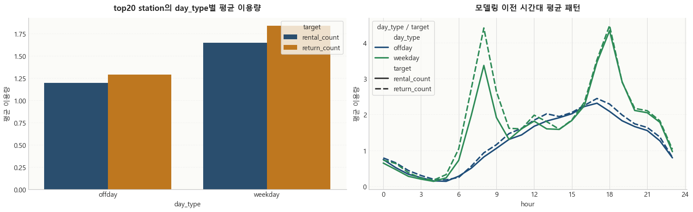
    


## 4. ?꾩쿂由ъ? ?곗씠??遺꾪븷 ?ㅺ퀎

媛쒕퀎 station ?명듃???숈씪???꾩쿂由??뚯씠?꾨씪?몄쓣 ?곕쫭?덈떎. ?쒓컙 蹂€?섎? ?뺣━?섍퀬, 怨듯쑕?쇱쓣 寃고빀?섍퀬, 二쇰쭚怨?怨듯쑕?쇱쓣 `offday`濡??듯빀???? ?꾩껜 ?쒓퀎?댁쓣 ?곕룄 湲곗??쇰줈 train, valid, test濡?遺꾪븷?⑸땲??


```python
preprocess_example_df = raw_all_df[
    ['station_id', 'time', 'date', 'year', 'month', 'day', 'weekday', 'hour', 'is_holiday', 'is_offday', 'day_type', 'split', 'rental_count', 'return_count']
].sort_values(['station_id', 'time']).head(12)
preprocess_example_df

```


<div>
<style scoped>
    .dataframe tbody tr th:only-of-type {
        vertical-align: middle;
    }


</style>
<table border="1" class="dataframe">
  <thead>
    <tr style="text-align: right;">
      <th></th>
      <th>station_id</th>
      <th>time</th>
      <th>date</th>
      <th>year</th>
      <th>month</th>
      <th>day</th>
      <th>weekday</th>
      <th>hour</th>
      <th>is_holiday</th>
      <th>is_offday</th>
      <th>day_type</th>
      <th>split</th>
      <th>rental_count</th>
      <th>return_count</th>
    </tr>
  </thead>
  <tbody>
    <tr>
      <th>0</th>
      <td>2306</td>
      <td>2023-01-01 00:00:00</td>
      <td>2023-01-01</td>
      <td>2023</td>
      <td>1</td>
      <td>1</td>
      <td>6</td>
      <td>0</td>
      <td>1</td>
      <td>1</td>
      <td>offday</td>
      <td>train</td>
      <td>0</td>
      <td>0</td>
    </tr>
    <tr>
      <th>1</th>
      <td>2306</td>
      <td>2023-01-01 01:00:00</td>
      <td>2023-01-01</td>
      <td>2023</td>
      <td>1</td>
      <td>1</td>
      <td>6</td>
      <td>1</td>
      <td>1</td>
      <td>1</td>
      <td>offday</td>
      <td>train</td>
      <td>0</td>
      <td>1</td>
    </tr>
    <tr>
      <th>2</th>
      <td>2306</td>
      <td>2023-01-01 02:00:00</td>
      <td>2023-01-01</td>
      <td>2023</td>
      <td>1</td>
      <td>1</td>
      <td>6</td>
      <td>2</td>
      <td>1</td>
      <td>1</td>
      <td>offday</td>
      <td>train</td>
      <td>1</td>
      <td>0</td>
    </tr>
    <tr>
      <th>3</th>
      <td>2306</td>
      <td>2023-01-01 03:00:00</td>
      <td>2023-01-01</td>
      <td>2023</td>
      <td>1</td>
      <td>1</td>
      <td>6</td>
      <td>3</td>
      <td>1</td>
      <td>1</td>
      <td>offday</td>
      <td>train</td>
      <td>0</td>
      <td>0</td>
    </tr>
    <tr>
      <th>4</th>
      <td>2306</td>
      <td>2023-01-01 04:00:00</td>
      <td>2023-01-01</td>
      <td>2023</td>
      <td>1</td>
      <td>1</td>
      <td>6</td>
      <td>4</td>
      <td>1</td>
      <td>1</td>
      <td>offday</td>
      <td>train</td>
      <td>0</td>
      <td>0</td>
    </tr>
    <tr>
      <th>5</th>
      <td>2306</td>
      <td>2023-01-01 05:00:00</td>
      <td>2023-01-01</td>
      <td>2023</td>
      <td>1</td>
      <td>1</td>
      <td>6</td>
      <td>5</td>
      <td>1</td>
      <td>1</td>
      <td>offday</td>
      <td>train</td>
      <td>0</td>
      <td>1</td>
    </tr>
    <tr>
      <th>6</th>
      <td>2306</td>
      <td>2023-01-01 06:00:00</td>
      <td>2023-01-01</td>
      <td>2023</td>
      <td>1</td>
      <td>1</td>
      <td>6</td>
      <td>6</td>
      <td>1</td>
      <td>1</td>
      <td>offday</td>
      <td>train</td>
      <td>1</td>
      <td>0</td>
    </tr>
    <tr>
      <th>7</th>
      <td>2306</td>
      <td>2023-01-01 07:00:00</td>
      <td>2023-01-01</td>
      <td>2023</td>
      <td>1</td>
      <td>1</td>
      <td>6</td>
      <td>7</td>
      <td>1</td>
      <td>1</td>
      <td>offday</td>
      <td>train</td>
      <td>0</td>
      <td>0</td>
    </tr>
    <tr>
      <th>8</th>
      <td>2306</td>
      <td>2023-01-01 08:00:00</td>
      <td>2023-01-01</td>
      <td>2023</td>
      <td>1</td>
      <td>1</td>
      <td>6</td>
      <td>8</td>
      <td>1</td>
      <td>1</td>
      <td>offday</td>
      <td>train</td>
      <td>0</td>
      <td>0</td>
    </tr>
    <tr>
      <th>9</th>
      <td>2306</td>
      <td>2023-01-01 09:00:00</td>
      <td>2023-01-01</td>
      <td>2023</td>
      <td>1</td>
      <td>1</td>
      <td>6</td>
      <td>9</td>
      <td>1</td>
      <td>1</td>
      <td>offday</td>
      <td>train</td>
      <td>1</td>
      <td>1</td>
    </tr>
    <tr>
      <th>10</th>
      <td>2306</td>
      <td>2023-01-01 10:00:00</td>
      <td>2023-01-01</td>
      <td>2023</td>
      <td>1</td>
      <td>1</td>
      <td>6</td>
      <td>10</td>
      <td>1</td>
      <td>1</td>
      <td>offday</td>
      <td>train</td>
      <td>2</td>
      <td>1</td>
    </tr>
    <tr>
      <th>11</th>
      <td>2306</td>
      <td>2023-01-01 11:00:00</td>
      <td>2023-01-01</td>
      <td>2023</td>
      <td>1</td>
      <td>1</td>
      <td>6</td>
      <td>11</td>
      <td>1</td>
      <td>1</td>
      <td>offday</td>
      <td>train</td>
      <td>0</td>
      <td>0</td>
    </tr>
  </tbody>
</table>
</div>


```python
split_summary_df = (
    raw_all_df.groupby(['split', 'day_type'], as_index=False)
    .agg(
        rows=('time', 'size'),
        station_count=('station_id', 'nunique'),
        rental_mean=('rental_count', 'mean'),
        return_mean=('return_count', 'mean'),
    )
)
split_summary_df['split'] = pd.Categorical(split_summary_df['split'], categories=SPLIT_ORDER, ordered=True)
split_summary_df.sort_values(['split', 'day_type'])

```


<div>
<style scoped>
    .dataframe tbody tr th:only-of-type {
        vertical-align: middle;
    }


</style>
<table border="1" class="dataframe">
  <thead>
    <tr style="text-align: right;">
      <th></th>
      <th>split</th>
      <th>day_type</th>
      <th>rows</th>
      <th>station_count</th>
      <th>rental_mean</th>
      <th>return_mean</th>
    </tr>
  </thead>
  <tbody>
    <tr>
      <th>2</th>
      <td>train</td>
      <td>offday</td>
      <td>56640</td>
      <td>20</td>
      <td>1.2911</td>
      <td>1.3941</td>
    </tr>
    <tr>
      <th>3</th>
      <td>train</td>
      <td>weekday</td>
      <td>118560</td>
      <td>20</td>
      <td>1.7291</td>
      <td>1.9181</td>
    </tr>
    <tr>
      <th>4</th>
      <td>valid</td>
      <td>offday</td>
      <td>57600</td>
      <td>20</td>
      <td>1.2688</td>
      <td>1.3616</td>
    </tr>
    <tr>
      <th>5</th>
      <td>valid</td>
      <td>weekday</td>
      <td>118080</td>
      <td>20</td>
      <td>1.7358</td>
      <td>1.9396</td>
    </tr>
    <tr>
      <th>0</th>
      <td>test</td>
      <td>offday</td>
      <td>58080</td>
      <td>20</td>
      <td>1.0250</td>
      <td>1.1125</td>
    </tr>
    <tr>
      <th>1</th>
      <td>test</td>
      <td>weekday</td>
      <td>117120</td>
      <td>20</td>
      <td>1.4745</td>
      <td>1.6507</td>
    </tr>
  </tbody>
</table>
</div>


## 5. ?⑦꽩 湲곕컲 feature ?앹꽦 怨쇱젙

??遺꾩꽍?€ ?먯쿇 count瑜?諛붾줈 Ridge???ｌ? ?딆뒿?덈떎. 癒쇱? `day_type`蹂??쒓컙 ?⑦꽩??湲곕낯 ?뺥깭濡?留뚮뱾怨? ?ш린??month, year, hour 媛€以묒튂瑜??뱀뼱 `base_value`, `pattern_prior`, `corrected_pattern_prior` 媛숈? ?⑦꽩 以묒떖 feature瑜??앹꽦?⑸땲??


```python
formula_summary_df = (
    formula_all_df.groupby(['target', 'day_type'], as_index=False)
    .agg(
        station_count=('station_id', 'nunique'),
        intercept_mean=('intercept', 'mean'),
        sin_coef_mean=('sin_hour_coef', 'mean'),
        cos_coef_mean=('cos_hour_coef', 'mean'),
    )
)
display(formula_summary_df.round(4))

formula_all_df.sort_values(['target', 'day_type', 'station_id']).head(12)

```


<div>
<style scoped>
    .dataframe tbody tr th:only-of-type {
        vertical-align: middle;
    }


</style>
<table border="1" class="dataframe">
  <thead>
    <tr style="text-align: right;">
      <th></th>
      <th>target</th>
      <th>day_type</th>
      <th>station_count</th>
      <th>intercept_mean</th>
      <th>sin_coef_mean</th>
      <th>cos_coef_mean</th>
    </tr>
  </thead>
  <tbody>
    <tr>
      <th>0</th>
      <td>rental_count</td>
      <td>offday</td>
      <td>20</td>
      <td>1.2911</td>
      <td>-0.9548</td>
      <td>-0.4993</td>
    </tr>
    <tr>
      <th>1</th>
      <td>rental_count</td>
      <td>weekday</td>
      <td>20</td>
      <td>1.7291</td>
      <td>-0.9323</td>
      <td>-0.6067</td>
    </tr>
    <tr>
      <th>2</th>
      <td>return_count</td>
      <td>offday</td>
      <td>20</td>
      <td>1.3941</td>
      <td>-0.9905</td>
      <td>-0.5280</td>
    </tr>
    <tr>
      <th>3</th>
      <td>return_count</td>
      <td>weekday</td>
      <td>20</td>
      <td>1.9181</td>
      <td>-0.7532</td>
      <td>-0.7013</td>
    </tr>
  </tbody>
</table>
</div>


<div>
<style scoped>
    .dataframe tbody tr th:only-of-type {
        vertical-align: middle;
    }


</style>
<table border="1" class="dataframe">
  <thead>
    <tr style="text-align: right;">
      <th></th>
      <th>target</th>
      <th>day_type</th>
      <th>intercept</th>
      <th>sin_hour_coef</th>
      <th>cos_hour_coef</th>
      <th>formula</th>
      <th>station_id</th>
    </tr>
  </thead>
  <tbody>
    <tr>
      <th>1</th>
      <td>rental_count</td>
      <td>offday</td>
      <td>1.4968</td>
      <td>-1.1625</td>
      <td>-0.7017</td>
      <td>1.496822 + (-1.162518 * sin(2pi*hour/24)) + (-...</td>
      <td>2306</td>
    </tr>
    <tr>
      <th>5</th>
      <td>rental_count</td>
      <td>offday</td>
      <td>1.0569</td>
      <td>-0.7939</td>
      <td>-0.4293</td>
      <td>1.056850 + (-0.793908 * sin(2pi*hour/24)) + (-...</td>
      <td>2332</td>
    </tr>
    <tr>
      <th>9</th>
      <td>rental_count</td>
      <td>offday</td>
      <td>1.2963</td>
      <td>-1.0235</td>
      <td>-0.5084</td>
      <td>1.296257 + (-1.023516 * sin(2pi*hour/24)) + (-...</td>
      <td>2335</td>
    </tr>
    <tr>
      <th>13</th>
      <td>rental_count</td>
      <td>offday</td>
      <td>1.4905</td>
      <td>-0.8717</td>
      <td>-0.7087</td>
      <td>1.490466 + (-0.871654 * sin(2pi*hour/24)) + (-...</td>
      <td>2340</td>
    </tr>
    <tr>
      <th>17</th>
      <td>rental_count</td>
      <td>offday</td>
      <td>1.4107</td>
      <td>-1.0203</td>
      <td>-0.4646</td>
      <td>1.410664 + (-1.020333 * sin(2pi*hour/24)) + (-...</td>
      <td>2342</td>
    </tr>
    <tr>
      <th>21</th>
      <td>rental_count</td>
      <td>offday</td>
      <td>0.5943</td>
      <td>-0.4428</td>
      <td>-0.1702</td>
      <td>0.594280 + (-0.442832 * sin(2pi*hour/24)) + (-...</td>
      <td>2348</td>
    </tr>
    <tr>
      <th>25</th>
      <td>rental_count</td>
      <td>offday</td>
      <td>0.7927</td>
      <td>-0.5585</td>
      <td>-0.2671</td>
      <td>0.792726 + (-0.558460 * sin(2pi*hour/24)) + (-...</td>
      <td>2369</td>
    </tr>
    <tr>
      <th>29</th>
      <td>rental_count</td>
      <td>offday</td>
      <td>0.9329</td>
      <td>-0.7023</td>
      <td>-0.1444</td>
      <td>0.932910 + (-0.702308 * sin(2pi*hour/24)) + (-...</td>
      <td>2375</td>
    </tr>
    <tr>
      <th>33</th>
      <td>rental_count</td>
      <td>offday</td>
      <td>1.6204</td>
      <td>-1.3481</td>
      <td>-0.6165</td>
      <td>1.620410 + (-1.348085 * sin(2pi*hour/24)) + (-...</td>
      <td>2377</td>
    </tr>
    <tr>
      <th>37</th>
      <td>rental_count</td>
      <td>offday</td>
      <td>1.3552</td>
      <td>-0.7562</td>
      <td>-0.5648</td>
      <td>1.355226 + (-0.756203 * sin(2pi*hour/24)) + (-...</td>
      <td>2384</td>
    </tr>
    <tr>
      <th>41</th>
      <td>rental_count</td>
      <td>offday</td>
      <td>1.7355</td>
      <td>-1.0084</td>
      <td>-0.9049</td>
      <td>1.735523 + (-1.008369 * sin(2pi*hour/24)) + (-...</td>
      <td>2404</td>
    </tr>
    <tr>
      <th>45</th>
      <td>rental_count</td>
      <td>offday</td>
      <td>1.1430</td>
      <td>-0.7778</td>
      <td>-0.4123</td>
      <td>1.143008 + (-0.777821 * sin(2pi*hour/24)) + (-...</td>
      <td>2413</td>
    </tr>
  </tbody>
</table>
</div>


```python
month_weight_df = weight_all_df[weight_all_df['weight_type'] == 'month_weight'].copy()
month_weight_summary_df = (
    month_weight_df.groupby(['target', 'key'], as_index=False)
    .agg(
        mean_weight=('value', 'mean'),
        min_weight=('value', 'min'),
        max_weight=('value', 'max'),
    )
    .rename(columns={'key': 'month'})
)

fig, axes = plt.subplots(1, 2, figsize=(16, 5), sharex=True)
for ax, target in zip(axes, TARGETS):
    sub = month_weight_summary_df[month_weight_summary_df['target'] == target]
    color = '#1f4e79' if target == 'rental_count' else '#d97a04'
    ax.plot(sub['month'], sub['mean_weight'], marker='o', linewidth=2.4, color=color)
    ax.fill_between(sub['month'], sub['min_weight'], sub['max_weight'], alpha=0.18, color=color)
    ax.axhline(1.0, color='gray', linestyle='--', linewidth=1)
    format_axis(ax, f'{target}????媛€以묒튂 踰붿쐞', 'month', '媛€以묒튂', grid_axis='y')
    ax.xaxis.set_major_locator(MaxNLocator(integer=True))
plt.tight_layout()
plt.show()

month_weight_summary_df.round(4)

```


    

    


<div>
<style scoped>
    .dataframe tbody tr th:only-of-type {
        vertical-align: middle;
    }


</style>
<table border="1" class="dataframe">
  <thead>
    <tr style="text-align: right;">
      <th></th>
      <th>target</th>
      <th>month</th>
      <th>mean_weight</th>
      <th>min_weight</th>
      <th>max_weight</th>
    </tr>
  </thead>
  <tbody>
    <tr>
      <th>0</th>
      <td>rental_count</td>
      <td>1</td>
      <td>0.5003</td>
      <td>0.2613</td>
      <td>0.6597</td>
    </tr>
    <tr>
      <th>1</th>
      <td>rental_count</td>
      <td>2</td>
      <td>0.5965</td>
      <td>0.4939</td>
      <td>0.7069</td>
    </tr>
    <tr>
      <th>2</th>
      <td>rental_count</td>
      <td>3</td>
      <td>0.8967</td>
      <td>0.7695</td>
      <td>0.9677</td>
    </tr>
    <tr>
      <th>3</th>
      <td>rental_count</td>
      <td>4</td>
      <td>1.1883</td>
      <td>1.0578</td>
      <td>1.2576</td>
    </tr>
    <tr>
      <th>4</th>
      <td>rental_count</td>
      <td>5</td>
      <td>1.2411</td>
      <td>1.1250</td>
      <td>1.4703</td>
    </tr>
    <tr>
      <th>5</th>
      <td>rental_count</td>
      <td>6</td>
      <td>1.3525</td>
      <td>1.2313</td>
      <td>1.5363</td>
    </tr>
    <tr>
      <th>6</th>
      <td>rental_count</td>
      <td>7</td>
      <td>1.0630</td>
      <td>0.9396</td>
      <td>1.1335</td>
    </tr>
    <tr>
      <th>7</th>
      <td>rental_count</td>
      <td>8</td>
      <td>1.1105</td>
      <td>0.9651</td>
      <td>1.3614</td>
    </tr>
    <tr>
      <th>8</th>
      <td>rental_count</td>
      <td>9</td>
      <td>1.2409</td>
      <td>1.0758</td>
      <td>1.4954</td>
    </tr>
    <tr>
      <th>9</th>
      <td>rental_count</td>
      <td>10</td>
      <td>1.2392</td>
      <td>1.1416</td>
      <td>1.3494</td>
    </tr>
    <tr>
      <th>10</th>
      <td>rental_count</td>
      <td>11</td>
      <td>0.9781</td>
      <td>0.8037</td>
      <td>1.1168</td>
    </tr>
    <tr>
      <th>11</th>
      <td>rental_count</td>
      <td>12</td>
      <td>0.5930</td>
      <td>0.3095</td>
      <td>0.6877</td>
    </tr>
    <tr>
      <th>12</th>
      <td>return_count</td>
      <td>1</td>
      <td>0.5010</td>
      <td>0.3257</td>
      <td>0.5770</td>
    </tr>
    <tr>
      <th>13</th>
      <td>return_count</td>
      <td>2</td>
      <td>0.5918</td>
      <td>0.4304</td>
      <td>0.6649</td>
    </tr>
    <tr>
      <th>14</th>
      <td>return_count</td>
      <td>3</td>
      <td>0.8878</td>
      <td>0.8309</td>
      <td>0.9827</td>
    </tr>
    <tr>
      <th>15</th>
      <td>return_count</td>
      <td>4</td>
      <td>1.1977</td>
      <td>1.1230</td>
      <td>1.3206</td>
    </tr>
    <tr>
      <th>16</th>
      <td>return_count</td>
      <td>5</td>
      <td>1.2320</td>
      <td>1.1319</td>
      <td>1.4006</td>
    </tr>
    <tr>
      <th>17</th>
      <td>return_count</td>
      <td>6</td>
      <td>1.3413</td>
      <td>1.1512</td>
      <td>1.5252</td>
    </tr>
    <tr>
      <th>18</th>
      <td>return_count</td>
      <td>7</td>
      <td>1.0893</td>
      <td>0.9617</td>
      <td>1.2500</td>
    </tr>
    <tr>
      <th>19</th>
      <td>return_count</td>
      <td>8</td>
      <td>1.1249</td>
      <td>0.9792</td>
      <td>1.3443</td>
    </tr>
    <tr>
      <th>20</th>
      <td>return_count</td>
      <td>9</td>
      <td>1.2303</td>
      <td>1.1266</td>
      <td>1.4065</td>
    </tr>
    <tr>
      <th>21</th>
      <td>return_count</td>
      <td>10</td>
      <td>1.2347</td>
      <td>1.1290</td>
      <td>1.3289</td>
    </tr>
    <tr>
      <th>22</th>
      <td>return_count</td>
      <td>11</td>
      <td>0.9834</td>
      <td>0.7536</td>
      <td>1.1651</td>
    </tr>
    <tr>
      <th>23</th>
      <td>return_count</td>
      <td>12</td>
      <td>0.5859</td>
      <td>0.3165</td>
      <td>0.6926</td>
    </tr>
  </tbody>
</table>
</div>


### year_weight?€ hour_weight ?댁꽍

??媛€以묒튂?€ 留덉갔媛€吏€濡??ㅼ젣 紐⑤뜽?먮뒗 `year_weight`, `hour_weight`???④퍡 ?ъ슜?⑸땲??

- `year_weight`: ?뱀젙 ?곕룄???꾩껜?곸씤 ?섏? 李⑥씠瑜?蹂댁젙?섎뒗 媛?
- `hour_weight`: 湲곕낯 ?⑦꽩?앸쭔?쇰줈 ?ㅻ챸?섏? ?딅뒗 ?몃? ?쒓컙?€ 蹂댁젙??諛섏쁺?섎뒗 媛?

?뱁엳 `year_weight`??**?대떦 ?곕룄???ㅼ젣 ?곗씠?곕? 蹂닿퀬 怨꾩궛?섎뒗 媛?*?닿린 ?뚮Ц?? ?꾩쟾???덈줈???곕룄???€???ъ쟾???뺥솗??媛믪쓣 ?????놁뒿?덈떎. 利? ?덈줈???곕룄???곗씠?곕? ?쇰? ?뺣낫?????ㅼ떆 weight瑜?媛깆떊?섍굅??紐⑤뜽???ы븰?듯븯??怨쇱젙???꾩슂?⑸땲??

?곕씪???꾩옱 援ъ“?먯꽌 `year_weight`???κ린 誘몃옒瑜?誘몃━ 怨좎젙?곸쑝濡??덉륫?섎뒗 蹂€?섎씪湲곕낫?? ?대떦 ?곕룄???섏? 蹂€?붾? 諛섏쁺?섍린 ?꾪븳 ?ы썑??蹂댁젙媛믪뿉 媛€源앹뒿?덈떎.


```python
year_weight_df = weight_all_df[weight_all_df['weight_type'] == 'year_weight'].copy()
year_weight_summary_df = (
    year_weight_df.groupby(['target', 'key'], as_index=False)
    .agg(
        mean_weight=('value', 'mean'),
        min_weight=('value', 'min'),
        max_weight=('value', 'max'),
    )
    .rename(columns={'key': 'year'})
)

fig, axes = plt.subplots(1, 2, figsize=(15, 5), sharex=True)
for ax, target in zip(axes, TARGETS):
    sub = year_weight_summary_df[year_weight_summary_df['target'] == target].copy().sort_values('year')
    color = '#2e8b57' if target == 'rental_count' else '#9c2f2f'
    ax.plot(sub['year'], sub['mean_weight'], marker='o', linewidth=2.6, color=color)
    ax.fill_between(sub['year'], sub['min_weight'], sub['max_weight'], alpha=0.18, color=color)
    ax.axhline(1.0, color='gray', linestyle='--', linewidth=1)
    format_axis(ax, f'{target}???곕룄 媛€以묒튂 踰붿쐞', 'year', '媛€以묒튂', grid_axis='y')
    ax.xaxis.set_major_locator(MaxNLocator(integer=True))
plt.tight_layout()
plt.show()

year_weight_summary_df.round(4)

```


    
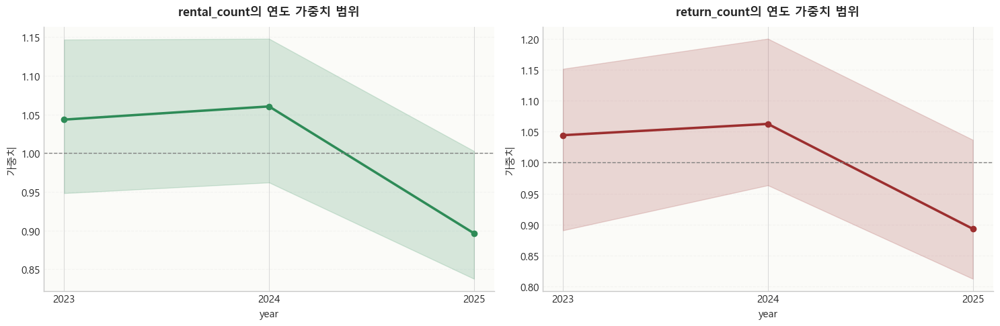
    


<div>
<style scoped>
    .dataframe tbody tr th:only-of-type {
        vertical-align: middle;
    }


</style>
<table border="1" class="dataframe">
  <thead>
    <tr style="text-align: right;">
      <th></th>
      <th>target</th>
      <th>year</th>
      <th>mean_weight</th>
      <th>min_weight</th>
      <th>max_weight</th>
    </tr>
  </thead>
  <tbody>
    <tr>
      <th>0</th>
      <td>rental_count</td>
      <td>2023</td>
      <td>1.0433</td>
      <td>0.9481</td>
      <td>1.1468</td>
    </tr>
    <tr>
      <th>1</th>
      <td>rental_count</td>
      <td>2024</td>
      <td>1.0604</td>
      <td>0.9620</td>
      <td>1.1479</td>
    </tr>
    <tr>
      <th>2</th>
      <td>rental_count</td>
      <td>2025</td>
      <td>0.8963</td>
      <td>0.8374</td>
      <td>1.0027</td>
    </tr>
    <tr>
      <th>3</th>
      <td>return_count</td>
      <td>2023</td>
      <td>1.0442</td>
      <td>0.8908</td>
      <td>1.1512</td>
    </tr>
    <tr>
      <th>4</th>
      <td>return_count</td>
      <td>2024</td>
      <td>1.0624</td>
      <td>0.9635</td>
      <td>1.1998</td>
    </tr>
    <tr>
      <th>5</th>
      <td>return_count</td>
      <td>2025</td>
      <td>0.8933</td>
      <td>0.8127</td>
      <td>1.0368</td>
    </tr>
  </tbody>
</table>
</div>


```python
hour_weight_df = weight_all_df[weight_all_df['weight_type'] == 'hour_weight'].copy()
hour_weight_summary_df = (
    hour_weight_df.groupby(['target', 'key'], as_index=False)
    .agg(
        mean_weight=('value', 'mean'),
        min_weight=('value', 'min'),
        max_weight=('value', 'max'),
    )
    .rename(columns={'key': 'hour'})
)

fig, axes = plt.subplots(1, 2, figsize=(16, 5), sharex=True)
for ax, target in zip(axes, TARGETS):
    sub = hour_weight_summary_df[hour_weight_summary_df['target'] == target].copy().sort_values('hour')
    color = '#6b4c9a' if target == 'rental_count' else '#d97a04'
    ax.plot(sub['hour'], sub['mean_weight'], marker='o', markersize=4, linewidth=2.0, color=color)
    ax.fill_between(sub['hour'], sub['min_weight'], sub['max_weight'], alpha=0.15, color=color)
    ax.axhline(1.0, color='gray', linestyle='--', linewidth=1)
    format_axis(ax, f'{target}???쒓컙 媛€以묒튂 踰붿쐞', 'hour', '媛€以묒튂', grid_axis='y')
    ax.xaxis.set_major_locator(MaxNLocator(integer=True))
plt.tight_layout()
plt.show()

hour_weight_summary_df.round(4)

```


    

    


<div>
<style scoped>
    .dataframe tbody tr th:only-of-type {
        vertical-align: middle;
    }


</style>
<table border="1" class="dataframe">
  <thead>
    <tr style="text-align: right;">
      <th></th>
      <th>target</th>
      <th>hour</th>
      <th>mean_weight</th>
      <th>min_weight</th>
      <th>max_weight</th>
    </tr>
  </thead>
  <tbody>
    <tr>
      <th>0</th>
      <td>rental_count</td>
      <td>0</td>
      <td>0.7618</td>
      <td>0.4597</td>
      <td>1.0066</td>
    </tr>
    <tr>
      <th>1</th>
      <td>rental_count</td>
      <td>1</td>
      <td>0.7754</td>
      <td>0.3908</td>
      <td>1.3749</td>
    </tr>
    <tr>
      <th>2</th>
      <td>rental_count</td>
      <td>2</td>
      <td>0.6658</td>
      <td>0.2837</td>
      <td>1.4010</td>
    </tr>
    <tr>
      <th>3</th>
      <td>rental_count</td>
      <td>3</td>
      <td>0.6654</td>
      <td>0.2159</td>
      <td>1.6051</td>
    </tr>
    <tr>
      <th>4</th>
      <td>rental_count</td>
      <td>4</td>
      <td>0.6021</td>
      <td>0.1578</td>
      <td>2.1961</td>
    </tr>
    <tr>
      <th>5</th>
      <td>rental_count</td>
      <td>5</td>
      <td>0.5091</td>
      <td>0.1527</td>
      <td>1.4160</td>
    </tr>
    <tr>
      <th>6</th>
      <td>rental_count</td>
      <td>6</td>
      <td>0.9217</td>
      <td>0.4774</td>
      <td>1.4738</td>
    </tr>
    <tr>
      <th>7</th>
      <td>rental_count</td>
      <td>7</td>
      <td>1.8615</td>
      <td>0.8844</td>
      <td>4.3942</td>
    </tr>
    <tr>
      <th>8</th>
      <td>rental_count</td>
      <td>8</td>
      <td>2.4723</td>
      <td>1.1380</td>
      <td>4.4294</td>
    </tr>
    <tr>
      <th>9</th>
      <td>rental_count</td>
      <td>9</td>
      <td>1.3050</td>
      <td>0.8080</td>
      <td>1.9297</td>
    </tr>
    <tr>
      <th>10</th>
      <td>rental_count</td>
      <td>10</td>
      <td>0.8886</td>
      <td>0.5948</td>
      <td>1.1110</td>
    </tr>
    <tr>
      <th>11</th>
      <td>rental_count</td>
      <td>11</td>
      <td>0.8706</td>
      <td>0.6911</td>
      <td>1.2155</td>
    </tr>
    <tr>
      <th>12</th>
      <td>rental_count</td>
      <td>12</td>
      <td>0.8969</td>
      <td>0.7222</td>
      <td>1.2339</td>
    </tr>
    <tr>
      <th>13</th>
      <td>rental_count</td>
      <td>13</td>
      <td>0.7738</td>
      <td>0.6686</td>
      <td>0.9209</td>
    </tr>
    <tr>
      <th>14</th>
      <td>rental_count</td>
      <td>14</td>
      <td>0.7417</td>
      <td>0.5981</td>
      <td>0.8281</td>
    </tr>
    <tr>
      <th>15</th>
      <td>rental_count</td>
      <td>15</td>
      <td>0.7855</td>
      <td>0.6392</td>
      <td>0.9516</td>
    </tr>
    <tr>
      <th>16</th>
      <td>rental_count</td>
      <td>16</td>
      <td>0.8902</td>
      <td>0.7366</td>
      <td>1.0844</td>
    </tr>
    <tr>
      <th>17</th>
      <td>rental_count</td>
      <td>17</td>
      <td>1.1869</td>
      <td>0.7994</td>
      <td>1.7445</td>
    </tr>
    <tr>
      <th>18</th>
      <td>rental_count</td>
      <td>18</td>
      <td>1.4325</td>
      <td>0.8294</td>
      <td>2.0593</td>
    </tr>
    <tr>
      <th>19</th>
      <td>rental_count</td>
      <td>19</td>
      <td>1.1388</td>
      <td>0.7534</td>
      <td>1.5267</td>
    </tr>
    <tr>
      <th>20</th>
      <td>rental_count</td>
      <td>20</td>
      <td>0.9688</td>
      <td>0.6919</td>
      <td>1.1490</td>
    </tr>
    <tr>
      <th>21</th>
      <td>rental_count</td>
      <td>21</td>
      <td>1.0595</td>
      <td>0.6989</td>
      <td>1.4856</td>
    </tr>
    <tr>
      <th>22</th>
      <td>rental_count</td>
      <td>22</td>
      <td>1.0658</td>
      <td>0.6410</td>
      <td>1.6188</td>
    </tr>
    <tr>
      <th>23</th>
      <td>rental_count</td>
      <td>23</td>
      <td>0.7602</td>
      <td>0.4874</td>
      <td>0.9845</td>
    </tr>
    <tr>
      <th>24</th>
      <td>return_count</td>
      <td>0</td>
      <td>0.7325</td>
      <td>0.2697</td>
      <td>1.0589</td>
    </tr>
    <tr>
      <th>25</th>
      <td>return_count</td>
      <td>1</td>
      <td>0.8403</td>
      <td>0.2358</td>
      <td>1.9414</td>
    </tr>
    <tr>
      <th>26</th>
      <td>return_count</td>
      <td>2</td>
      <td>0.7365</td>
      <td>0.2314</td>
      <td>2.0120</td>
    </tr>
    <tr>
      <th>27</th>
      <td>return_count</td>
      <td>3</td>
      <td>0.6684</td>
      <td>0.1840</td>
      <td>2.2980</td>
    </tr>
    <tr>
      <th>28</th>
      <td>return_count</td>
      <td>4</td>
      <td>0.5579</td>
      <td>0.1009</td>
      <td>1.3986</td>
    </tr>
    <tr>
      <th>29</th>
      <td>return_count</td>
      <td>5</td>
      <td>0.5911</td>
      <td>0.0654</td>
      <td>1.5538</td>
    </tr>
    <tr>
      <th>30</th>
      <td>return_count</td>
      <td>6</td>
      <td>1.0726</td>
      <td>0.3165</td>
      <td>4.0886</td>
    </tr>
    <tr>
      <th>31</th>
      <td>return_count</td>
      <td>7</td>
      <td>2.0133</td>
      <td>0.7505</td>
      <td>5.0036</td>
    </tr>
    <tr>
      <th>32</th>
      <td>return_count</td>
      <td>8</td>
      <td>2.2594</td>
      <td>1.3075</td>
      <td>3.9093</td>
    </tr>
    <tr>
      <th>33</th>
      <td>return_count</td>
      <td>9</td>
      <td>1.3048</td>
      <td>0.8861</td>
      <td>1.9913</td>
    </tr>
    <tr>
      <th>34</th>
      <td>return_count</td>
      <td>10</td>
      <td>0.9019</td>
      <td>0.4639</td>
      <td>1.2451</td>
    </tr>
    <tr>
      <th>35</th>
      <td>return_count</td>
      <td>11</td>
      <td>0.7974</td>
      <td>0.3504</td>
      <td>1.1265</td>
    </tr>
    <tr>
      <th>36</th>
      <td>return_count</td>
      <td>12</td>
      <td>0.8461</td>
      <td>0.4215</td>
      <td>1.1141</td>
    </tr>
    <tr>
      <th>37</th>
      <td>return_count</td>
      <td>13</td>
      <td>0.7570</td>
      <td>0.3524</td>
      <td>0.9645</td>
    </tr>
    <tr>
      <th>38</th>
      <td>return_count</td>
      <td>14</td>
      <td>0.6529</td>
      <td>0.3290</td>
      <td>0.8334</td>
    </tr>
    <tr>
      <th>39</th>
      <td>return_count</td>
      <td>15</td>
      <td>0.7038</td>
      <td>0.3575</td>
      <td>0.9158</td>
    </tr>
    <tr>
      <th>40</th>
      <td>return_count</td>
      <td>16</td>
      <td>0.8241</td>
      <td>0.4350</td>
      <td>1.0645</td>
    </tr>
    <tr>
      <th>41</th>
      <td>return_count</td>
      <td>17</td>
      <td>1.1543</td>
      <td>0.5142</td>
      <td>1.6351</td>
    </tr>
    <tr>
      <th>42</th>
      <td>return_count</td>
      <td>18</td>
      <td>1.4185</td>
      <td>0.8099</td>
      <td>2.2657</td>
    </tr>
    <tr>
      <th>43</th>
      <td>return_count</td>
      <td>19</td>
      <td>1.0664</td>
      <td>0.6876</td>
      <td>1.5140</td>
    </tr>
    <tr>
      <th>44</th>
      <td>return_count</td>
      <td>20</td>
      <td>0.9427</td>
      <td>0.5689</td>
      <td>1.4156</td>
    </tr>
    <tr>
      <th>45</th>
      <td>return_count</td>
      <td>21</td>
      <td>1.0971</td>
      <td>0.6163</td>
      <td>2.8447</td>
    </tr>
    <tr>
      <th>46</th>
      <td>return_count</td>
      <td>22</td>
      <td>1.2845</td>
      <td>0.4705</td>
      <td>6.2958</td>
    </tr>
    <tr>
      <th>47</th>
      <td>return_count</td>
      <td>23</td>
      <td>0.7764</td>
      <td>0.3348</td>
      <td>2.3591</td>
    </tr>
  </tbody>
</table>
</div>

## ?⑦꽩 湲곕컲 Feature ?ъ쟾

?꾨옒 ?쒕뒗 ?⑦꽩 湲곕컲 feature ?앹꽦 ?④퀎?먯꽌 留뚮뱾?댁졇 Ridge 紐⑤뜽???ъ슜??二쇱슂 feature瑜??뺣━???댁슜?낅땲??
(湲곗? ?뚯씪: `hmw3/Data/station_*_offday_month_ridge_coefficients.csv`)

| Feature | ?앹꽦 諛⑹떇 | ?섎? | 紐⑤뜽?먯꽌????븷 |
| --- | --- | --- | --- |
| `base_value` | `day_type`(weekday/offday)蹂??쒓컙 ?됯퇏???ъ씤/肄붿궗???뚭?濡?洹쇱궗 | ?붿씪?좏삎蹂?湲곕낯 ?쒓컙 ?⑦꽩 | ?덉륫??湲곕낯 怨④꺽 |
| `month_weight` | ?붾퀎 ?됯퇏 ?섏???湲곗? ?⑦꽩 ?€鍮?鍮꾩쑉濡?怨꾩궛 | ??怨꾩젅 ?⑥쐞 洹쒕え 李⑥씠 | ???⑥쐞 ?덈꺼 蹂댁젙 |
| `year_weight` | ?곕룄蹂??됯퇏 ?섏???湲곗? ?⑦꽩 ?€鍮?鍮꾩쑉濡?怨꾩궛 | ?곕룄蹂??섏슂 ?섏? ?대룞 | ?곕룄 ?꾪솚 蹂댁젙 |
| `hour_weight` | 諛섎났?곸쑝濡?諛쒖깮???쒓컙?€ ?ㅼ감瑜?鍮꾩쑉濡?蹂댁젙 | ?몃? ?쒓컙?€ ?몄감 | ?쇳겕/鍮꾪뵾??蹂댁젙 |
| `pattern_prior` | `base_value * month_weight * year_weight` | ?⑦꽩 湲곕컲 1李??ъ쟾 ?덉륫媛?| Ridge ?낅젰???듭떖 prior |
| `corrected_pattern_prior` | `pattern_prior * hour_weight` | ?쒓컙?€ 蹂댁젙源뚯? 諛섏쁺???ъ쟾媛?| Ridge媛€ 吏곸젒 李몄“?섎뒗 蹂댁젙 prior |
| `day_type_weekday` | ?됱씪 ?붾? 蹂€??0/1) | ?됱씪 援ш컙 ?쒖떆 | ?됱씪 ?④낵 蹂댁젙 |
| `day_type_offday` | 鍮꾧렐臾댁씪(二쇰쭚+怨듯쑕?? ?붾? 蹂€??0/1) | 鍮꾧렐臾댁씪 援ш컙 ?쒖떆 | 鍮꾧렐臾댁씪 ?④낵 蹂댁젙 |
| `intercept` | Ridge ?덊렪 ??| ?ㅻⅨ feature濡??ㅻ챸?섏? ?딅뒗 湲곗???| ?붿뿬 ?됯퇏 ?섏? ?≪닔 |

異붽? 硫붾え:
- 理쒖쥌 ?덉륫 異쒕젰?€ `prediction`?대ʼn, 以묎컙媛믪쑝濡?`raw_prediction`???④퍡 ?€?λ맗?덈떎.
- ??feature?ㅼ? ?곸쐞 20媛?station 怨꾩닔 ?뚯씪?먯꽌 怨듯넻?쇰줈 ?뺤씤?⑸땲??

## 6. 紐⑤뜽 ?좎젙 ?댁쑀

?대쾲 遺꾩꽍?먯꽌??`pattern feature + Ridge ?뚭?` 援ъ“瑜??좏깮?덉뒿?덈떎. ?좎젙 ?댁쑀???ㅼ쓬怨?媛숈뒿?덈떎.

1. **?댁꽍 媛€?μ꽦**: ?€??諛섎궔?됱씠 ?대뼡 ?쒓컙 ?⑦꽩怨?媛€以묒튂???섑빐 ?ㅻ챸?섎뒗吏€ 鍮꾧탳??紐낇솗?섍쾶 蹂????덉뒿?덈떎.
2. **?곗씠??洹쒕え ?곹빀??*: station蹂꾨줈 ?곗씠?곕? ?섎늻???숈뒿???? 吏€?섏튂寃?蹂듭옟??紐⑤뜽蹂대떎 ?덉젙?곸쑝濡??숈뒿?⑸땲??
3. **怨쇱쟻???쒖뼱**: Ridge??`alpha`瑜??듯빐 feature 怨꾩닔瑜?議곗젅?????덉뼱 station蹂?蹂€?숈뿉 怨쇳븯寃?留욎텛??寃껋쓣 以꾩씪 ???덉뒿?덈떎.
4. **?꾩옱 紐⑹쟻怨쇱쓽 ?곹빀??*: ?대쾲 ?④퀎???듭떖?€ `rental_count`, `return_count`瑜??덉륫?섍퀬 station 媛??⑦꽩??鍮꾧탳?섎뒗 寃껋씠誘€濡? 怨좎꽦??釉붾옓諛뺤뒪 紐⑤뜽蹂대떎 援ъ“媛€ ?⑥닚?섍퀬 鍮꾧탳媛€ ?ъ슫 紐⑤뜽?????곸젅?덉뒿?덈떎.

利? ?대쾲 紐⑤뜽?€ 理쒓퀬 蹂듭옟?꾩쓽 ?덉륫湲곕씪湲곕낫?? **?쒓컙 ?⑦꽩??蹂댁〈?섎㈃??station蹂?李⑥씠瑜??댁꽍 媛€?ν븯寃?鍮꾧탳?섍린 ?꾪븳 湲곗? 紐⑤뜽**濡??좏깮??寃껋엯?덈떎.

## 7. Ridge ?쒕떇怨??됯?

station蹂? target蹂꾨줈 train 援ш컙?먯꽌 ?⑦꽩 援ъ“瑜??숈뒿?섍퀬 valid 援ш컙?먯꽌 Ridge alpha瑜?怨좊Ⅸ ?? 媛숈? ?ㅼ젙??2025 test 援ш컙???곸슜??理쒖쥌 ?깅뒫???됯??⑸땲??


```python
best_alpha_df = (
    tuning_all_df.sort_values(['station_id', 'target', 'rmse'])
    .groupby(['station_id', 'target'], as_index=False)
    .first()
)
display(best_alpha_df[['station_id', 'target', 'alpha', 'rmse', 'mae', 'r2']].round(4))

alpha_dist_df = (
    best_alpha_df.groupby(['target', 'alpha'], as_index=False)
    .size()
    .rename(columns={'size': 'station_count'})
)
alpha_dist_df

```


<div>
<style scoped>
    .dataframe tbody tr th:only-of-type {
        vertical-align: middle;
    }


</style>
<table border="1" class="dataframe">
  <thead>
    <tr style="text-align: right;">
      <th></th>
      <th>station_id</th>
      <th>target</th>
      <th>alpha</th>
      <th>rmse</th>
      <th>mae</th>
      <th>r2</th>
    </tr>
  </thead>
  <tbody>
    <tr>
      <th>0</th>
      <td>2306</td>
      <td>rental_count</td>
      <td>100.0000</td>
      <td>1.6549</td>
      <td>1.1608</td>
      <td>0.3770</td>
    </tr>
    <tr>
      <th>1</th>
      <td>2306</td>
      <td>return_count</td>
      <td>0.0010</td>
      <td>1.7203</td>
      <td>1.1495</td>
      <td>0.5577</td>
    </tr>
    <tr>
      <th>2</th>
      <td>2332</td>
      <td>rental_count</td>
      <td>10.0000</td>
      <td>1.5037</td>
      <td>1.1007</td>
      <td>0.3987</td>
    </tr>
    <tr>
      <th>3</th>
      <td>2332</td>
      <td>return_count</td>
      <td>0.0010</td>
      <td>1.6331</td>
      <td>1.1735</td>
      <td>0.4680</td>
    </tr>
    <tr>
      <th>4</th>
      <td>2335</td>
      <td>rental_count</td>
      <td>0.0010</td>
      <td>1.8079</td>
      <td>1.2319</td>
      <td>0.5365</td>
    </tr>
    <tr>
      <th>5</th>
      <td>2335</td>
      <td>return_count</td>
      <td>10.0000</td>
      <td>1.8421</td>
      <td>1.2838</td>
      <td>0.5397</td>
    </tr>
    <tr>
      <th>6</th>
      <td>2340</td>
      <td>rental_count</td>
      <td>0.0010</td>
      <td>1.7013</td>
      <td>1.2041</td>
      <td>0.3970</td>
    </tr>
    <tr>
      <th>7</th>
      <td>2340</td>
      <td>return_count</td>
      <td>100.0000</td>
      <td>1.7442</td>
      <td>1.2557</td>
      <td>0.4382</td>
    </tr>
    <tr>
      <th>8</th>
      <td>2342</td>
      <td>rental_count</td>
      <td>0.0010</td>
      <td>1.4614</td>
      <td>1.0430</td>
      <td>0.3825</td>
    </tr>
    <tr>
      <th>9</th>
      <td>2342</td>
      <td>return_count</td>
      <td>10.0000</td>
      <td>1.4859</td>
      <td>1.0689</td>
      <td>0.3749</td>
    </tr>
    <tr>
      <th>10</th>
      <td>2348</td>
      <td>rental_count</td>
      <td>100.0000</td>
      <td>1.9730</td>
      <td>1.1890</td>
      <td>0.6640</td>
    </tr>
    <tr>
      <th>11</th>
      <td>2348</td>
      <td>return_count</td>
      <td>100.0000</td>
      <td>2.4764</td>
      <td>1.5107</td>
      <td>0.6702</td>
    </tr>
    <tr>
      <th>12</th>
      <td>2369</td>
      <td>rental_count</td>
      <td>1,000.0000</td>
      <td>1.3839</td>
      <td>1.0164</td>
      <td>0.3340</td>
    </tr>
    <tr>
      <th>13</th>
      <td>2369</td>
      <td>return_count</td>
      <td>100.0000</td>
      <td>1.4550</td>
      <td>1.0791</td>
      <td>0.3493</td>
    </tr>
    <tr>
      <th>14</th>
      <td>2375</td>
      <td>rental_count</td>
      <td>0.0010</td>
      <td>1.5100</td>
      <td>1.0333</td>
      <td>0.4757</td>
    </tr>
    <tr>
      <th>15</th>
      <td>2375</td>
      <td>return_count</td>
      <td>10.0000</td>
      <td>1.6136</td>
      <td>1.1552</td>
      <td>0.4751</td>
    </tr>
    <tr>
      <th>16</th>
      <td>2377</td>
      <td>rental_count</td>
      <td>0.0010</td>
      <td>1.8682</td>
      <td>1.2470</td>
      <td>0.4517</td>
    </tr>
    <tr>
      <th>17</th>
      <td>2377</td>
      <td>return_count</td>
      <td>0.0010</td>
      <td>2.0871</td>
      <td>1.4491</td>
      <td>0.5775</td>
    </tr>
    <tr>
      <th>18</th>
      <td>2384</td>
      <td>rental_count</td>
      <td>0.0010</td>
      <td>1.7618</td>
      <td>1.2286</td>
      <td>0.4878</td>
    </tr>
    <tr>
      <th>19</th>
      <td>2384</td>
      <td>return_count</td>
      <td>100.0000</td>
      <td>1.8967</td>
      <td>1.3663</td>
      <td>0.4490</td>
    </tr>
    <tr>
      <th>20</th>
      <td>2404</td>
      <td>rental_count</td>
      <td>0.0010</td>
      <td>1.7770</td>
      <td>1.2710</td>
      <td>0.3724</td>
    </tr>
    <tr>
      <th>21</th>
      <td>2404</td>
      <td>return_count</td>
      <td>100.0000</td>
      <td>1.7297</td>
      <td>1.2399</td>
      <td>0.4062</td>
    </tr>
    <tr>
      <th>22</th>
      <td>2413</td>
      <td>rental_count</td>
      <td>1.0000</td>
      <td>1.4437</td>
      <td>1.0049</td>
      <td>0.3340</td>
    </tr>
    <tr>
      <th>23</th>
      <td>2413</td>
      <td>return_count</td>
      <td>1,000.0000</td>
      <td>1.4805</td>
      <td>1.0658</td>
      <td>0.2880</td>
    </tr>
    <tr>
      <th>24</th>
      <td>2414</td>
      <td>rental_count</td>
      <td>0.0010</td>
      <td>1.5952</td>
      <td>1.1226</td>
      <td>0.3968</td>
    </tr>
    <tr>
      <th>25</th>
      <td>2414</td>
      <td>return_count</td>
      <td>0.0010</td>
      <td>1.6172</td>
      <td>1.1649</td>
      <td>0.4769</td>
    </tr>
    <tr>
      <th>26</th>
      <td>2415</td>
      <td>rental_count</td>
      <td>0.0010</td>
      <td>1.2202</td>
      <td>0.8821</td>
      <td>0.3092</td>
    </tr>
    <tr>
      <th>27</th>
      <td>2415</td>
      <td>return_count</td>
      <td>10.0000</td>
      <td>1.2385</td>
      <td>0.8838</td>
      <td>0.3489</td>
    </tr>
    <tr>
      <th>28</th>
      <td>2423</td>
      <td>rental_count</td>
      <td>1,000.0000</td>
      <td>1.5404</td>
      <td>1.1484</td>
      <td>0.2647</td>
    </tr>
    <tr>
      <th>29</th>
      <td>2423</td>
      <td>return_count</td>
      <td>1,000.0000</td>
      <td>1.5531</td>
      <td>1.1344</td>
      <td>0.3743</td>
    </tr>
    <tr>
      <th>30</th>
      <td>2431</td>
      <td>rental_count</td>
      <td>1,000.0000</td>
      <td>1.5384</td>
      <td>1.1208</td>
      <td>0.3477</td>
    </tr>
    <tr>
      <th>31</th>
      <td>2431</td>
      <td>return_count</td>
      <td>100.0000</td>
      <td>1.6052</td>
      <td>1.1773</td>
      <td>0.3664</td>
    </tr>
    <tr>
      <th>32</th>
      <td>3614</td>
      <td>rental_count</td>
      <td>1,000.0000</td>
      <td>1.4787</td>
      <td>1.0842</td>
      <td>0.3189</td>
    </tr>
    <tr>
      <th>33</th>
      <td>3614</td>
      <td>return_count</td>
      <td>1,000.0000</td>
      <td>1.4738</td>
      <td>1.0786</td>
      <td>0.3227</td>
    </tr>
    <tr>
      <th>34</th>
      <td>3627</td>
      <td>rental_count</td>
      <td>1,000.0000</td>
      <td>1.5207</td>
      <td>1.0118</td>
      <td>0.2749</td>
    </tr>
    <tr>
      <th>35</th>
      <td>3627</td>
      <td>return_count</td>
      <td>100.0000</td>
      <td>1.6505</td>
      <td>1.0199</td>
      <td>0.3509</td>
    </tr>
    <tr>
      <th>36</th>
      <td>3651</td>
      <td>rental_count</td>
      <td>1.0000</td>
      <td>1.4080</td>
      <td>0.9851</td>
      <td>0.2749</td>
    </tr>
    <tr>
      <th>37</th>
      <td>3651</td>
      <td>return_count</td>
      <td>0.0010</td>
      <td>1.3873</td>
      <td>0.9154</td>
      <td>0.3757</td>
    </tr>
    <tr>
      <th>38</th>
      <td>4906</td>
      <td>rental_count</td>
      <td>0.0010</td>
      <td>1.5007</td>
      <td>0.9836</td>
      <td>0.4308</td>
    </tr>
    <tr>
      <th>39</th>
      <td>4906</td>
      <td>return_count</td>
      <td>0.0010</td>
      <td>1.5571</td>
      <td>1.1271</td>
      <td>0.4467</td>
    </tr>
  </tbody>
</table>
</div>


<div>
<style scoped>
    .dataframe tbody tr th:only-of-type {
        vertical-align: middle;
    }


</style>
<table border="1" class="dataframe">
  <thead>
    <tr style="text-align: right;">
      <th></th>
      <th>target</th>
      <th>alpha</th>
      <th>station_count</th>
    </tr>
  </thead>
  <tbody>
    <tr>
      <th>0</th>
      <td>rental_count</td>
      <td>0.0010</td>
      <td>10</td>
    </tr>
    <tr>
      <th>1</th>
      <td>rental_count</td>
      <td>1.0000</td>
      <td>2</td>
    </tr>
    <tr>
      <th>2</th>
      <td>rental_count</td>
      <td>10.0000</td>
      <td>1</td>
    </tr>
    <tr>
      <th>3</th>
      <td>rental_count</td>
      <td>100.0000</td>
      <td>2</td>
    </tr>
    <tr>
      <th>4</th>
      <td>rental_count</td>
      <td>1,000.0000</td>
      <td>5</td>
    </tr>
    <tr>
      <th>5</th>
      <td>return_count</td>
      <td>0.0010</td>
      <td>6</td>
    </tr>
    <tr>
      <th>6</th>
      <td>return_count</td>
      <td>10.0000</td>
      <td>4</td>
    </tr>
    <tr>
      <th>7</th>
      <td>return_count</td>
      <td>100.0000</td>
      <td>7</td>
    </tr>
    <tr>
      <th>8</th>
      <td>return_count</td>
      <td>1,000.0000</td>
      <td>3</td>
    </tr>
  </tbody>
</table>
</div>


```python
fig, axes = plt.subplots(1, 2, figsize=(15, 5))
for ax, target in zip(axes, TARGETS):
    sub = alpha_dist_df[alpha_dist_df['target'] == target].copy()
    sub['alpha_label'] = sub['alpha'].astype(str)
    sns.barplot(data=sub, x='alpha_label', y='station_count', ax=ax, color='#4C78A8')
    format_axis(ax, f'{target}???좏깮 alpha 遺꾪룷', 'alpha', 'station 媛쒖닔', grid_axis='y')
    annotate_bar(ax, fmt='{:.0f}', pad=0.04)
plt.tight_layout()
plt.show()

```


    
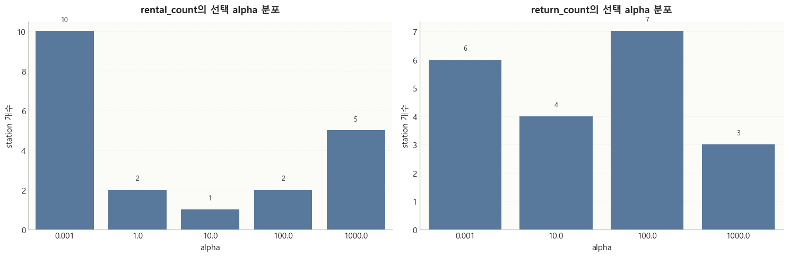
    


## 8. station蹂??깅뒫 鍮꾧탳

???덉뿉?쒕뒗 split蹂?RMSE, MAE, R^2瑜?鍮꾧탳?섍퀬, 留덉?留됱뿉????target??test R^2 ?됯퇏?쇰줈 ?듯빀 ??궧??留뚮벊?덈떎.


```python
metric_summary_df = (
    metrics_df.groupby(['target', 'split'], as_index=False)
    .agg(
        rmse_mean=('rmse', 'mean'),
        mae_mean=('mae', 'mean'),
        r2_mean=('r2', 'mean'),
        r2_min=('r2', 'min'),
        r2_max=('r2', 'max'),
    )
)
metric_summary_df['split'] = pd.Categorical(metric_summary_df['split'], categories=SPLIT_ORDER, ordered=True)
metric_summary_df.sort_values(['target', 'split']).round(4)

```


<div>
<style scoped>
    .dataframe tbody tr th:only-of-type {
        vertical-align: middle;
    }


</style>
<table border="1" class="dataframe">
  <thead>
    <tr style="text-align: right;">
      <th></th>
      <th>target</th>
      <th>split</th>
      <th>rmse_mean</th>
      <th>mae_mean</th>
      <th>r2_mean</th>
      <th>r2_min</th>
      <th>r2_max</th>
    </tr>
  </thead>
  <tbody>
    <tr>
      <th>1</th>
      <td>bike_change_from_predictions</td>
      <td>train</td>
      <td>1.7775</td>
      <td>1.2166</td>
      <td>0.1616</td>
      <td>0.0058</td>
      <td>0.6130</td>
    </tr>
    <tr>
      <th>2</th>
      <td>bike_change_from_predictions</td>
      <td>valid</td>
      <td>1.8212</td>
      <td>1.2502</td>
      <td>0.1826</td>
      <td>-0.0660</td>
      <td>0.6550</td>
    </tr>
    <tr>
      <th>0</th>
      <td>bike_change_from_predictions</td>
      <td>test</td>
      <td>1.7200</td>
      <td>1.1706</td>
      <td>0.1551</td>
      <td>-0.0790</td>
      <td>0.6229</td>
    </tr>
    <tr>
      <th>4</th>
      <td>rental_count</td>
      <td>train</td>
      <td>1.6138</td>
      <td>1.1194</td>
      <td>0.3754</td>
      <td>0.2786</td>
      <td>0.5636</td>
    </tr>
    <tr>
      <th>5</th>
      <td>rental_count</td>
      <td>valid</td>
      <td>1.5825</td>
      <td>1.1035</td>
      <td>0.3915</td>
      <td>0.2647</td>
      <td>0.6640</td>
    </tr>
    <tr>
      <th>3</th>
      <td>rental_count</td>
      <td>test</td>
      <td>1.4124</td>
      <td>0.9889</td>
      <td>0.3498</td>
      <td>0.2040</td>
      <td>0.5848</td>
    </tr>
    <tr>
      <th>7</th>
      <td>return_count</td>
      <td>train</td>
      <td>1.6911</td>
      <td>1.1722</td>
      <td>0.4206</td>
      <td>0.3100</td>
      <td>0.6408</td>
    </tr>
    <tr>
      <th>8</th>
      <td>return_count</td>
      <td>valid</td>
      <td>1.6624</td>
      <td>1.1649</td>
      <td>0.4328</td>
      <td>0.2880</td>
      <td>0.6702</td>
    </tr>
    <tr>
      <th>6</th>
      <td>return_count</td>
      <td>test</td>
      <td>1.5161</td>
      <td>1.0562</td>
      <td>0.3781</td>
      <td>0.2191</td>
      <td>0.6441</td>
    </tr>
  </tbody>
</table>
</div>


```python
for target in TARGETS:
    view = metrics_df[metrics_df['target'] == target].copy()
    pivot_r2 = view.pivot(index='station_id', columns='split', values='r2').reindex(TOP20_STATIONS)
    pivot_rmse = view.pivot(index='station_id', columns='split', values='rmse').reindex(TOP20_STATIONS)
    fig, axes = plt.subplots(1, 2, figsize=(18, 6))
    pivot_r2[SPLIT_ORDER].plot(kind='bar', ax=axes[0], color=['#1f4e79', '#6b4c9a', '#2e8b57'], width=0.82)
    format_axis(axes[0], f'{target}??split蹂?R^2', 'station_id', 'R^2', grid_axis='y')
    axes[0].tick_params(axis='x', rotation=45)
    axes[0].legend(title='split', frameon=True, loc='upper right')
    pivot_rmse[SPLIT_ORDER].plot(kind='bar', ax=axes[1], color=['#1f4e79', '#6b4c9a', '#d97a04'], width=0.82)
    format_axis(axes[1], f'{target}??split蹂?RMSE', 'station_id', 'RMSE', grid_axis='y')
    axes[1].tick_params(axis='x', rotation=45)
    axes[1].legend(title='split', frameon=True, loc='upper right')
    plt.tight_layout()
    plt.show()

```


    

    


    
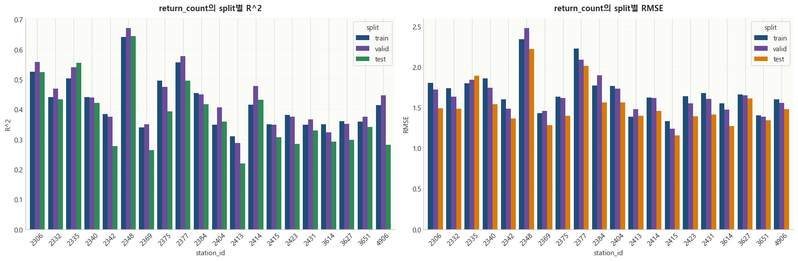
    


```python
test_metric_df = metrics_df[(metrics_df['split'] == 'test') & (metrics_df['target'].isin(TARGETS))].copy()
r2_df = (
    test_metric_df.pivot_table(index='station_id', columns='target', values='r2', aggfunc='mean')
    .reset_index()
)
rmse_df = (
    test_metric_df.pivot_table(index='station_id', columns='target', values='rmse', aggfunc='mean')
    .reset_index()
    .rename(columns={'rental_count': 'rental_rmse', 'return_count': 'return_rmse'})
)
mae_df = (
    test_metric_df.pivot_table(index='station_id', columns='target', values='mae', aggfunc='mean')
    .reset_index()
    .rename(columns={'rental_count': 'rental_mae', 'return_count': 'return_mae'})
)
ranking_df = r2_df.merge(rmse_df, on='station_id').merge(mae_df, on='station_id')
ranking_df['combined_test_r2'] = ranking_df[['rental_count', 'return_count']].mean(axis=1)
ranking_df['combined_test_rmse'] = ranking_df[['rental_rmse', 'return_rmse']].mean(axis=1)
ranking_df['combined_test_mae'] = ranking_df[['rental_mae', 'return_mae']].mean(axis=1)
ranking_df = ranking_df.sort_values('combined_test_r2', ascending=False).reset_index(drop=True)
ranking_df = ranking_df.merge(station_meta_df[['station_id', 'station_name', 'station_label', 'latitude', 'longitude']], on='station_id', how='left')
ranking_df.index = ranking_df.index + 1
ranking_df.to_csv(DATA_DIR / 'top20_station_combined_test_r2_ranking.csv', index_label='rank', encoding='utf-8-sig')
ranking_df

```


<div>
<style scoped>
    .dataframe tbody tr th:only-of-type {
        vertical-align: middle;
    }


</style>
<table border="1" class="dataframe">
  <thead>
    <tr style="text-align: right;">
      <th></th>
      <th>station_id</th>
      <th>rental_count</th>
      <th>return_count</th>
      <th>rental_rmse</th>
      <th>return_rmse</th>
      <th>rental_mae</th>
      <th>return_mae</th>
      <th>combined_test_r2</th>
      <th>combined_test_rmse</th>
      <th>combined_test_mae</th>
      <th>station_name</th>
      <th>station_label</th>
      <th>latitude</th>
      <th>longitude</th>
    </tr>
  </thead>
  <tbody>
    <tr>
      <th>1</th>
      <td>2348</td>
      <td>0.5848</td>
      <td>0.6441</td>
      <td>1.7215</td>
      <td>2.2219</td>
      <td>1.0214</td>
      <td>1.2797</td>
      <td>0.6144</td>
      <td>1.9717</td>
      <td>1.1505</td>
      <td>?ъ뒪肄붿궗嫄곕━(湲곗뾽?€??</td>
      <td>2348 |  ?ъ뒪肄붿궗嫄곕━(湲곗뾽?€??</td>
      <td>37.5072</td>
      <td>127.0569</td>
    </tr>
    <tr>
      <th>2</th>
      <td>2335</td>
      <td>0.5367</td>
      <td>0.5552</td>
      <td>1.7196</td>
      <td>1.8927</td>
      <td>1.1629</td>
      <td>1.2819</td>
      <td>0.5460</td>
      <td>1.8061</td>
      <td>1.2224</td>
      <td>3?몄꽑 留ㅻ큺??3踰덉텧援ъ븵</td>
      <td>2335 |  3?몄꽑 留ㅻ큺??3踰덉텧援ъ븵</td>
      <td>37.4868</td>
      <td>127.0468</td>
    </tr>
    <tr>
      <th>3</th>
      <td>2377</td>
      <td>0.4155</td>
      <td>0.4957</td>
      <td>1.8552</td>
      <td>2.0133</td>
      <td>1.2471</td>
      <td>1.4052</td>
      <td>0.4556</td>
      <td>1.9343</td>
      <td>1.3262</td>
      <td>?섏꽌??5踰덉텧援?/td>
      <td>2377 |  ?섏꽌??5踰덉텧援?/td>
      <td>37.4874</td>
      <td>127.1023</td>
    </tr>
    <tr>
      <th>4</th>
      <td>2384</td>
      <td>0.4551</td>
      <td>0.4159</td>
      <td>1.4937</td>
      <td>1.5597</td>
      <td>1.0598</td>
      <td>1.0711</td>
      <td>0.4355</td>
      <td>1.5267</td>
      <td>1.0654</td>
      <td>?먭끝?ш굅由?/td>
      <td>2384 |  ?먭끝?ш굅由?/td>
      <td>37.4760</td>
      <td>127.1059</td>
    </tr>
    <tr>
      <th>5</th>
      <td>2306</td>
      <td>0.3398</td>
      <td>0.5235</td>
      <td>1.4563</td>
      <td>1.4913</td>
      <td>1.0125</td>
      <td>0.9917</td>
      <td>0.4316</td>
      <td>1.4738</td>
      <td>1.0021</td>
      <td>?뺢뎄?뺤뿭 2踰?異쒓뎄 ??/td>
      <td>2306 |  ?뺢뎄?뺤뿭 2踰?異쒓뎄 ??/td>
      <td>37.5271</td>
      <td>127.0287</td>
    </tr>
    <tr>
      <th>6</th>
      <td>2375</td>
      <td>0.4257</td>
      <td>0.3922</td>
      <td>1.3082</td>
      <td>1.3978</td>
      <td>0.8794</td>
      <td>1.0040</td>
      <td>0.4089</td>
      <td>1.3530</td>
      <td>0.9417</td>
      <td>?섏꽌??1踰덉텧援???/td>
      <td>2375 |  ?섏꽌??1踰덉텧援???/td>
      <td>37.4874</td>
      <td>127.1010</td>
    </tr>
    <tr>
      <th>7</th>
      <td>2332</td>
      <td>0.3764</td>
      <td>0.4328</td>
      <td>1.3788</td>
      <td>1.4866</td>
      <td>0.9867</td>
      <td>1.0716</td>
      <td>0.4046</td>
      <td>1.4327</td>
      <td>1.0291</td>
      <td>?좊쫱??踰덉텧援?/td>
      <td>2332 |  ?좊쫱??踰덉텧援?/td>
      <td>37.5040</td>
      <td>127.0491</td>
    </tr>
    <tr>
      <th>8</th>
      <td>2414</td>
      <td>0.3686</td>
      <td>0.4314</td>
      <td>1.3425</td>
      <td>1.4572</td>
      <td>0.9557</td>
      <td>1.0536</td>
      <td>0.4000</td>
      <td>1.3999</td>
      <td>1.0046</td>
      <td>?꾧끝???꾩뭅?곕??ㅼ쐞????/td>
      <td>2414 |  ?꾧끝???꾩뭅?곕??ㅼ쐞????/td>
      <td>37.4890</td>
      <td>127.0518</td>
    </tr>
    <tr>
      <th>9</th>
      <td>2340</td>
      <td>0.3758</td>
      <td>0.4206</td>
      <td>1.4763</td>
      <td>1.5403</td>
      <td>1.0656</td>
      <td>1.1221</td>
      <td>0.3982</td>
      <td>1.5083</td>
      <td>1.0938</td>
      <td>?쇳샇臾쇱궛踰꾩뒪?뺣쪟??23370) ??/td>
      <td>2340 |  ?쇳샇臾쇱궛踰꾩뒪?뺣쪟??23370)??/td>
      <td>37.4775</td>
      <td>127.0452</td>
    </tr>
    <tr>
      <th>10</th>
      <td>2404</td>
      <td>0.3231</td>
      <td>0.3581</td>
      <td>1.5816</td>
      <td>1.5613</td>
      <td>1.1360</td>
      <td>1.1262</td>
      <td>0.3406</td>
      <td>1.5715</td>
      <td>1.1311</td>
      <td>?€紐⑥궛?낃뎄??4踰?異쒓뎄 ??/td>
      <td>2404 |  ?€紐⑥궛?낃뎄??4踰?異쒓뎄 ??/td>
      <td>37.4918</td>
      <td>127.0732</td>
    </tr>
    <tr>
      <th>11</th>
      <td>2431</td>
      <td>0.3224</td>
      <td>0.3288</td>
      <td>1.3600</td>
      <td>1.4137</td>
      <td>0.9676</td>
      <td>1.0207</td>
      <td>0.3256</td>
      <td>1.3869</td>
      <td>0.9941</td>
      <td>?€移섏뿭 7踰덉텧援?/td>
      <td>2431 | ?€移섏뿭 7踰덉텧援?/td>
      <td>37.4941</td>
      <td>127.0629</td>
    </tr>
    <tr>
      <th>12</th>
      <td>2342</td>
      <td>0.3334</td>
      <td>0.2763</td>
      <td>1.3306</td>
      <td>1.3649</td>
      <td>0.9695</td>
      <td>1.0010</td>
      <td>0.3049</td>
      <td>1.3478</td>
      <td>0.9852</td>
      <td>?€泥?뿭 1踰덉텧援???/td>
      <td>2342 |  ?€泥?뿭 1踰덉텧援???/td>
      <td>37.4940</td>
      <td>127.0795</td>
    </tr>
    <tr>
      <th>13</th>
      <td>3651</td>
      <td>0.2482</td>
      <td>0.3405</td>
      <td>1.3180</td>
      <td>1.3431</td>
      <td>0.9407</td>
      <td>0.9320</td>
      <td>0.2944</td>
      <td>1.3306</td>
      <td>0.9364</td>
      <td>媛쒗룷?숈뿭 4踰덉텧援?/td>
      <td>3651 |  媛쒗룷?숈뿭 4踰덉텧援?/td>
      <td>37.4893</td>
      <td>127.0662</td>
    </tr>
    <tr>
      <th>14</th>
      <td>2415</td>
      <td>0.2778</td>
      <td>0.3063</td>
      <td>1.1268</td>
      <td>1.1562</td>
      <td>0.8235</td>
      <td>0.8275</td>
      <td>0.2921</td>
      <td>1.1415</td>
      <td>0.8255</td>
      <td>?쒗떚??濡?뜲諛깊솕????/td>
      <td>2415 | ?쒗떚??濡?뜲諛깊솕????/td>
      <td>37.4967</td>
      <td>127.0534</td>
    </tr>
    <tr>
      <th>15</th>
      <td>3627</td>
      <td>0.2823</td>
      <td>0.2985</td>
      <td>1.3922</td>
      <td>1.6093</td>
      <td>0.9285</td>
      <td>0.9389</td>
      <td>0.2904</td>
      <td>1.5007</td>
      <td>0.9337</td>
      <td>?뺢뎄?뺣굹?ㅻぉ</td>
      <td>3627 |  ?뺢뎄?뺣굹?ㅻぉ</td>
      <td>37.5308</td>
      <td>127.0416</td>
    </tr>
    <tr>
      <th>16</th>
      <td>4906</td>
      <td>0.2935</td>
      <td>0.2822</td>
      <td>1.3410</td>
      <td>1.4765</td>
      <td>0.9566</td>
      <td>1.1025</td>
      <td>0.2878</td>
      <td>1.4088</td>
      <td>1.0296</td>
      <td>?ъ쑀?쇳꽣 ??/td>
      <td>4906 |  ?ъ쑀?쇳꽣 ??/td>
      <td>37.5077</td>
      <td>127.0602</td>
    </tr>
    <tr>
      <th>17</th>
      <td>3614</td>
      <td>0.2736</td>
      <td>0.2915</td>
      <td>1.2710</td>
      <td>1.2699</td>
      <td>0.9280</td>
      <td>0.9234</td>
      <td>0.2825</td>
      <td>1.2705</td>
      <td>0.9257</td>
      <td>?€留덉븘?뚰듃 ?낃뎄 ?ш굅由?/td>
      <td>3614 |  ?€留덉븘?뚰듃 ?낃뎄 ?ш굅由?/td>
      <td>37.4984</td>
      <td>127.0609</td>
    </tr>
    <tr>
      <th>18</th>
      <td>2369</td>
      <td>0.2709</td>
      <td>0.2635</td>
      <td>1.1615</td>
      <td>1.2790</td>
      <td>0.8581</td>
      <td>0.9526</td>
      <td>0.2672</td>
      <td>1.2202</td>
      <td>0.9053</td>
      <td>KT?좊쫱?€??/td>
      <td>2369 |  KT?좊쫱?€??/td>
      <td>37.5054</td>
      <td>127.0529</td>
    </tr>
    <tr>
      <th>19</th>
      <td>2413</td>
      <td>0.2884</td>
      <td>0.2191</td>
      <td>1.3082</td>
      <td>1.3949</td>
      <td>0.9026</td>
      <td>0.9993</td>
      <td>0.2537</td>
      <td>1.3515</td>
      <td>0.9509</td>
      <td>?꾧끝??1踰?異쒓뎄</td>
      <td>2413 | ?꾧끝??1踰?異쒓뎄</td>
      <td>37.4910</td>
      <td>127.0550</td>
    </tr>
    <tr>
      <th>20</th>
      <td>2423</td>
      <td>0.2040</td>
      <td>0.2849</td>
      <td>1.3055</td>
      <td>1.3931</td>
      <td>0.9757</td>
      <td>1.0185</td>
      <td>0.2444</td>
      <td>1.3493</td>
      <td>0.9971</td>
      <td>?곹씗珥덇탳 ?ш굅由??섎??덇컻?щ（泥댄븯??</td>
      <td>2423 | ?곹씗珥덇탳 ?ш굅由??섎??덇컻?щ（泥댄븯??/td>
      <td>37.4908</td>
      <td>127.0807</td>
    </tr>
  </tbody>
</table>
</div>


```python
plot_df = ranking_df.reset_index().rename(columns={'index': 'rank'})
fig, axes = plt.subplots(1, 3, figsize=(22, 8), sharey=True)
sns.barplot(data=plot_df, x='combined_test_r2', y='station_label', ax=axes[0], color='#4C78A8')
format_axis(axes[0], '?듯빀 test R^2 ??궧', '?됯퇏 test R^2', 'station')
annotate_barh(axes[0], fmt='{:.3f}', pad=0.02)

sns.barplot(data=plot_df, x='combined_test_rmse', y='station_label', ax=axes[1], color='#F58518')
format_axis(axes[1], '?듯빀 test RMSE', '?됯퇏 RMSE', 'station')
annotate_barh(axes[1], fmt='{:.3f}', pad=0.02)

sns.barplot(data=plot_df, x='combined_test_mae', y='station_label', ax=axes[2], color='#54A24B')
format_axis(axes[2], '?듯빀 test MAE', '?됯퇏 MAE', 'station')
annotate_barh(axes[2], fmt='{:.3f}', pad=0.02)
plt.tight_layout()
plt.show()

plot_df[['rank', 'station_id', 'station_name', 'rental_count', 'return_count', 'combined_test_r2', 'combined_test_rmse', 'combined_test_mae']]

```


    
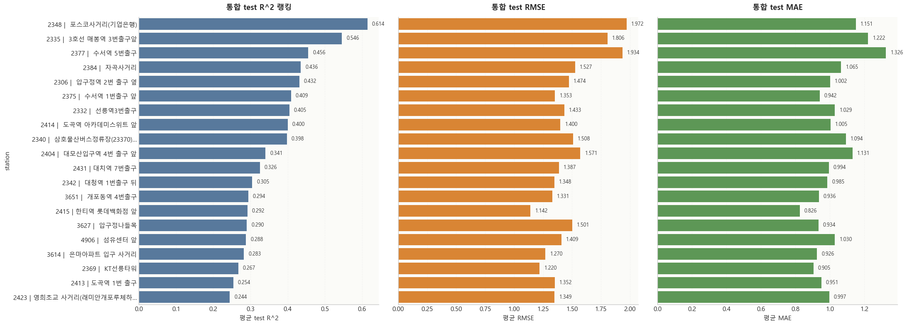
    


<div>
<style scoped>
    .dataframe tbody tr th:only-of-type {
        vertical-align: middle;
    }


</style>
<table border="1" class="dataframe">
  <thead>
    <tr style="text-align: right;">
      <th></th>
      <th>rank</th>
      <th>station_id</th>
      <th>station_name</th>
      <th>rental_count</th>
      <th>return_count</th>
      <th>combined_test_r2</th>
      <th>combined_test_rmse</th>
      <th>combined_test_mae</th>
    </tr>
  </thead>
  <tbody>
    <tr>
      <th>0</th>
      <td>1</td>
      <td>2348</td>
      <td>?ъ뒪肄붿궗嫄곕━(湲곗뾽?€??</td>
      <td>0.5848</td>
      <td>0.6441</td>
      <td>0.6144</td>
      <td>1.9717</td>
      <td>1.1505</td>
    </tr>
    <tr>
      <th>1</th>
      <td>2</td>
      <td>2335</td>
      <td>3?몄꽑 留ㅻ큺??3踰덉텧援ъ븵</td>
      <td>0.5367</td>
      <td>0.5552</td>
      <td>0.5460</td>
      <td>1.8061</td>
      <td>1.2224</td>
    </tr>
    <tr>
      <th>2</th>
      <td>3</td>
      <td>2377</td>
      <td>?섏꽌??5踰덉텧援?/td>
      <td>0.4155</td>
      <td>0.4957</td>
      <td>0.4556</td>
      <td>1.9343</td>
      <td>1.3262</td>
    </tr>
    <tr>
      <th>3</th>
      <td>4</td>
      <td>2384</td>
      <td>?먭끝?ш굅由?/td>
      <td>0.4551</td>
      <td>0.4159</td>
      <td>0.4355</td>
      <td>1.5267</td>
      <td>1.0654</td>
    </tr>
    <tr>
      <th>4</th>
      <td>5</td>
      <td>2306</td>
      <td>?뺢뎄?뺤뿭 2踰?異쒓뎄 ??/td>
      <td>0.3398</td>
      <td>0.5235</td>
      <td>0.4316</td>
      <td>1.4738</td>
      <td>1.0021</td>
    </tr>
    <tr>
      <th>5</th>
      <td>6</td>
      <td>2375</td>
      <td>?섏꽌??1踰덉텧援???/td>
      <td>0.4257</td>
      <td>0.3922</td>
      <td>0.4089</td>
      <td>1.3530</td>
      <td>0.9417</td>
    </tr>
    <tr>
      <th>6</th>
      <td>7</td>
      <td>2332</td>
      <td>?좊쫱??踰덉텧援?/td>
      <td>0.3764</td>
      <td>0.4328</td>
      <td>0.4046</td>
      <td>1.4327</td>
      <td>1.0291</td>
    </tr>
    <tr>
      <th>7</th>
      <td>8</td>
      <td>2414</td>
      <td>?꾧끝???꾩뭅?곕??ㅼ쐞????/td>
      <td>0.3686</td>
      <td>0.4314</td>
      <td>0.4000</td>
      <td>1.3999</td>
      <td>1.0046</td>
    </tr>
    <tr>
      <th>8</th>
      <td>9</td>
      <td>2340</td>
      <td>?쇳샇臾쇱궛踰꾩뒪?뺣쪟??23370) ??/td>
      <td>0.3758</td>
      <td>0.4206</td>
      <td>0.3982</td>
      <td>1.5083</td>
      <td>1.0938</td>
    </tr>
    <tr>
      <th>9</th>
      <td>10</td>
      <td>2404</td>
      <td>?€紐⑥궛?낃뎄??4踰?異쒓뎄 ??/td>
      <td>0.3231</td>
      <td>0.3581</td>
      <td>0.3406</td>
      <td>1.5715</td>
      <td>1.1311</td>
    </tr>
    <tr>
      <th>10</th>
      <td>11</td>
      <td>2431</td>
      <td>?€移섏뿭 7踰덉텧援?/td>
      <td>0.3224</td>
      <td>0.3288</td>
      <td>0.3256</td>
      <td>1.3869</td>
      <td>0.9941</td>
    </tr>
    <tr>
      <th>11</th>
      <td>12</td>
      <td>2342</td>
      <td>?€泥?뿭 1踰덉텧援???/td>
      <td>0.3334</td>
      <td>0.2763</td>
      <td>0.3049</td>
      <td>1.3478</td>
      <td>0.9852</td>
    </tr>
    <tr>
      <th>12</th>
      <td>13</td>
      <td>3651</td>
      <td>媛쒗룷?숈뿭 4踰덉텧援?/td>
      <td>0.2482</td>
      <td>0.3405</td>
      <td>0.2944</td>
      <td>1.3306</td>
      <td>0.9364</td>
    </tr>
    <tr>
      <th>13</th>
      <td>14</td>
      <td>2415</td>
      <td>?쒗떚??濡?뜲諛깊솕????/td>
      <td>0.2778</td>
      <td>0.3063</td>
      <td>0.2921</td>
      <td>1.1415</td>
      <td>0.8255</td>
    </tr>
    <tr>
      <th>14</th>
      <td>15</td>
      <td>3627</td>
      <td>?뺢뎄?뺣굹?ㅻぉ</td>
      <td>0.2823</td>
      <td>0.2985</td>
      <td>0.2904</td>
      <td>1.5007</td>
      <td>0.9337</td>
    </tr>
    <tr>
      <th>15</th>
      <td>16</td>
      <td>4906</td>
      <td>?ъ쑀?쇳꽣 ??/td>
      <td>0.2935</td>
      <td>0.2822</td>
      <td>0.2878</td>
      <td>1.4088</td>
      <td>1.0296</td>
    </tr>
    <tr>
      <th>16</th>
      <td>17</td>
      <td>3614</td>
      <td>?€留덉븘?뚰듃 ?낃뎄 ?ш굅由?/td>
      <td>0.2736</td>
      <td>0.2915</td>
      <td>0.2825</td>
      <td>1.2705</td>
      <td>0.9257</td>
    </tr>
    <tr>
      <th>17</th>
      <td>18</td>
      <td>2369</td>
      <td>KT?좊쫱?€??/td>
      <td>0.2709</td>
      <td>0.2635</td>
      <td>0.2672</td>
      <td>1.2202</td>
      <td>0.9053</td>
    </tr>
    <tr>
      <th>18</th>
      <td>19</td>
      <td>2413</td>
      <td>?꾧끝??1踰?異쒓뎄</td>
      <td>0.2884</td>
      <td>0.2191</td>
      <td>0.2537</td>
      <td>1.3515</td>
      <td>0.9509</td>
    </tr>
    <tr>
      <th>19</th>
      <td>20</td>
      <td>2423</td>
      <td>?곹씗珥덇탳 ?ш굅由??섎??덇컻?щ（泥댄븯??</td>
      <td>0.2040</td>
      <td>0.2849</td>
      <td>0.2444</td>
      <td>1.3493</td>
      <td>0.9971</td>
    </tr>
  </tbody>
</table>
</div>


## 9. ?곸쐞 6媛?station ?ы솕 遺꾩꽍

?듯빀 test R^2 湲곗??쇰줈 媛€???깅뒫??醫뗭? ?곸쐞 6媛?station??蹂꾨룄濡??좎젙?? ?깅뒫 援ъ꽦, 二쇱슂 feature, ?곕룄蹂??⑦꽩 ?ы쁽?? ?ㅼ감 ?뱀꽦?????먯꽭???댄렣遊낅땲??


```python
top6_station_ids = ranking_df.head(6)['station_id'].astype(int).tolist()
top6_summary_df = ranking_df[ranking_df['station_id'].isin(top6_station_ids)].copy()
top6_summary_df = top6_summary_df.set_index('station_id').loc[top6_station_ids].reset_index()
top6_summary_df

```


<div>
<style scoped>
    .dataframe tbody tr th:only-of-type {
        vertical-align: middle;
    }


</style>
<table border="1" class="dataframe">
  <thead>
    <tr style="text-align: right;">
      <th></th>
      <th>station_id</th>
      <th>rental_count</th>
      <th>return_count</th>
      <th>rental_rmse</th>
      <th>return_rmse</th>
      <th>rental_mae</th>
      <th>return_mae</th>
      <th>combined_test_r2</th>
      <th>combined_test_rmse</th>
      <th>combined_test_mae</th>
      <th>station_name</th>
      <th>station_label</th>
      <th>latitude</th>
      <th>longitude</th>
    </tr>
  </thead>
  <tbody>
    <tr>
      <th>0</th>
      <td>2348</td>
      <td>0.5848</td>
      <td>0.6441</td>
      <td>1.7215</td>
      <td>2.2219</td>
      <td>1.0214</td>
      <td>1.2797</td>
      <td>0.6144</td>
      <td>1.9717</td>
      <td>1.1505</td>
      <td>?ъ뒪肄붿궗嫄곕━(湲곗뾽?€??</td>
      <td>2348 |  ?ъ뒪肄붿궗嫄곕━(湲곗뾽?€??</td>
      <td>37.5072</td>
      <td>127.0569</td>
    </tr>
    <tr>
      <th>1</th>
      <td>2335</td>
      <td>0.5367</td>
      <td>0.5552</td>
      <td>1.7196</td>
      <td>1.8927</td>
      <td>1.1629</td>
      <td>1.2819</td>
      <td>0.5460</td>
      <td>1.8061</td>
      <td>1.2224</td>
      <td>3?몄꽑 留ㅻ큺??3踰덉텧援ъ븵</td>
      <td>2335 |  3?몄꽑 留ㅻ큺??3踰덉텧援ъ븵</td>
      <td>37.4868</td>
      <td>127.0468</td>
    </tr>
    <tr>
      <th>2</th>
      <td>2377</td>
      <td>0.4155</td>
      <td>0.4957</td>
      <td>1.8552</td>
      <td>2.0133</td>
      <td>1.2471</td>
      <td>1.4052</td>
      <td>0.4556</td>
      <td>1.9343</td>
      <td>1.3262</td>
      <td>?섏꽌??5踰덉텧援?/td>
      <td>2377 |  ?섏꽌??5踰덉텧援?/td>
      <td>37.4874</td>
      <td>127.1023</td>
    </tr>
    <tr>
      <th>3</th>
      <td>2384</td>
      <td>0.4551</td>
      <td>0.4159</td>
      <td>1.4937</td>
      <td>1.5597</td>
      <td>1.0598</td>
      <td>1.0711</td>
      <td>0.4355</td>
      <td>1.5267</td>
      <td>1.0654</td>
      <td>?먭끝?ш굅由?/td>
      <td>2384 |  ?먭끝?ш굅由?/td>
      <td>37.4760</td>
      <td>127.1059</td>
    </tr>
    <tr>
      <th>4</th>
      <td>2306</td>
      <td>0.3398</td>
      <td>0.5235</td>
      <td>1.4563</td>
      <td>1.4913</td>
      <td>1.0125</td>
      <td>0.9917</td>
      <td>0.4316</td>
      <td>1.4738</td>
      <td>1.0021</td>
      <td>?뺢뎄?뺤뿭 2踰?異쒓뎄 ??/td>
      <td>2306 |  ?뺢뎄?뺤뿭 2踰?異쒓뎄 ??/td>
      <td>37.5271</td>
      <td>127.0287</td>
    </tr>
    <tr>
      <th>5</th>
      <td>2375</td>
      <td>0.4257</td>
      <td>0.3922</td>
      <td>1.3082</td>
      <td>1.3978</td>
      <td>0.8794</td>
      <td>1.0040</td>
      <td>0.4089</td>
      <td>1.3530</td>
      <td>0.9417</td>
      <td>?섏꽌??1踰덉텧援???/td>
      <td>2375 |  ?섏꽌??1踰덉텧援???/td>
      <td>37.4874</td>
      <td>127.1010</td>
    </tr>
  </tbody>
</table>
</div>


```python
top6_plot_df = top6_summary_df.copy()
fig, axes = plt.subplots(1, 2, figsize=(18, 6))
sns.barplot(data=top6_plot_df, x='combined_test_r2', y='station_label', ax=axes[0], color='#1f4e79')
format_axis(axes[0], '?곸쐞 6媛?station???듯빀 test R^2', '?듯빀 test R^2', 'station')
annotate_barh(axes[0], fmt='{:.3f}', pad=0.02)

top6_target_df = top6_plot_df.melt(id_vars=['station_id', 'station_name', 'station_label', 'latitude', 'longitude'], value_vars=['rental_count', 'return_count'], var_name='target', value_name='test_r2')
sns.barplot(data=top6_target_df, x='test_r2', y='station_label', hue='target', ax=axes[1], palette=['#1f4e79', '#d97a04'])
format_axis(axes[1], '?곸쐞 6媛?station??target蹂?test R^2', 'test R^2', 'station')
axes[1].legend(title='target', frameon=True, loc='lower right')
plt.tight_layout()
plt.show()

top6_map = folium.Map(location=[top6_plot_df['latitude'].mean(), top6_plot_df['longitude'].mean()], zoom_start=13, tiles='CartoDB positron')
for _, row in top6_plot_df.iterrows():
    popup_html = f"<b>{row['station_name']}</b><br>station_id: {int(row['station_id'])}<br>?듯빀 test R^2: {row['combined_test_r2']:.3f}"
    folium.Marker(location=[row['latitude'], row['longitude']], popup=popup_html, tooltip=row['station_label'], icon=folium.Icon(color='blue', icon='info-sign')).add_to(top6_map)
top6_map

```


    

    


```python
top6_importance_df = importance_all_df[importance_all_df['station_id'].isin(top6_station_ids)].copy()
for target in TARGETS:
    target_df = top6_importance_df[top6_importance_df['target'] == target].copy()
    target_df = target_df.merge(station_meta_df[['station_id', 'station_label']], on='station_id', how='left')
    pivot_df = target_df.pivot(index='feature', columns='station_label', values='importance_ratio')
    plt.figure(figsize=(12, 5.5))
    sns.heatmap(pivot_df, annot=True, fmt='.2f', cmap='Blues', linewidths=0.4, linecolor='white', cbar_kws={'shrink': 0.8, 'label': '以묒슂??鍮꾩쑉'})
    plt.title(f'?곸쐞 6媛?station feature 以묒슂??鍮꾧탳: {target}', fontsize=13, fontweight='bold', pad=12)
    plt.xlabel('station')
    plt.ylabel('feature')
    plt.xticks(rotation=20, ha='right', fontsize=8)
    plt.yticks(fontsize=9)
    plt.tight_layout()
    plt.show()

```


    
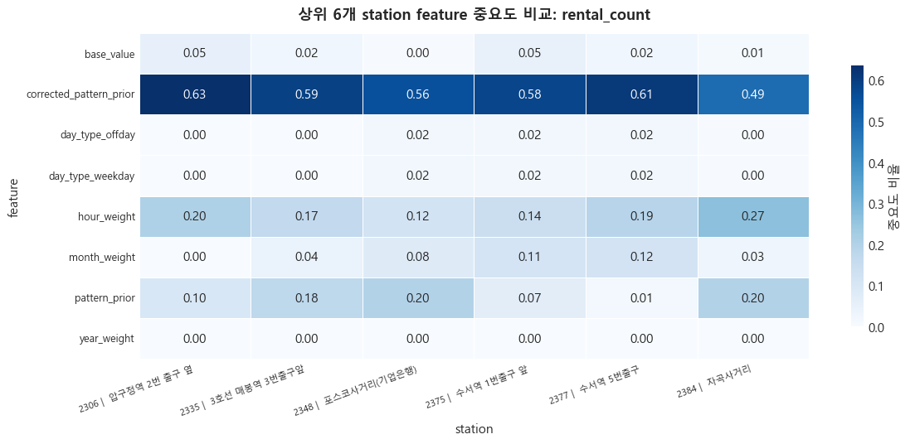
    


    

    


```python
for target in TARGETS:
    target_df = comparison_all_df[(comparison_all_df['target'] == target) & (comparison_all_df['granularity'] == 'hour') & (comparison_all_df['station_id'].isin(top6_station_ids))].copy()
    yearly = (
        target_df.pivot_table(index=['station_id', 'year', 'key'], columns='series', values='value', aggfunc='mean')
        .reset_index()
    )
    fig, axes = plt.subplots(2, 3, figsize=(18, 9), sharex=True, sharey=True)
    axes = axes.flatten()
    for ax, station_id in zip(axes, top6_station_ids):
        station_df = yearly[yearly['station_id'] == station_id]
        for year in sorted(station_df['year'].dropna().unique()):
            part = station_df[station_df['year'] == year]
            ax.plot(part['key'], part['actual_value'], label=f'{int(year)} ?ㅼ젣', linewidth=2.0)
            ax.plot(part['key'], part['prediction'], linestyle='--', label=f'{int(year)} ?덉륫', linewidth=1.8)
        ax.set_title(f'Station {station_id}', fontsize=11, fontweight='bold')
        ax.grid(axis='y', alpha=0.18, linestyle='--')
    handles, labels = axes[0].get_legend_handles_labels()
    fig.legend(handles, labels, loc='upper center', ncol=3)
    fig.suptitle(f'?곸쐞 6媛?station???곕룄蹂??쒓컙 ?⑦꽩 鍮꾧탳: {target}', y=0.995, fontsize=14, fontweight='bold')
    plt.tight_layout(rect=[0, 0, 1, 0.95])
    plt.show()

```


    
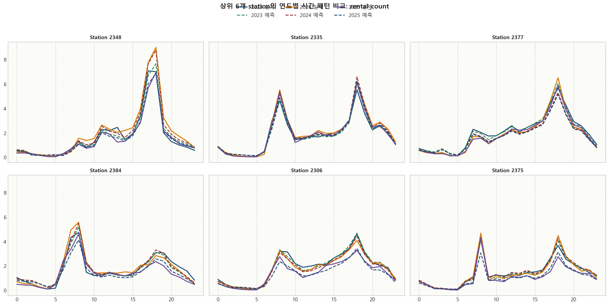
    


    
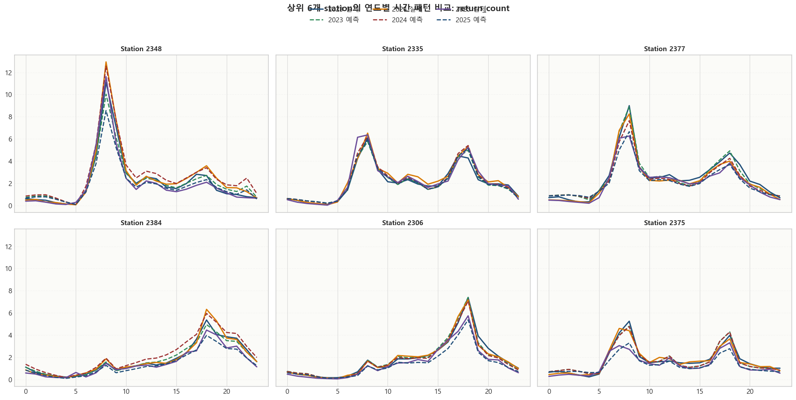
    


```python
top6_error_df = error_all_df[error_all_df['station_id'].isin(top6_station_ids)].copy()
top6_error_summary_df = (
    top6_error_df.groupby(['station_id', 'target'], as_index=False)
    .agg(
        mean_abs_error=('abs_error', 'mean'),
        max_abs_error=('abs_error', 'max'),
    )
)
top6_error_summary_df = top6_error_summary_df.merge(station_meta_df[['station_id', 'station_label', 'station_name']], on='station_id', how='left')
display(top6_error_summary_df.round(4))

plt.figure(figsize=(12, 5.5))
sns.barplot(data=top6_error_summary_df, x='mean_abs_error', y='station_label', hue='target', palette=['#9c2f2f', '#d97a04'])
format_axis(plt.gca(), '?곸쐞 6媛?station???됯퇏 ?덈??ㅼ감 鍮꾧탳', '?됯퇏 ?덈??ㅼ감', 'station')
plt.legend(title='target', frameon=True, loc='lower right')
plt.tight_layout()
plt.show()

```


<div>
<style scoped>
    .dataframe tbody tr th:only-of-type {
        vertical-align: middle;
    }


</style>
<table border="1" class="dataframe">
  <thead>
    <tr style="text-align: right;">
      <th></th>
      <th>station_id</th>
      <th>target</th>
      <th>mean_abs_error</th>
      <th>max_abs_error</th>
      <th>station_label</th>
      <th>station_name</th>
    </tr>
  </thead>
  <tbody>
    <tr>
      <th>0</th>
      <td>2306</td>
      <td>rental_count</td>
      <td>4.2401</td>
      <td>11.1931</td>
      <td>2306 |  ?뺢뎄?뺤뿭 2踰?異쒓뎄 ??/td>
      <td>?뺢뎄?뺤뿭 2踰?異쒓뎄 ??/td>
    </tr>
    <tr>
      <th>1</th>
      <td>2306</td>
      <td>return_count</td>
      <td>4.5946</td>
      <td>11.8120</td>
      <td>2306 |  ?뺢뎄?뺤뿭 2踰?異쒓뎄 ??/td>
      <td>?뺢뎄?뺤뿭 2踰?異쒓뎄 ??/td>
    </tr>
    <tr>
      <th>2</th>
      <td>2335</td>
      <td>rental_count</td>
      <td>5.1406</td>
      <td>11.4570</td>
      <td>2335 |  3?몄꽑 留ㅻ큺??3踰덉텧援ъ븵</td>
      <td>3?몄꽑 留ㅻ큺??3踰덉텧援ъ븵</td>
    </tr>
    <tr>
      <th>3</th>
      <td>2335</td>
      <td>return_count</td>
      <td>5.7814</td>
      <td>15.4786</td>
      <td>2335 |  3?몄꽑 留ㅻ큺??3踰덉텧援ъ븵</td>
      <td>3?몄꽑 留ㅻ큺??3踰덉텧援ъ븵</td>
    </tr>
    <tr>
      <th>4</th>
      <td>2348</td>
      <td>rental_count</td>
      <td>5.7146</td>
      <td>18.8554</td>
      <td>2348 |  ?ъ뒪肄붿궗嫄곕━(湲곗뾽?€??</td>
      <td>?ъ뒪肄붿궗嫄곕━(湲곗뾽?€??</td>
    </tr>
    <tr>
      <th>5</th>
      <td>2348</td>
      <td>return_count</td>
      <td>7.3217</td>
      <td>28.4262</td>
      <td>2348 |  ?ъ뒪肄붿궗嫄곕━(湲곗뾽?€??</td>
      <td>?ъ뒪肄붿궗嫄곕━(湲곗뾽?€??</td>
    </tr>
    <tr>
      <th>6</th>
      <td>2375</td>
      <td>rental_count</td>
      <td>3.9818</td>
      <td>12.1469</td>
      <td>2375 |  ?섏꽌??1踰덉텧援???/td>
      <td>?섏꽌??1踰덉텧援???/td>
    </tr>
    <tr>
      <th>7</th>
      <td>2375</td>
      <td>return_count</td>
      <td>4.1761</td>
      <td>9.8281</td>
      <td>2375 |  ?섏꽌??1踰덉텧援???/td>
      <td>?섏꽌??1踰덉텧援???/td>
    </tr>
    <tr>
      <th>8</th>
      <td>2377</td>
      <td>rental_count</td>
      <td>5.6795</td>
      <td>18.4003</td>
      <td>2377 |  ?섏꽌??5踰덉텧援?/td>
      <td>?섏꽌??5踰덉텧援?/td>
    </tr>
    <tr>
      <th>9</th>
      <td>2377</td>
      <td>return_count</td>
      <td>6.0385</td>
      <td>16.7125</td>
      <td>2377 |  ?섏꽌??5踰덉텧援?/td>
      <td>?섏꽌??5踰덉텧援?/td>
    </tr>
    <tr>
      <th>10</th>
      <td>2384</td>
      <td>rental_count</td>
      <td>4.4491</td>
      <td>10.2389</td>
      <td>2384 |  ?먭끝?ш굅由?/td>
      <td>?먭끝?ш굅由?/td>
    </tr>
    <tr>
      <th>11</th>
      <td>2384</td>
      <td>return_count</td>
      <td>4.6436</td>
      <td>10.6281</td>
      <td>2384 |  ?먭끝?ш굅由?/td>
      <td>?먭끝?ш굅由?/td>
    </tr>
  </tbody>
</table>
</div>


    
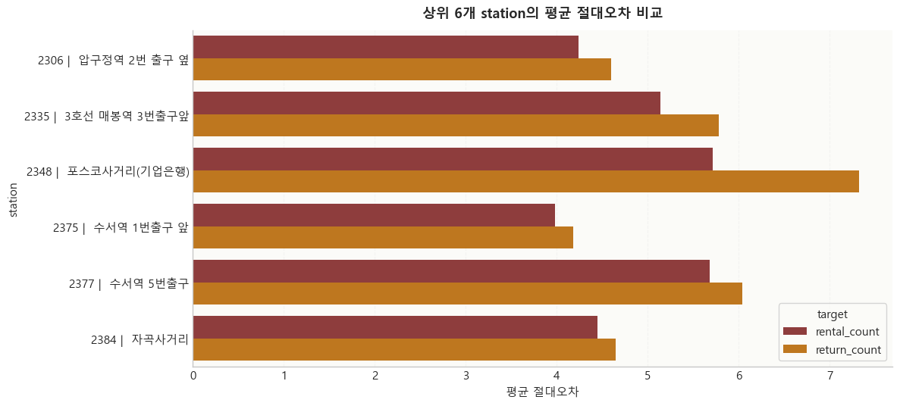
    


## 10. 以묒슂 feature?€ ?ㅼ감 吏꾨떒

?⑥닚 ??궧留뚯쑝濡쒕뒗 紐⑤뜽???ㅻ챸?섍린 ?대졄湲??뚮Ц?? ?ш린?쒕뒗 紐⑤뜽??諛섎났?곸쑝濡??섏〈??feature?€ 2025?꾩뿉 ?ㅼ감媛€ 留롮씠 諛쒖깮???쒖젏???④퍡 ?뺣━?⑸땲??


```python
importance_summary_df = (
    importance_all_df.groupby(['target', 'feature'], as_index=False)['importance_ratio']
    .mean()
    .sort_values(['target', 'importance_ratio'], ascending=[True, False])
)
importance_summary_df.round(4)

```


<div>
<style scoped>
    .dataframe tbody tr th:only-of-type {
        vertical-align: middle;
    }


</style>
<table border="1" class="dataframe">
  <thead>
    <tr style="text-align: right;">
      <th></th>
      <th>target</th>
      <th>feature</th>
      <th>importance_ratio</th>
    </tr>
  </thead>
  <tbody>
    <tr>
      <th>1</th>
      <td>rental_count</td>
      <td>corrected_pattern_prior</td>
      <td>0.5548</td>
    </tr>
    <tr>
      <th>6</th>
      <td>rental_count</td>
      <td>pattern_prior</td>
      <td>0.1575</td>
    </tr>
    <tr>
      <th>4</th>
      <td>rental_count</td>
      <td>hour_weight</td>
      <td>0.1406</td>
    </tr>
    <tr>
      <th>5</th>
      <td>rental_count</td>
      <td>month_weight</td>
      <td>0.0797</td>
    </tr>
    <tr>
      <th>0</th>
      <td>rental_count</td>
      <td>base_value</td>
      <td>0.0497</td>
    </tr>
    <tr>
      <th>2</th>
      <td>rental_count</td>
      <td>day_type_offday</td>
      <td>0.0089</td>
    </tr>
    <tr>
      <th>3</th>
      <td>rental_count</td>
      <td>day_type_weekday</td>
      <td>0.0089</td>
    </tr>
    <tr>
      <th>7</th>
      <td>rental_count</td>
      <td>year_weight</td>
      <td>0.0000</td>
    </tr>
    <tr>
      <th>9</th>
      <td>return_count</td>
      <td>corrected_pattern_prior</td>
      <td>0.5494</td>
    </tr>
    <tr>
      <th>14</th>
      <td>return_count</td>
      <td>pattern_prior</td>
      <td>0.1490</td>
    </tr>
    <tr>
      <th>12</th>
      <td>return_count</td>
      <td>hour_weight</td>
      <td>0.1465</td>
    </tr>
    <tr>
      <th>13</th>
      <td>return_count</td>
      <td>month_weight</td>
      <td>0.0735</td>
    </tr>
    <tr>
      <th>8</th>
      <td>return_count</td>
      <td>base_value</td>
      <td>0.0482</td>
    </tr>
    <tr>
      <th>10</th>
      <td>return_count</td>
      <td>day_type_offday</td>
      <td>0.0167</td>
    </tr>
    <tr>
      <th>11</th>
      <td>return_count</td>
      <td>day_type_weekday</td>
      <td>0.0167</td>
    </tr>
    <tr>
      <th>15</th>
      <td>return_count</td>
      <td>year_weight</td>
      <td>0.0000</td>
    </tr>
  </tbody>
</table>
</div>


```python
for target in TARGETS:
    target_df = importance_summary_df[importance_summary_df['target'] == target].copy()
    plt.figure(figsize=(10, 5))
    sns.barplot(data=target_df, x='importance_ratio', y='feature', color='#4C78A8')
    plt.title(f'top20 station ?됯퇏 feature 以묒슂?? {target}')
    plt.xlabel('?됯퇏 ?뺢퇋??以묒슂??)
    plt.ylabel('feature')
    annotate_barh(plt.gca(), fmt='{:.3f}', pad=0.02)
    plt.tight_layout()
    plt.show()

```


    

    


    

    


## 11. 2025 ?뚯뒪???ㅼ감 hotspot

媛?station?먯꽌 異붿텧??怨좎삤李??쒖젏???⑹퀜, ?꾩옱 feature 援ъ꽦?쇰줈 ?ㅻ챸???대젮??怨듯넻 ?붽낵 ?쒓컙?€瑜??뺤씤?⑸땲??


```python
error_summary_df = (
    error_all_df.groupby(['station_id', 'target'], as_index=False)
    .agg(
        hotspot_count=('abs_error', 'size'),
        mean_abs_error=('abs_error', 'mean'),
        max_abs_error=('abs_error', 'max'),
    )
    .sort_values(['mean_abs_error', 'max_abs_error'], ascending=False)
)
display(error_summary_df.head(12).round(4))

hotspot_time_df = (
    error_all_df.groupby(['target', 'month', 'hour'], as_index=False)
    .agg(
        hotspot_count=('abs_error', 'size'),
        mean_abs_error=('abs_error', 'mean'),
    )
)
hotspot_time_df.sort_values(['target', 'hotspot_count', 'mean_abs_error'], ascending=[True, False, False]).head(20)

```


<div>
<style scoped>
    .dataframe tbody tr th:only-of-type {
        vertical-align: middle;
    }


</style>
<table border="1" class="dataframe">
  <thead>
    <tr style="text-align: right;">
      <th></th>
      <th>station_id</th>
      <th>target</th>
      <th>hotspot_count</th>
      <th>mean_abs_error</th>
      <th>max_abs_error</th>
    </tr>
  </thead>
  <tbody>
    <tr>
      <th>11</th>
      <td>2348</td>
      <td>return_count</td>
      <td>441</td>
      <td>7.3217</td>
      <td>28.4262</td>
    </tr>
    <tr>
      <th>17</th>
      <td>2377</td>
      <td>return_count</td>
      <td>438</td>
      <td>6.0385</td>
      <td>16.7125</td>
    </tr>
    <tr>
      <th>5</th>
      <td>2335</td>
      <td>return_count</td>
      <td>438</td>
      <td>5.7814</td>
      <td>15.4786</td>
    </tr>
    <tr>
      <th>10</th>
      <td>2348</td>
      <td>rental_count</td>
      <td>438</td>
      <td>5.7146</td>
      <td>18.8554</td>
    </tr>
    <tr>
      <th>16</th>
      <td>2377</td>
      <td>rental_count</td>
      <td>438</td>
      <td>5.6795</td>
      <td>18.4003</td>
    </tr>
    <tr>
      <th>35</th>
      <td>3627</td>
      <td>return_count</td>
      <td>438</td>
      <td>5.3062</td>
      <td>23.1260</td>
    </tr>
    <tr>
      <th>4</th>
      <td>2335</td>
      <td>rental_count</td>
      <td>441</td>
      <td>5.1406</td>
      <td>11.4570</td>
    </tr>
    <tr>
      <th>19</th>
      <td>2384</td>
      <td>return_count</td>
      <td>439</td>
      <td>4.6436</td>
      <td>10.6281</td>
    </tr>
    <tr>
      <th>1</th>
      <td>2306</td>
      <td>return_count</td>
      <td>441</td>
      <td>4.5946</td>
      <td>11.8120</td>
    </tr>
    <tr>
      <th>20</th>
      <td>2404</td>
      <td>rental_count</td>
      <td>438</td>
      <td>4.4590</td>
      <td>12.9984</td>
    </tr>
    <tr>
      <th>18</th>
      <td>2384</td>
      <td>rental_count</td>
      <td>438</td>
      <td>4.4491</td>
      <td>10.2389</td>
    </tr>
    <tr>
      <th>21</th>
      <td>2404</td>
      <td>return_count</td>
      <td>440</td>
      <td>4.4296</td>
      <td>10.3809</td>
    </tr>
  </tbody>
</table>
</div>


<div>
<style scoped>
    .dataframe tbody tr th:only-of-type {
        vertical-align: middle;
    }


</style>
<table border="1" class="dataframe">
  <thead>
    <tr style="text-align: right;">
      <th></th>
      <th>target</th>
      <th>month</th>
      <th>hour</th>
      <th>hotspot_count</th>
      <th>mean_abs_error</th>
    </tr>
  </thead>
  <tbody>
    <tr>
      <th>102</th>
      <td>rental_count</td>
      <td>5</td>
      <td>18</td>
      <td>208</td>
      <td>4.4500</td>
    </tr>
    <tr>
      <th>196</th>
      <td>rental_count</td>
      <td>9</td>
      <td>18</td>
      <td>201</td>
      <td>4.8006</td>
    </tr>
    <tr>
      <th>80</th>
      <td>rental_count</td>
      <td>4</td>
      <td>18</td>
      <td>182</td>
      <td>4.3585</td>
    </tr>
    <tr>
      <th>217</th>
      <td>rental_count</td>
      <td>10</td>
      <td>18</td>
      <td>180</td>
      <td>4.5707</td>
    </tr>
    <tr>
      <th>125</th>
      <td>rental_count</td>
      <td>6</td>
      <td>18</td>
      <td>176</td>
      <td>4.3927</td>
    </tr>
    <tr>
      <th>172</th>
      <td>rental_count</td>
      <td>8</td>
      <td>18</td>
      <td>154</td>
      <td>4.9307</td>
    </tr>
    <tr>
      <th>148</th>
      <td>rental_count</td>
      <td>7</td>
      <td>18</td>
      <td>150</td>
      <td>4.6537</td>
    </tr>
    <tr>
      <th>195</th>
      <td>rental_count</td>
      <td>9</td>
      <td>17</td>
      <td>143</td>
      <td>4.3238</td>
    </tr>
    <tr>
      <th>216</th>
      <td>rental_count</td>
      <td>10</td>
      <td>17</td>
      <td>137</td>
      <td>4.2035</td>
    </tr>
    <tr>
      <th>101</th>
      <td>rental_count</td>
      <td>5</td>
      <td>17</td>
      <td>134</td>
      <td>4.2246</td>
    </tr>
    <tr>
      <th>126</th>
      <td>rental_count</td>
      <td>6</td>
      <td>19</td>
      <td>132</td>
      <td>3.8441</td>
    </tr>
    <tr>
      <th>103</th>
      <td>rental_count</td>
      <td>5</td>
      <td>19</td>
      <td>119</td>
      <td>4.0154</td>
    </tr>
    <tr>
      <th>79</th>
      <td>rental_count</td>
      <td>4</td>
      <td>17</td>
      <td>113</td>
      <td>4.0253</td>
    </tr>
    <tr>
      <th>186</th>
      <td>rental_count</td>
      <td>9</td>
      <td>8</td>
      <td>111</td>
      <td>4.3301</td>
    </tr>
    <tr>
      <th>124</th>
      <td>rental_count</td>
      <td>6</td>
      <td>17</td>
      <td>110</td>
      <td>4.1773</td>
    </tr>
    <tr>
      <th>218</th>
      <td>rental_count</td>
      <td>10</td>
      <td>19</td>
      <td>106</td>
      <td>3.7896</td>
    </tr>
    <tr>
      <th>81</th>
      <td>rental_count</td>
      <td>4</td>
      <td>19</td>
      <td>99</td>
      <td>4.0704</td>
    </tr>
    <tr>
      <th>58</th>
      <td>rental_count</td>
      <td>3</td>
      <td>18</td>
      <td>93</td>
      <td>4.3266</td>
    </tr>
    <tr>
      <th>138</th>
      <td>rental_count</td>
      <td>7</td>
      <td>8</td>
      <td>91</td>
      <td>3.9912</td>
    </tr>
    <tr>
      <th>149</th>
      <td>rental_count</td>
      <td>7</td>
      <td>19</td>
      <td>88</td>
      <td>4.6965</td>
    </tr>
  </tbody>
</table>
</div>


```python
fig, axes = plt.subplots(1, 2, figsize=(18, 6))
for ax, target in zip(axes, TARGETS):
    sub = hotspot_time_df[hotspot_time_df['target'] == target]
    pivot = sub.pivot(index='month', columns='hour', values='mean_abs_error').sort_index()
    sns.heatmap(pivot, cmap='YlOrRd', ax=ax, linewidths=0.4, linecolor='white', cbar_kws={'shrink': 0.8, 'label': '?됯퇏 ?덈??ㅼ감'})
    ax.set_title(f'{target}???됯퇏 ?덈??ㅼ감 hotspot ?덊듃留?)
    ax.set_xlabel('hour')
    ax.set_ylabel('month')
plt.tight_layout()
plt.show()

```


    

    


## 12. 理쒖쥌 寃곕줎

留덉?留됱쑝濡??듯빀 ??궧, 諛섎났?곸쑝濡?以묒슂??feature, test hotspot 寃곌낵瑜???踰덉뿉 臾띠뼱 ?붿빟?⑸땲??


```python
top5_df = ranking_df.head(5)[['station_id', 'combined_test_r2', 'combined_test_rmse', 'combined_test_mae']].copy()
bottom5_df = ranking_df.tail(5)[['station_id', 'combined_test_r2', 'combined_test_rmse', 'combined_test_mae']].copy()
top_feature_df = (
    importance_summary_df.sort_values(['target', 'importance_ratio'], ascending=[True, False])
    .groupby('target', as_index=False)
    .first()[['target', 'feature', 'importance_ratio']]
)
conclusion_summary_df = pd.DataFrame([
    {'item': '?듯빀 test R^2 1??station', 'value': int(ranking_df.iloc[0]['station_id'])},
    {'item': '1??station???듯빀 test R^2', 'value': float(ranking_df.iloc[0]['combined_test_r2'])},
    {'item': '?듯빀 test R^2 以묒븰媛?, 'value': float(ranking_df['combined_test_r2'].median())},
    {'item': '?듯빀 test R^2 理쒗븯??station', 'value': int(ranking_df.iloc[-1]['station_id'])},
    {'item': 'rental_count 怨듯넻 ?듭떖 feature', 'value': top_feature_df[top_feature_df['target'] == 'rental_count']['feature'].iloc[0]},
    {'item': 'return_count 怨듯넻 ?듭떖 feature', 'value': top_feature_df[top_feature_df['target'] == 'return_count']['feature'].iloc[0]},
])
display(conclusion_summary_df)
display(top5_df.round(4))
display(bottom5_df.round(4))
display(top_feature_df.round(4))

print('?댁꽍 媛€?대뱶')
print('- ?듯빀 ?먯닔??rental_count?€ return_count??test R^2 ?됯퇏?낅땲??')
print('- ?곸쐞 station?쇱닔濡??쒓컙?€ ?⑦꽩 ?ы쁽?μ씠 ?덉젙?곸씤 寃쎌슦媛€ 留롮뒿?덈떎.')
print('- 諛섎났?곸쑝濡??섑??섎뒗 hotspot ?붽낵 ?쒓컙?€???꾩냽 ?몄깮 蹂€??蹂닿컯 ?꾨낫?낅땲??')

```


<div>
<style scoped>
    .dataframe tbody tr th:only-of-type {
        vertical-align: middle;
    }


</style>
<table border="1" class="dataframe">
  <thead>
    <tr style="text-align: right;">
      <th></th>
      <th>item</th>
      <th>value</th>
    </tr>
  </thead>
  <tbody>
    <tr>
      <th>0</th>
      <td>?듯빀 test R^2 1??station</td>
      <td>2348</td>
    </tr>
    <tr>
      <th>1</th>
      <td>1??station???듯빀 test R^2</td>
      <td>0.6144</td>
    </tr>
    <tr>
      <th>2</th>
      <td>?듯빀 test R^2 以묒븰媛?/td>
      <td>0.3331</td>
    </tr>
    <tr>
      <th>3</th>
      <td>?듯빀 test R^2 理쒗븯??station</td>
      <td>2423</td>
    </tr>
    <tr>
      <th>4</th>
      <td>rental_count 怨듯넻 ?듭떖 feature</td>
      <td>corrected_pattern_prior</td>
    </tr>
    <tr>
      <th>5</th>
      <td>return_count 怨듯넻 ?듭떖 feature</td>
      <td>corrected_pattern_prior</td>
    </tr>
  </tbody>
</table>
</div>


<div>
<style scoped>
    .dataframe tbody tr th:only-of-type {
        vertical-align: middle;
    }


</style>
<table border="1" class="dataframe">
  <thead>
    <tr style="text-align: right;">
      <th></th>
      <th>station_id</th>
      <th>combined_test_r2</th>
      <th>combined_test_rmse</th>
      <th>combined_test_mae</th>
    </tr>
  </thead>
  <tbody>
    <tr>
      <th>1</th>
      <td>2348</td>
      <td>0.6144</td>
      <td>1.9717</td>
      <td>1.1505</td>
    </tr>
    <tr>
      <th>2</th>
      <td>2335</td>
      <td>0.5460</td>
      <td>1.8061</td>
      <td>1.2224</td>
    </tr>
    <tr>
      <th>3</th>
      <td>2377</td>
      <td>0.4556</td>
      <td>1.9343</td>
      <td>1.3262</td>
    </tr>
    <tr>
      <th>4</th>
      <td>2384</td>
      <td>0.4355</td>
      <td>1.5267</td>
      <td>1.0654</td>
    </tr>
    <tr>
      <th>5</th>
      <td>2306</td>
      <td>0.4316</td>
      <td>1.4738</td>
      <td>1.0021</td>
    </tr>
  </tbody>
</table>
</div>


<div>
<style scoped>
    .dataframe tbody tr th:only-of-type {
        vertical-align: middle;
    }


</style>
<table border="1" class="dataframe">
  <thead>
    <tr style="text-align: right;">
      <th></th>
      <th>station_id</th>
      <th>combined_test_r2</th>
      <th>combined_test_rmse</th>
      <th>combined_test_mae</th>
    </tr>
  </thead>
  <tbody>
    <tr>
      <th>16</th>
      <td>4906</td>
      <td>0.2878</td>
      <td>1.4088</td>
      <td>1.0296</td>
    </tr>
    <tr>
      <th>17</th>
      <td>3614</td>
      <td>0.2825</td>
      <td>1.2705</td>
      <td>0.9257</td>
    </tr>
    <tr>
      <th>18</th>
      <td>2369</td>
      <td>0.2672</td>
      <td>1.2202</td>
      <td>0.9053</td>
    </tr>
    <tr>
      <th>19</th>
      <td>2413</td>
      <td>0.2537</td>
      <td>1.3515</td>
      <td>0.9509</td>
    </tr>
    <tr>
      <th>20</th>
      <td>2423</td>
      <td>0.2444</td>
      <td>1.3493</td>
      <td>0.9971</td>
    </tr>
  </tbody>
</table>
</div>


<div>
<style scoped>
    .dataframe tbody tr th:only-of-type {
        vertical-align: middle;
    }


</style>
<table border="1" class="dataframe">
  <thead>
    <tr style="text-align: right;">
      <th></th>
      <th>target</th>
      <th>feature</th>
      <th>importance_ratio</th>
    </tr>
  </thead>
  <tbody>
    <tr>
      <th>0</th>
      <td>rental_count</td>
      <td>corrected_pattern_prior</td>
      <td>0.5548</td>
    </tr>
    <tr>
      <th>1</th>
      <td>return_count</td>
      <td>corrected_pattern_prior</td>
      <td>0.5494</td>
    </tr>
  </tbody>
</table>
</div>


    ?댁꽍 媛€?대뱶
    - ?듯빀 ?먯닔??rental_count?€ return_count??test R^2 ?됯퇏?낅땲??
    - ?곸쐞 station?쇱닔濡??쒓컙?€ ?⑦꽩 ?ы쁽?μ씠 ?덉젙?곸씤 寃쎌슦媛€ 留롮뒿?덈떎.
    - 諛섎났?곸쑝濡??섑??섎뒗 hotspot ?붽낵 ?쒓컙?€???꾩냽 ?몄깮 蹂€??蹂닿컯 ?꾨낫?낅땲??
    

## 13. ?꾩옱 援ъ“?먯꽌 ?ш퀬 ?덉륫???댁꽍?섎뒗 諛⑸쾿

?꾩옱 紐⑤뜽?€ ?뱀젙 ?쒖젏??**珥?蹂댁쑀 ?€??*瑜?吏곸젒 ?덉륫?섎뒗 援ъ“媛€ ?꾨땲?? 媛??쒓컙?€??`rental_count`?€ `return_count`瑜??덉륫?섎뒗 援ъ“?낅땲??

?곕씪??API ?깆쓣 ?듯빐 **?꾩옱 ?쒖젏???ㅼ젣 ?먯쟾嫄??섎웾**???뚭퀬 ?덈떎硫? ?댄썑 ?ш퀬???ㅼ쓬怨?媛숈씠 ?꾩쟻 怨꾩궛?????덉뒿?덈떎.

`?ㅼ쓬 ?쒖젏 ?ш퀬 = ?꾩옱 ?ш퀬 - ?덉륫 rental_count + ?덉륫 return_count`

??諛⑹떇?€ 紐??쒓컙 ???먮뒗 ?섎（ ?대궡泥섎읆 **?④린 ?ш퀬 ?먮쫫**??蹂대뒗 ?곕뒗 ?쒖슜?????덉?留? 硫곗튌 ?ㅼ쿂???덉륫 援ш컙??湲몄뼱吏덉닔濡??€??諛섎궔 ?덉륫 ?ㅼ감媛€ ?꾩쟻?섍린 ?뚮Ц???좊ː?꾧? 鍮좊Ⅴ寃???븘吏????덉뒿?덈떎.

?먰븳 ?ㅼ젣 ?댁쁺?먯꽌???щ같移? 嫄곗튂?€ ?⑸웾, ?뚮컻 ?대깽??媛숈? ?붿냼媛€ ?ш퀬???곹뼢??二쇰?濡? ?κ린 ?ш퀬 ?덉륫源뚯? ?덉젙?곸쑝濡??섑뻾?섎젮硫??댄썑?먮뒗 `珥??ш퀬` ?먯껜瑜?吏곸젒 ?덉륫?섎뒗 紐⑤뜽?대굹 ?щ같移??몄깮 蹂€?섍퉴吏€ ?ы븿??援ъ“濡??뺤옣?섎뒗 寃껋씠 ???곸젅?⑸땲??


```python
inventory_note_df = pd.DataFrame([
    {'援щ텇': '?꾩옱 紐⑤뜽??吏곸젒 ?덉륫媛?, '?ㅻ챸': '?쒓컙?€蹂?rental_count, return_count'},
    {'援щ텇': '?ш퀬 怨꾩궛 諛⑹떇', '?ㅻ챸': '?꾩옱 ?ш퀬 - ?덉륫 ?€?щ웾 + ?덉륫 諛섎궔?됱쓽 ?꾩쟻 ??},
    {'援щ텇': '?곷??곸쑝濡??곹빀??踰붿쐞', '?ㅻ챸': '紐??쒓컙 ??~ ?섎（ ?대궡???④린 ?ш퀬 ?먮쫫'},
    {'援щ텇': '二쇱쓽媛€ ?꾩슂??踰붿쐞', '?ㅻ챸': '硫곗튌 ???ш퀬泥섎읆 ?꾩쟻 ?ㅼ감媛€ 而ㅼ????κ린 ?덉륫'},
    {'援щ텇': '?ㅼ감 ?뺣? ?붿씤', '?ㅻ챸': '?щ같移? 嫄곗튂?€ ?쒓퀎, ?대깽?? ?좎뵪 湲됰?, ?쒓컙 ?꾩쟻 ?ㅼ감'},
])
inventory_note_df

```


<div>
<style scoped>
    .dataframe tbody tr th:only-of-type {
        vertical-align: middle;
    }


</style>
<table border="1" class="dataframe">
  <thead>
    <tr style="text-align: right;">
      <th></th>
      <th>援щ텇</th>
      <th>?ㅻ챸</th>
    </tr>
  </thead>
  <tbody>
    <tr>
      <th>0</th>
      <td>?꾩옱 紐⑤뜽??吏곸젒 ?덉륫媛?/td>
      <td>?쒓컙?€蹂?rental_count, return_count</td>
    </tr>
    <tr>
      <th>1</th>
      <td>?ш퀬 怨꾩궛 諛⑹떇</td>
      <td>?꾩옱 ?ш퀬 - ?덉륫 ?€?щ웾 + ?덉륫 諛섎궔?됱쓽 ?꾩쟻 ??/td>
    </tr>
    <tr>
      <th>2</th>
      <td>?곷??곸쑝濡??곹빀??踰붿쐞</td>
      <td>紐??쒓컙 ??~ ?섎（ ?대궡???④린 ?ш퀬 ?먮쫫</td>
    </tr>
    <tr>
      <th>3</th>
      <td>二쇱쓽媛€ ?꾩슂??踰붿쐞</td>
      <td>硫곗튌 ???ш퀬泥섎읆 ?꾩쟻 ?ㅼ감媛€ 而ㅼ????κ린 ?덉륫</td>
    </tr>
    <tr>
      <th>4</th>
      <td>?ㅼ감 ?뺣? ?붿씤</td>
      <td>?щ같移? 嫄곗튂?€ ?쒓퀎, ?대깽?? ?좎뵪 湲됰?, ?쒓컙 ?꾩쟻 ?ㅼ감</td>
    </tr>
  </tbody>
</table>
</div>

