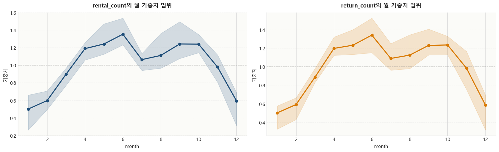
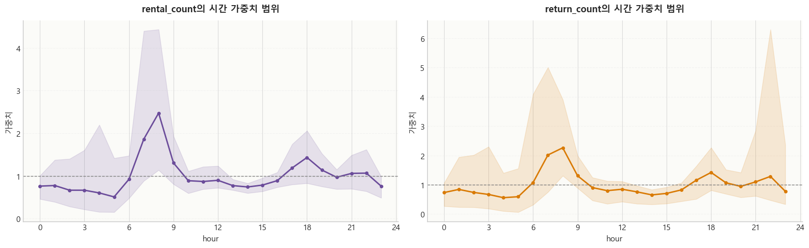
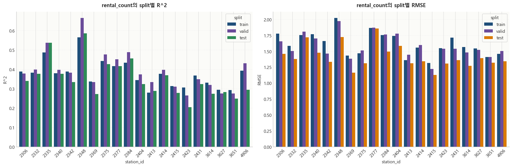
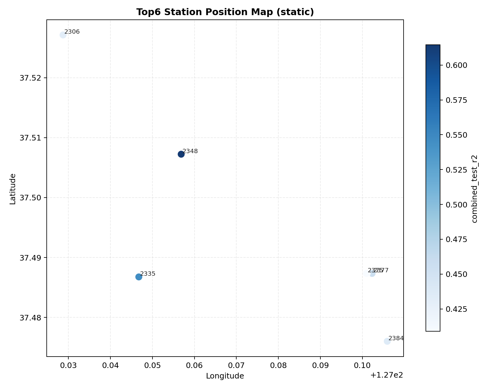
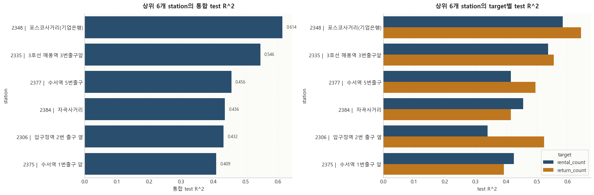
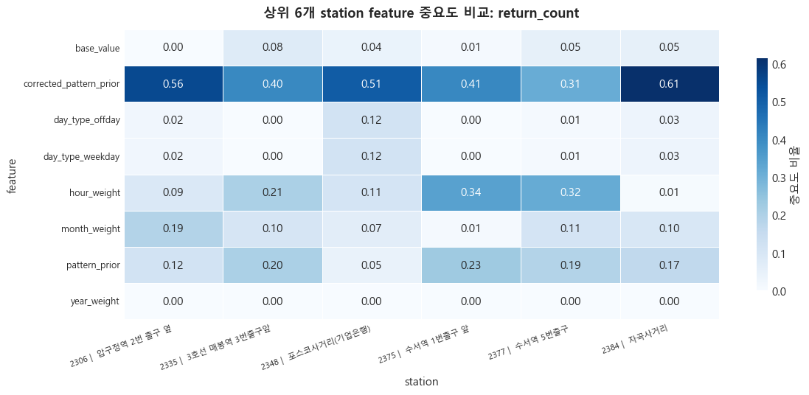
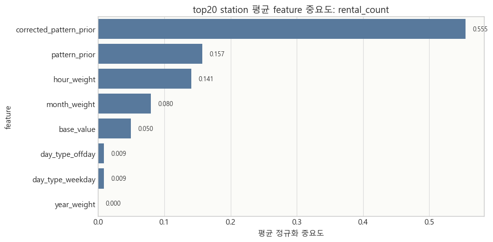
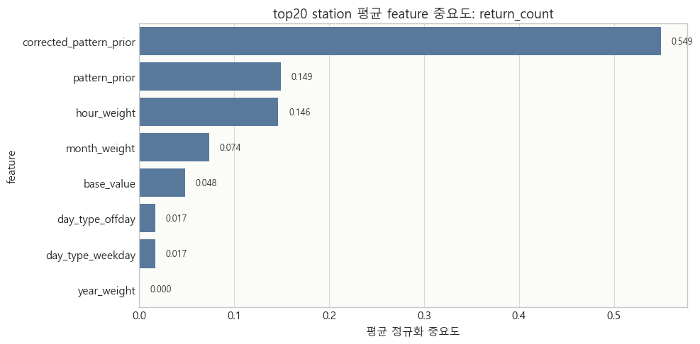
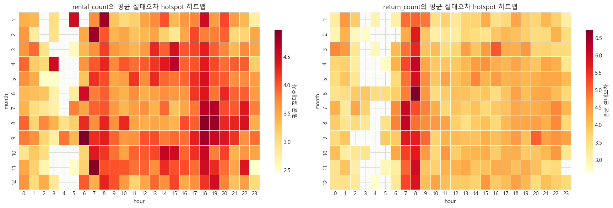

---
pdf_options:
  format: A4
  landscape: true
---

<!-- markdownlint-disable MD013 -->

# 강남구 따릉이 통합 분석 보고서

## 목차

1. 군집화 분석 개요
2. 군집화 분석에서 사용한 기준
3. 군집 분리와 특성 요약
4. 군집 대표 대여소와 공간 분포
5. 분석 대상과 사용 데이터 정리
6. station 선정 근거 설명
7. 원천 데이터 품질 점검
8. 전처리 및 데이터 분할 방식 정리
9. 패턴 기반 feature 생성 과정 설명
10. Ridge 튜닝 및 성능 비교
11. 통합 랭킹, 중요 feature, 오차 구간 해석
12. 최종 결론 정리
13. 현재 구조에서 재고 예측을 해석하는 방법

# 1. 군집화 분석 개요

## 왜 군집화가 먼저였는가

- 대여량 자체만으로는 각 대여소가 어떤 역할을 하는지 설명하기 어렵다.
- 예측 성능 비교를 먼저 수행하면 점수 차이는 보이지만, 왜 특정 station에서 성능이 높거나 낮은지 공간 맥락으로 연결하기 어렵다.
- 그래서 예측 이전 단계에서 대여소를 `station-level`로 군집화해, 이후 예측 성능 차이를 `공간 역할 차이`와 함께 해석하도록 설계했다.

## 군집화 분석 목적

- 강남구 대여소의 공간 역할을 유형화한다.
- 이후 상위 20개 station 예측 단계에서 해석 기준으로 활용한다.
- 단순한 군집 분류가 아니라, 수요 예측 단계에서 어떤 공간 구조를 설명해야 하는지 기준을 먼저 고정하는 데 목적이 있다.

## 군집화 핵심 결과

- 통합 군집화 기준: `k = 5`
- 해석 중심 라벨: `업무/상업형`, `주거형`, `생활·상권 혼합형`, `외곽 주거형`
- 군집화의 역할: 예측 점수 자체보다, 대여소 수요 변동을 설명할 수 있는 공간 구조를 제공하는 것

> 군집화의 역할은 대여소의 공간적 역할을 먼저 정의하고, 예측 단계에서 그 차이가 실제 수요 패턴 차이로 어떻게 나타나는지 설명 가능하게 연결하는 것이다.

# 2. 군집화 분석에서 사용한 기준

## 군집화 타깃과 활용

- 타깃 단위: `대여소 단위(station-level)`
- 활용 목적: 상위 20개 station 예측 결과를 군집 맥락과 함께 해석
- 해석 포인트: 대여소별 시간대 반납 비율, 순유입, 교통 접근성 조합이 어떤 공간 역할을 형성하는지 확인

## 메인 군집화 피처

| 피처 1 | 피처 2 |
|------|------|
| 오전 반납 비율 (`arrival_7_10_ratio`) | 점심 반납 비율 (`arrival_11_14_ratio`) |
| 저녁 반납 비율 (`arrival_17_20_ratio`) | 아침 순유입 (`morning_net_inflow`) |
| 저녁 순유입 (`evening_net_inflow`) | 최근접 지하철 거리 (`subway_distance_m`) |
| 300m 내 버스정류장 수 (`bus_stop_count_300m`) |  |

## 데이터와 이미지 기준

- 상위 20개 station 예측 데이터는 현재 작업 폴더의 `hmw` 분석 자료를 기준으로 해석했다.
- 군집 시각화는 기존 통합 산출물 이미지(`works/01_clustering/08_integrated/...`)를 그대로 연결했다.

## 데이터/전처리 기준 요약

- 대여 이력: 서울시 공공자전거 이용 이력
- 대여소 정보: 서울시 공공자전거 대여소 메타데이터
- 공통 운영 기준: `2023~2025` 공통 관측 가능한 station 중심
- 후속 예측 단계와 연결하기 위해 과도한 흔들림이 없는 station을 우선 사용

# 3. 군집 분리와 특성 요약

  

  

## 해석

- 산점도는 군집이 완전히 겹치지 않고 역할별로 분리되는 경향을 보여준다.
- 히트맵은 군집별 시간대 반납 비율, 순유입, 교통 접근성 조합이 다름을 한눈에 요약한다.
- 즉, 산점도는 `분리 정도`, 히트맵은 `무엇이 다른지`를 설명한다.

# 4. 군집 대표 대여소와 공간 분포

  

## 대표 예시

- 업무/상업 혼합형: `SB타워 앞`, `역삼지하보도 7번출구 앞`
- 아침 도착 업무 집중형: `수서역 5번출구`, `포스코사거리(기업은행)`
- 주거 도착형: `청담역 13번 출구 앞`, `현대아파트 정문 앞`
- 외곽 주거형: `더시그넘하우스 앞`, `세곡동 사거리`

## 왜 상위 20개 station을 먼저 봤는가

- 군집화로 공간 맥락을 먼저 잡은 뒤, 예측 성능을 안정적으로 비교할 station 집합이 필요했다.
- 그래서 이용량이 충분하고 `2023~2025` 시간대 패턴이 과도하게 흔들리지 않는 상위 20개 station을 우선 선정했다.

# 5. 분석 대상과 사용 데이터 정리

이후 본문은 상위 20개 station 데이터를 기준으로 전처리, feature 생성, Ridge 평가를 이어서 정리한다.

## 사용 자산

| 자산 | 개수 |
|------|-----:|
| station 원천 csv | 20 |
| 공휴일 기준 csv | 20 |
| 패턴 공식 csv | 20 |
| 가중치 csv | 20 |
| 튜닝 결과 csv | 20 |
| 성능 지표 csv | 20 |
| feature 중요도 csv | 20 |
| 연도별 비교 csv | 20 |
| 고오차 지점 csv | 20 |
| 예측 long csv | 20 |

## 전체 데이터 범위

| 항목 | 값 |
|------|------|
| station 개수 | 20 |
| 전체 row 수 | 526080 |
| 시작 시점 | 2023-01-01 00:00:00 |
| 종료 시점 | 2025-12-31 23:00:00 |
| 공휴일 개수 | 56 |

## 선정된 20개 station

| station_id | station_name | total_usage | mean_hourly_flow | mean_hourly_cv |
|-----------:|--------------|------------:|-----------------:|---------------:|
| 2377 | 수서역 5번출구 | 111233 | 4.2288 | 0.1135 |
| 2335 | 3호선 매봉역 3번출구앞 | 108398 | 4.1208 | 0.1147 |
| 2348 | 포스코사거리(기업은행) | 102225 | 3.8858 | 0.1961 |
| 2340 | 삼호물산버스정류장(23370) 옆 | 95011 | 3.6119 | 0.1601 |
| 2404 | 대모산입구역 4번 출구 앞 | 93814 | 3.5664 | 0.1321 |
| 2306 | 압구정역 2번 출구 옆 | 89475 | 3.4014 | 0.1789 |
| 2332 | 선릉역3번출구 | 88519 | 3.3651 | 0.1191 |
| 2431 | 대치역 7번출구 | 87802 | 3.3378 | 0.1768 |
| 2384 | 자곡사거리 | 86743 | 3.2975 | 0.1527 |
| 2414 | 도곡역 아카데미스위트 앞 | 85664 | 3.2564 | 0.2005 |
| 2342 | 대청역 1번출구 뒤 | 82749 | 3.1459 | 0.1573 |
| 2423 | 영희초교 사거리(래미안개포루체하임) | 80644 | 3.0656 | 0.1625 |
| 4906 | 섬유센터 앞 | 76386 | 2.9038 | 0.1458 |
| 2375 | 수서역 1번출구 앞 | 76190 | 2.8963 | 0.1524 |
| 3614 | 은마아파트 입구 사거리 | 75452 | 2.8683 | 0.1814 |
| 2369 | KT선릉타워 | 69773 | 2.6523 | 0.1536 |
| 2413 | 도곡역 1번 출구 | 65525 | 2.4908 | 0.1621 |
| 3651 | 개포동역 4번출구 | 64633 | 2.4572 | 0.1059 |
| 2415 | 한티역 롯데백화점 앞 | 61136 | 2.3242 | 0.1740 |
| 3627 | 압구정나들목 | 58794 | 2.2351 | 0.1744 |

# 6. station 선정 근거 설명

이번 분석에서는 단순히 이용량이 많은 station만 고른 것이 아니라, 머신러닝 예측에 적합하도록 다음 두 조건을 함께 만족하는 station을 우선 선정했다.

1. 이용량이 충분히 많아 패턴이 안정적으로 관측될 것
2. 연도별 시간대 패턴이 지나치게 흔들리지 않아 학습한 패턴이 다음 해에도 재현될 것

  

  

## 해석

- 상위권 station은 절대 이용량이 높아 패턴 추정에 필요한 데이터가 충분하다.
- 동시에 `mean_hourly_cv`가 과도하게 높지 않아, 특정 해에만 튀는 station보다 학습-검증-테스트 분할에 더 적합하다.
- 따라서 본 보고서의 station 선정은 `이용량`과 `안정성`을 동시에 반영한 선택이다.

# 7. 원천 데이터 품질 점검

모델 결과를 해석하기 전에 각 station 시계열이 충분한 길이를 가지는지, 결측이 많은지, 시간 중복이 있는지, 음수처럼 비정상 값이 있는지를 먼저 확인했다.

## 품질 점검 요약

| 항목 | 결과 |
|------|------|
| station별 row 수 | 모두 26304 |
| unique_time | station별 모두 26304 |
| rental/return 결측 | 모두 0 |
| 음수 대여/반납 | 모두 없음 |
| duplicate time row | 모두 0 |

## 해석

- 상위 20개 station은 모두 `2023-01-01 00:00:00`부터 `2025-12-31 23:00:00`까지 동일 길이의 시계열을 보유했다.
- 결측, 음수, 중복 시간행이 확인되지 않아 기본적인 데이터 품질은 양호한 편으로 판단했다.

# 8. 전처리 및 데이터 분할 방식 정리

개별 station 노트는 동일한 전처리 파이프라인을 따른다. 시간 변수를 정리하고, 공휴일을 결합하고, 주말과 공휴일을 `offday`로 통합한 뒤 전체 시계열을 연도 기준으로 `train`, `valid`, `test`로 분할했다.

## 분할 기준

- `train`: 2023년
- `valid`: 2024년
- `test`: 2025년
- `day_type`: `weekday`, `offday`

## 분할 요약

| split | day_type | rows | station_count | rental_mean | return_mean |
|------|----------|-----:|--------------:|------------:|------------:|
| train | offday | 56640 | 20 | 1.2911 | 1.3941 |
| train | weekday | 118560 | 20 | 1.7291 | 1.9181 |
| valid | offday | 57600 | 20 | 1.2688 | 1.3616 |
| valid | weekday | 118080 | 20 | 1.7358 | 1.9396 |
| test | offday | 58080 | 20 | 1.0250 | 1.1125 |
| test | weekday | 117120 | 20 | 1.4745 | 1.6507 |

  

## 해석

- `weekday`가 `offday`보다 평균 대여/반납량이 높았다.
- 시간대 패턴은 출근·퇴근 시간에 뚜렷한 피크를 보였고, 이 구조가 후속 패턴 기반 feature 설계의 출발점이 됐다.

# 9. 패턴 기반 feature 생성 과정 설명

이 분석은 원천 count를 바로 Ridge에 넣지 않는다. 먼저 `day_type`별 시간 패턴을 기본 형태로 만들고, 여기에 `month`, `year`, `hour` 가중치를 얹어 `base_value`, `pattern_prior`, `corrected_pattern_prior` 같은 패턴 중심 feature를 생성한다.

## 패턴식 요약

| target | day_type | intercept_mean | sin_coef_mean | cos_coef_mean |
|--------|----------|---------------:|--------------:|--------------:|
| rental_count | offday | 1.2911 | -0.9548 | -0.4993 |
| rental_count | weekday | 1.7291 | -0.9323 | -0.6067 |
| return_count | offday | 1.3941 | -0.9905 | -0.5280 |
| return_count | weekday | 1.9181 | -0.7532 | -0.7013 |

## 월 가중치 요약

| target | 1월 | 6월 | 9월 | 12월 |
|--------|---:|---:|---:|----:|
| rental_count | 0.5003 | 1.3525 | 1.2409 | 0.5930 |
| return_count | 0.5010 | 1.3413 | 1.2303 | 0.5859 |

  

  

  

## year_weight와 hour_weight 해석

- `year_weight`: 특정 연도의 전체적인 수준 차이를 보정하는 값
- `hour_weight`: 기본 패턴식만으로 설명되지 않는 세부 시간대 보정을 반영하는 값
- 특히 `year_weight`는 해당 연도의 실제 데이터를 보고 계산되는 값이라, 완전히 새로운 연도에 대해 사전에 고정된 값으로 보기 어렵다.

## 패턴 기반 feature 사전

| Feature | 생성 방식 | 의미 | 모델에서의 역할 |
|---------|-----------|------|----------------|
| `base_value` | `day_type`별 시간 평균을 사인/코사인 회귀로 근사 | 요일유형별 기본 시간 패턴 | 예측의 기본 골격 |
| `month_weight` | 월별 평균 수준을 기준 패턴 대비 비율로 계산 | 월/계절 단위 규모 차이 | 월 단위 레벨 보정 |
| `year_weight` | 연도별 평균 수준을 기준 패턴 대비 비율로 계산 | 연도별 수요 수준 이동 | 연도 전환 보정 |
| `hour_weight` | 반복적으로 발생한 시간대 오차를 비율로 보정 | 세부 시간대 편차 | 피크/비피크 보정 |
| `pattern_prior` | `base_value * month_weight * year_weight` | 패턴 기반 1차 사전 예측값 | Ridge 입력의 핵심 prior |
| `corrected_pattern_prior` | `pattern_prior * hour_weight` | 시간대 보정까지 반영한 사전값 | Ridge가 직접 참조하는 보정 prior |
| `day_type_weekday` | 평일 더미 변수 | 평일 구간 표시 | 평일 효과 보정 |
| `day_type_offday` | 비근무일 더미 변수 | 비근무일 구간 표시 | 비근무일 효과 보정 |
| `intercept` | Ridge 절편 항 | 잔여 기준선 | 평균 수준 흡수 |

## 모델 선정 이유

1. 해석 가능성: 어떤 시간 패턴과 가중치가 예측에 기여했는지 비교적 명확하게 볼 수 있다.
2. 데이터 규모 적합성: station별 분리 학습에서 과도하게 복잡한 모델보다 안정적이다.
3. 과적합 제어: Ridge의 `alpha`로 계수 크기를 조절할 수 있다.
4. 현재 목적 적합성: 최고 성능 블랙박스보다, station 간 패턴 차이를 비교 가능한 기준 모델이 더 중요했다.

# 10. Ridge 튜닝 및 성능 비교

station별, target별로 `train` 구간에서 패턴 구조를 학습하고 `valid` 구간에서 Ridge `alpha`를 고른 뒤, 같은 설정을 `2025 test` 구간에 적용해 최종 성능을 평가했다.

## 선택된 alpha 분포

| target | alpha | station_count |
|--------|------:|--------------:|
| rental_count | 0.0010 | 10 |
| rental_count | 1.0000 | 2 |
| rental_count | 10.0000 | 1 |
| rental_count | 100.0000 | 2 |
| rental_count | 1000.0000 | 5 |
| return_count | 0.0010 | 6 |
| return_count | 10.0000 | 4 |
| return_count | 100.0000 | 7 |
| return_count | 1000.0000 | 3 |

  

## split별 평균 성능

| target | split | rmse_mean | mae_mean | r2_mean | r2_min | r2_max |
|--------|-------|----------:|---------:|--------:|-------:|-------:|
| bike_change_from_predictions | train | 1.7775 | 1.2166 | 0.1616 | 0.0058 | 0.6130 |
| bike_change_from_predictions | valid | 1.8212 | 1.2502 | 0.1826 | -0.0660 | 0.6550 |
| bike_change_from_predictions | test | 1.7200 | 1.1706 | 0.1551 | -0.0790 | 0.6229 |
| rental_count | train | 1.6138 | 1.1194 | 0.3754 | 0.2786 | 0.5636 |
| rental_count | valid | 1.5825 | 1.1035 | 0.3915 | 0.2647 | 0.6640 |
| rental_count | test | 1.4124 | 0.9889 | 0.3498 | 0.2040 | 0.5848 |
| return_count | train | 1.6911 | 1.1722 | 0.4206 | 0.3100 | 0.6408 |
| return_count | valid | 1.6624 | 1.1649 | 0.4328 | 0.2880 | 0.6702 |
| return_count | test | 1.5161 | 1.0562 | 0.3781 | 0.2191 | 0.6441 |

  

  

## 해석

- `return_count`가 `rental_count`보다 평균 R^2가 조금 더 높다.
- train-valid-test 간 성능 격차가 과도하게 벌어지지 않아, 기준 모델로는 비교적 안정적이다.
- 다만 station별 편차는 분명해서, 동일 구조의 모델이라도 공간 역할과 시간대 패턴에 따라 재현력이 달라진다.

# 11. 통합 랭킹, 중요 feature, 오차 구간 해석

## 통합 test 랭킹

통합 점수는 `rental_count`와 `return_count`의 test R^2 평균이다.

| rank | station_id | station_name | combined_test_r2 | combined_test_rmse | combined_test_mae |
|-----:|-----------:|--------------|-----------------:|-------------------:|------------------:|
| 1 | 2348 | 포스코사거리(기업은행) | 0.6144 | 1.9717 | 1.1505 |
| 2 | 2335 | 3호선 매봉역 3번출구앞 | 0.5460 | 1.8061 | 1.2224 |
| 3 | 2377 | 수서역 5번출구 | 0.4556 | 1.9343 | 1.3262 |
| 4 | 2384 | 자곡사거리 | 0.4355 | 1.5267 | 1.0654 |
| 5 | 2306 | 압구정역 2번 출구 옆 | 0.4316 | 1.4738 | 1.0021 |
| 6 | 2375 | 수서역 1번출구 앞 | 0.4089 | 1.3530 | 0.9417 |
| 20 | 2423 | 영희초교 사거리(래미안개포루체하임) | 0.2444 | 1.3493 | 0.9971 |

  

## 상위 6개 station 심화 분석

상위 6개 station은 `2348`, `2335`, `2377`, `2384`, `2306`, `2375`였다.

  

  

  

  

  

  

  

## 중요 feature 오차 진단

단순 랭킹만으로는 모델을 설명하기 어렵기 때문에, 여기서는 모델이 반복적으로 의존한 feature와 2025년에 오차가 많이 발생한 시점을 함께 정리한다.

| target | feature | importance_ratio |
|--------|---------|-----------------:|
| rental_count | corrected_pattern_prior | 0.5548 |
| rental_count | pattern_prior | 0.1575 |
| rental_count | hour_weight | 0.1406 |
| rental_count | month_weight | 0.0797 |
| return_count | corrected_pattern_prior | 0.5494 |
| return_count | pattern_prior | 0.1490 |
| return_count | hour_weight | 0.1465 |
| return_count | month_weight | 0.0735 |

  

  

## 2025 테스트 오차 hotspot

각 station에서 추출한 고오차 시점을 합쳐 현재 feature 구성으로 설명이 어려운 공통 월과 시간대를 확인했다.

### station별 hotspot 상위

| station_id | target | hotspot_count | mean_abs_error | max_abs_error |
|-----------:|--------|--------------:|---------------:|--------------:|
| 2348 | return_count | 441 | 7.3217 | 28.4262 |
| 2377 | return_count | 438 | 6.0385 | 16.7125 |
| 2335 | return_count | 438 | 5.7814 | 15.4786 |
| 2348 | rental_count | 438 | 5.7146 | 18.8554 |
| 2377 | rental_count | 438 | 5.6795 | 18.4003 |
| 3627 | return_count | 438 | 5.3062 | 23.1260 |

### 시간대 hotspot 상위

| target | month | hour | hotspot_count | mean_abs_error |
|--------|------:|----:|--------------:|---------------:|
| rental_count | 5 | 18 | 208 | 4.4500 |
| rental_count | 9 | 18 | 201 | 4.8006 |
| rental_count | 4 | 18 | 182 | 4.3585 |
| rental_count | 10 | 18 | 180 | 4.5707 |
| rental_count | 6 | 18 | 176 | 4.3927 |

  

## 해석

- 최상위 station일수록 시간대 패턴 자체가 안정적으로 반복되는 경향이 있었다.
- 중요도는 거의 모든 station에서 `corrected_pattern_prior`에 집중돼, 패턴 기반 사전 예측값이 실제 Ridge 입력의 중심 축임을 보여준다.
- 오차 hotspot은 특히 `17~19시`와 일부 계절 전환 구간에 몰려 있어, 후속 단계에서는 날씨, 이벤트, 재배치, 혼잡도 같은 외생 변수 보강이 필요하다.

# 12. 최종 결론 정리

## 최종 요약 표

| item | value |
|------|------|
| 통합 test R^2 1위 station | 2348 |
| 1위 station의 통합 test R^2 | 0.6144 |
| 통합 test R^2 중앙값 | 0.3331 |
| 통합 test R^2 최하위 station | 2423 |
| rental_count 공통 핵심 feature | corrected_pattern_prior |
| return_count 공통 핵심 feature | corrected_pattern_prior |

## 결론

- 이번 모델은 최고 복잡도의 예측기라기보다, 시간 패턴을 보존하면서 station별 차이를 해석 가능하게 비교하기 위한 기준 모델로 적절했다.
- 군집화는 대여소의 공간 역할을 정리하는 단계였고, 예측 모델은 그 위에서 각 station의 시간 패턴 재현력을 비교하는 단계였다.
- 따라서 이번 통합 보고서의 핵심 가치는 단순한 점수 경쟁보다 `공간 역할`, `패턴 prior`, `station별 재현력 차이`를 함께 해석할 수 있게 만든 데 있다.

# 13. 현재 구조에서 재고 예측을 해석하는 방법

현재 모델은 특정 시점의 총 보유 대수를 직접 예측하는 구조가 아니라, 각 시간대의 `rental_count`와 `return_count`를 예측하는 구조다.

## 재고 계산 방식

`다음 시점 재고 = 현재 재고 - 예측 rental_count + 예측 return_count`

## 적용 범위와 주의점

| 구분 | 설명 |
|------|------|
| 현재 모델의 직접 예측값 | 시간대별 `rental_count`, `return_count` |
| 재고 계산 방식 | 현재 재고 - 예측 대여량 + 예측 반납량의 누적 합 |
| 상대적으로 적합한 범위 | 몇 시간 뒤 ~ 하루 이내의 단기 재고 흐름 |
| 주의가 필요한 범위 | 며칠 후 재고처럼 누적 오차가 커지는 장기 예측 |
| 오차 확대 요인 | 재배치, 거치대 한계, 이벤트, 날씨 급변, 시간 누적 오차 |

## 해석 가이드

- API 등을 통해 현재 시점의 실제 자전거 수량을 알고 있다면, 이후 몇 시간 수준의 재고 흐름은 누적 계산으로 추적할 수 있다.
- 하지만 예측 구간이 길어질수록 대여/반납 오차가 누적되므로 장기 재고 예측에는 적합하지 않다.
- 장기 운영 관점에서는 총 재고 자체를 직접 예측하는 모델이나, 재배치/외생 변수를 포함한 구조로 확장하는 편이 더 적절하다.
