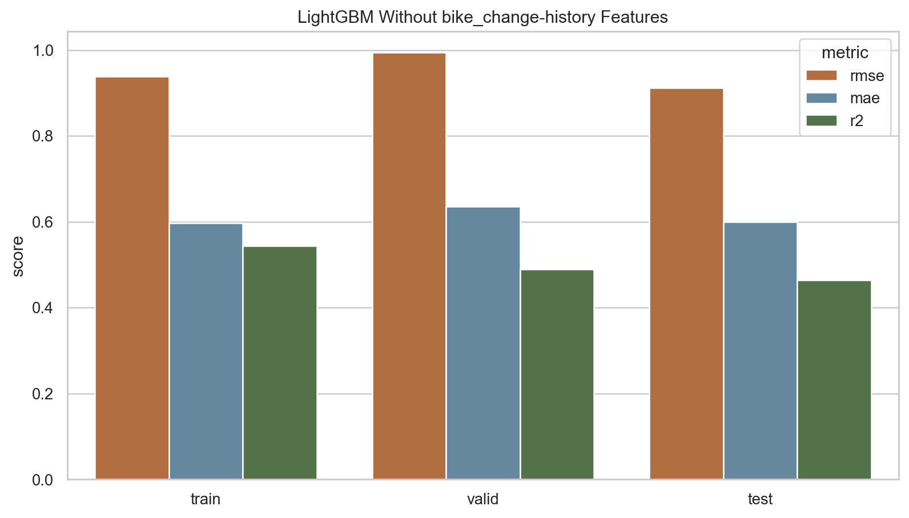
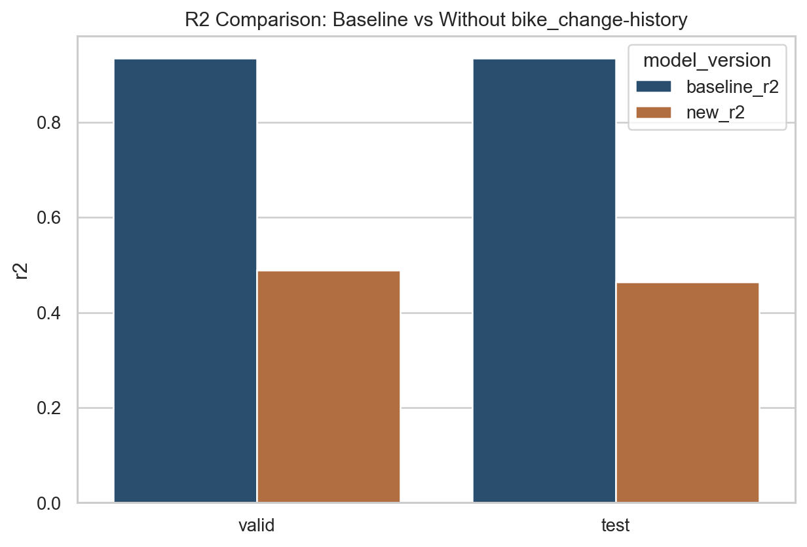

# LightGBM 재실험 보고서: bike_change 파생 feature 제거

## 1. 실험 목적
- LightGBM의 매우 높은 성능이 `bike_change` 과거 이력 파생 feature에 과도하게 의존한 결과인지 확인한다.
- 아래 5개 feature를 제거하고 다시 학습한다.

- 제거 feature: `bike_change_lag_1, bike_change_rollmean_24, bike_change_rollstd_24, bike_change_rollmean_168, bike_change_rollstd_168`

## 2. 데이터 분할
- train: 2023년
- valid: 2024년
- test: 2025년
- train에는 기존 `sample_weight`를 동일하게 사용

## 3. 남은 학습 feature (11개)

`station_id, hour, rental_count, weekday, month, holiday, temperature, humidity, precipitation, wind_speed, cluster`

## 4. 재실험 성능

| split   |     rmse |      mae |       r2 |
|:--------|---------:|---------:|---------:|
| train   | 0.938215 | 0.596582 | 0.543621 |
| valid   | 0.993907 | 0.635511 | 0.488971 |
| test    | 0.911335 | 0.599049 | 0.463648 |

## 5. 기존 LightGBM 대비 변화

| split   |   baseline_rmse |   new_rmse |   rmse_change |   baseline_mae |   new_mae |   mae_change |   baseline_r2 |   new_r2 |   r2_change |
|:--------|----------------:|-----------:|--------------:|---------------:|----------:|-------------:|--------------:|---------:|------------:|
| valid   |        0.354179 |   0.993907 |      0.639728 |       0.149206 |  0.635511 |     0.486305 |      0.935107 | 0.488971 |   -0.446136 |
| test    |        0.317459 |   0.911335 |      0.593876 |       0.131086 |  0.599049 |     0.467963 |      0.934917 | 0.463648 |   -0.471269 |

## 6. 해석
- valid 기준 R2는 `0.935107` -> `0.488971`로 변했다.
- test 기준 R2는 `0.934917` -> `0.463648`로 변했다.
- 만약 성능이 크게 떨어졌다면, 기존 고성능은 과거 타깃 이력 feature의 영향이 매우 컸다는 뜻이다.
- 반대로 성능이 여전히 높다면, 순수한 시간/기상/수요 수준 feature만으로도 충분한 설명력이 있다는 뜻이다.