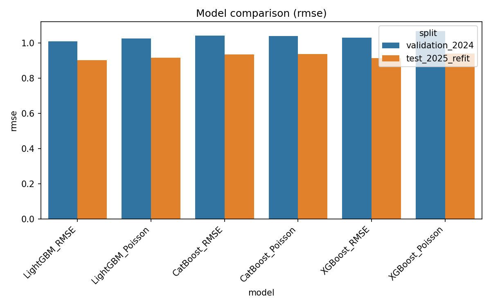
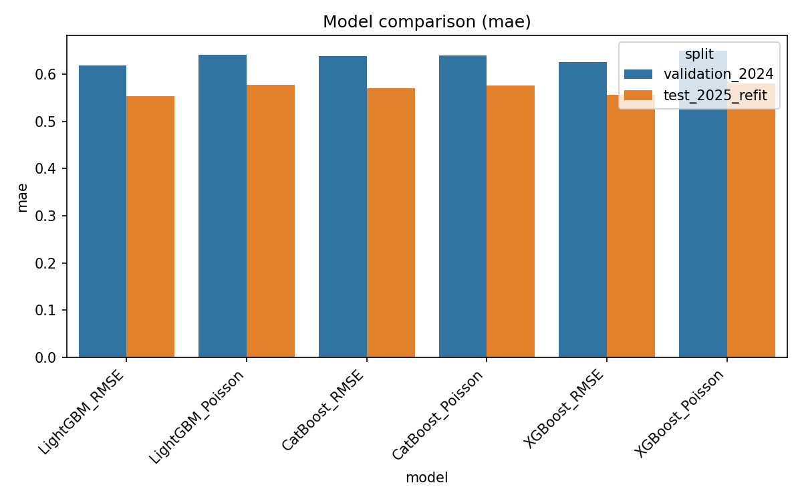
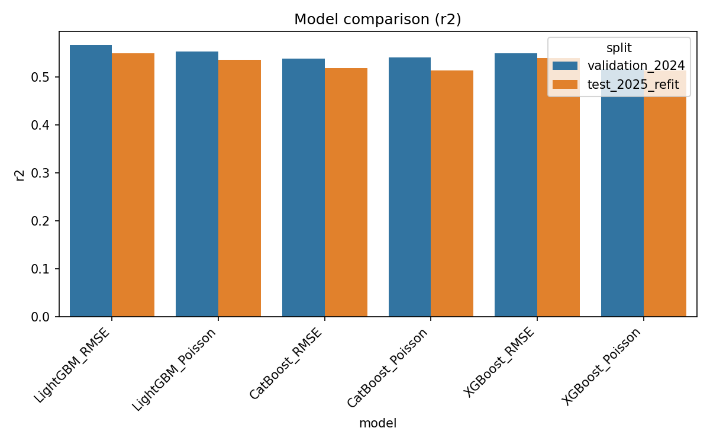

# 동일 피처(원본 + 시계열 파생) 모델 비교 결과

파일: [same_features_metrics.csv](same_features_metrics.csv)

## 요약 (test_2025_refit)

|model|rmse|mae|r2|
|-|-:|-:|-:|
|LightGBM_RMSE|0.903342|0.553428|0.550191|
|LightGBM_Poisson|0.917687|0.577953|0.535792|
|CatBoost_RMSE|0.934478|0.570033|0.518648|
|CatBoost_Poisson|0.938704|0.576509|0.514285|
|XGBoost_RMSE|0.91354|0.556109|0.539977|
|XGBoost_Poisson|0.939667|0.580177|0.513288|

## 시각화

## 상세
- 메트릭은 `same_features_metrics.csv`의 값입니다.
- 모든 모델에 동일한 기본 입력 컬럼과 파생 시계열(`lag_*`, `rolling_*`)을 적용하여 학습했습니다.