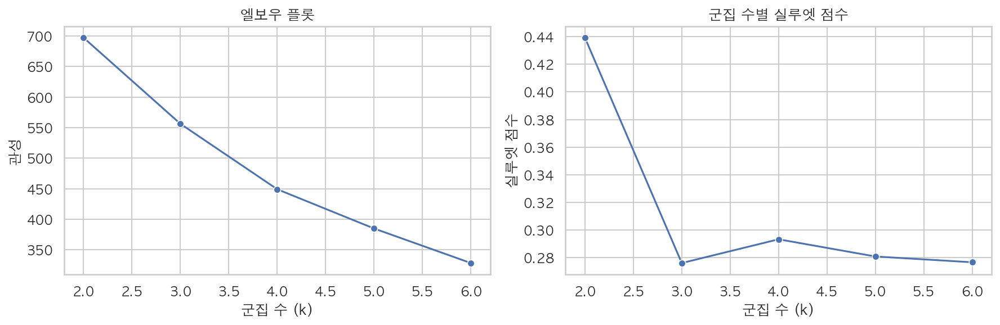
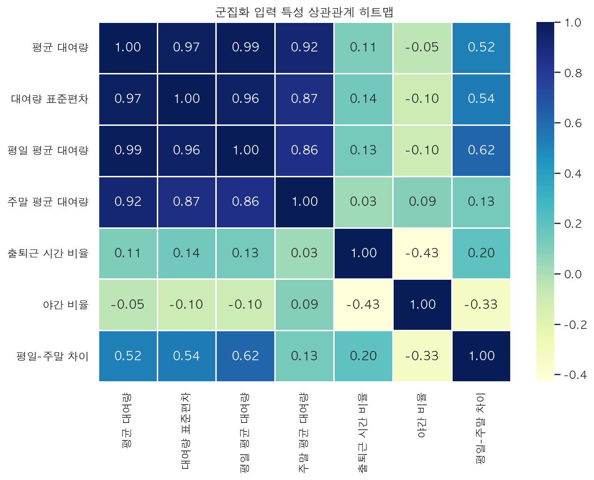
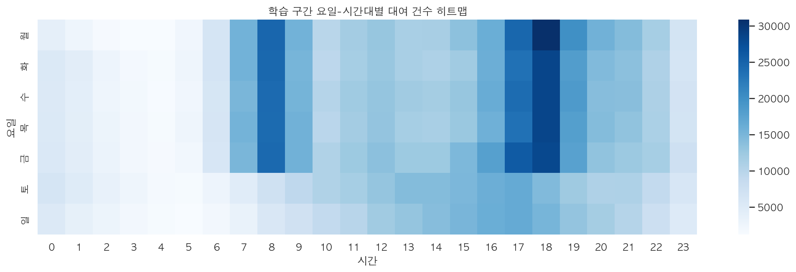
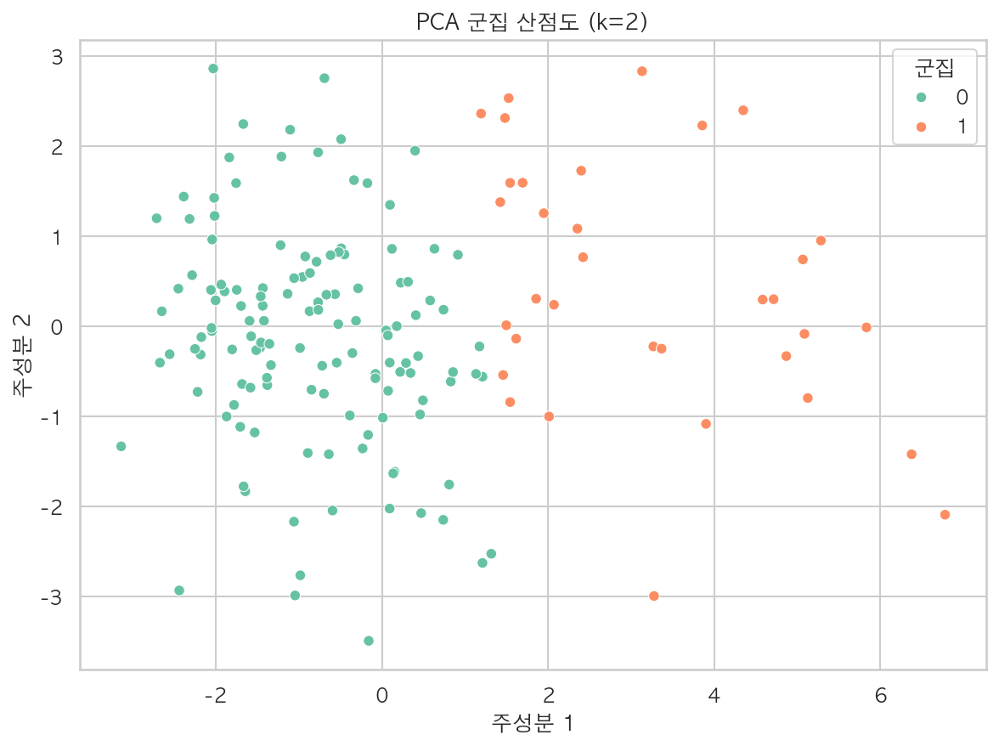
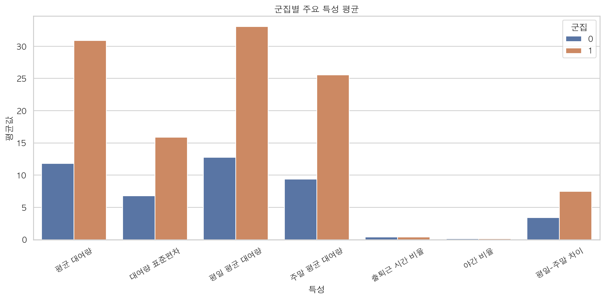
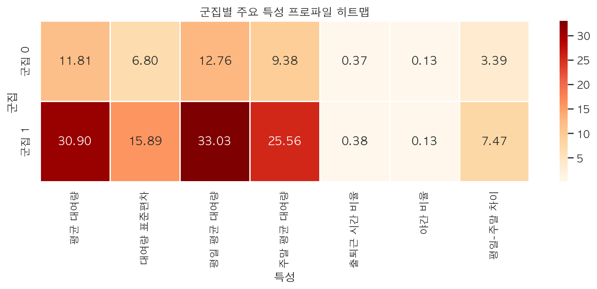

<!-- markdownlint-disable MD013 -->

<link rel="stylesheet" href="../ddri_presentation_a4_landscape.css">

# 강남구 따릉이 대여소 군집화 분석

## 발표 목적

- 강남구 대여소를 이용 패턴 기준으로 유형화
- 수요 예측 전 단계에서 대여소 성격을 설명 가능한 구조로 정리
- 발표 기준으로는 군집 결과와 공간 해석까지 제시

## 핵심 결과

- 기준 기간: `2023~2024 학습`, `2025 테스트 기준`
- 군집 수: `k = 2`
- 군집 해석: `일반수요형`, `고수요형`
- 고수요형은 지하철·버스 접근성이 상대적으로 더 우수

군집화 결과 = 예측 모델용 보조 feature 기반

# 1. 데이터 기준과 전처리

## 데이터 기준

- 대여 이력: 강남구 따릉이 이용정보
- 공통 운영 대여소: `2023~2025 공통 운영 대여소`
- 처리 원칙: 신규 스테이션은 메인 분석과 분리

## 전처리 기준

- 결측치 제거: `대여일시`, `반납일시`, `대여 대여소번호`, `반납대여소번호`, `이용시간(분)`, `이용거리(M)`
- 이상치 제거: `이용시간(분) <= 0`, `이용거리(M) <= 0`, `동일 대여소 반납 + 5분 이하`
- 운영 범위 정리: 공통 기준 밖 대여소, 강남구 외 반납 사례 제거
- 나머지 동일 대여소 반납은 제거하지 않고 유지

## 전처리 및 해석 원칙

- 없는 자료는 임의 생성하지 않음
- 메인 모델은 기존 운영 스테이션 중심으로 설계
- `동일 대여소 + 5분 이하`만 제거하고, 나머지 self-return은 운영 해석용 보조 지표로 관리

5분 이하 즉시 반납만 제거, 나머지 self-return은 보존하고 재고 변동은 별도 해석

  

# 2. 군집화 Feature와 방법

## 사용 Feature

- 평균 대여량
- 평일 평균 대여량
- 주말 평균 대여량
- 출퇴근 시간 비율
- 야간 비율
- 평일-주말 차이
- 대여량 표준편차

## 방법

- 알고리즘: `K-Means`
- 비교 범위: `k = 2 ~ 6`
- 선택 기준: `silhouette score`
- 최종 선택: `k = 2`

현재 군집의 핵심 분리축 = 이용 목적보다 수요 규모

# 3. 군집 수 선택 결과

| k | inertia | silhouette |
|---|---:|---:|
| 2 | 698.00 | 0.4389 |
| 3 | 556.63 | 0.2758 |
| 4 | 449.94 | 0.2927 |
| 5 | 385.46 | 0.2853 |
| 6 | 328.87 | 0.2816 |

  

<ul class="compact-list">
  <li><code>k = 2</code>에서 silhouette가 가장 높음</li>
  <li>1차 baseline에서는 분리도와 설명력이 가장 안정적임</li>
</ul>

# 4. 입력 특성과 시간대 패턴

  
  

<ul class="compact-list">
  <li>대여량 관련 feature끼리 높은 상관을 보이며, 수요 규모 축이 핵심 분리축임</li>
  <li>시간대 패턴은 아침·퇴근 시간대 피크가 뚜렷해 강남구 수요 배경을 설명함</li>
</ul>

# 5. 군집 결과와 분포

| 군집 | 해석 | 평균 대여량 | 평일 평균 | 주말 평균 | 출퇴근 비율 | 야간 비율 |
|---|---|---:|---:|---:|---:|---:|
| Cluster 0 | 일반수요형 | 11.91 | 12.87 | 9.48 | 0.373 | 0.133 |
| Cluster 1 | 고수요형 | 31.18 | 33.30 | 25.86 | 0.382 | 0.134 |

  
  

<ul class="compact-list">
  <li>고수요형은 평균 대여량 규모가 뚜렷하게 큼</li>
  <li>평일과 주말 모두 고수요형이 우세</li>
  <li>출퇴근·야간 비율 차이는 보조적 신호에 가까움</li>
</ul>

# 6. 군집 프로파일

  

<ul class="compact-list">
  <li>군집 1은 평균 대여량, 평일 평균, 주말 평균이 모두 높음</li>
  <li>이번 baseline의 주된 분리축은 수요 규모 차이로 해석 가능</li>
</ul>

# 7. 환경 기반 해석 고도화

## 핵심 수치

- 일반수요형: 지하철 거리 `551.64m`, 300m 버스정류장 수 `26.98`
- 고수요형: 지하철 거리 `387.75m`, 300m 버스정류장 수 `32.56`

  

환경 해석의 현재 결론 = 고수요형은 교통 접근성이 더 우수한 대여소군

# 8. 군집 분포 지도

  

<ul class="compact-list">
  <li>고수요형 대표: <code>매봉역 3번출구앞</code>, <code>수서역 5번출구</code>, <code>대모산입구역 4번 출구 앞</code></li>
  <li>일반수요형 대표: <code>압구정파출소 앞</code>, <code>도심공항타워 앞</code></li>
  <li>고수요형이 교통 접근성이 좋은 지점 주변에 상대적으로 분포</li>
  <li>인터랙티브 원본: <code>works/01_clustering/04_maps/ddri_cluster_map_gangnam.html</code></li>
</ul>

# 부록. 강남구 따릉이 군집 분포 전체 지도

  

<ul class="compact-list">
  <li>발표 중 전체 분포를 크게 보여줄 때 사용하는 보조 슬라이드</li>
  <li>본문 8페이지의 요약형 지도 설명 뒤에 이어서 제시</li>
</ul>

# 9. 결론과 다음 단계

## 결론

- 강남구 따릉이 대여소는 1차 군집화 결과 `일반수요형`과 `고수요형`으로 구분됨
- 고수요형은 평균 대여량이 높고, 지하철·버스 접근성이 상대적으로 더 우수함
- 군집 label은 이후 `Station별 하루 대여량 예측`의 보조 feature로 활용 가능
- 다만 상업지구·출퇴근형 해석은 추가 POI와 시간대 지표 보강 후 재검토가 필요함

## 다음 단계

- `station-day` 회귀 모델 학습
- 군집 label 포함/제외 성능 비교
- 발표 이후 지도 웹 서비스와 API 설계 고도화

핵심 결론 = 군집 도출 + 공간적 의미 설명 가능

