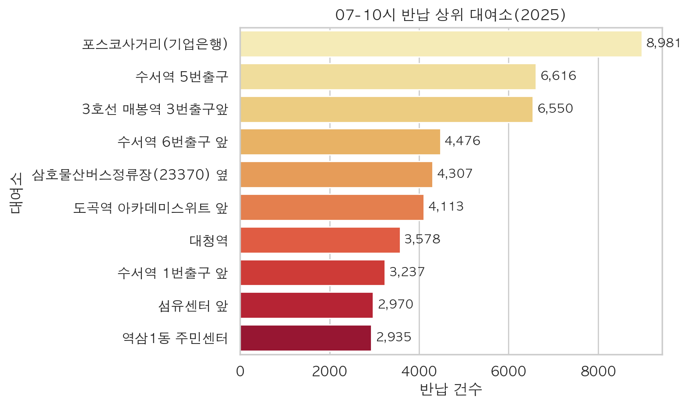
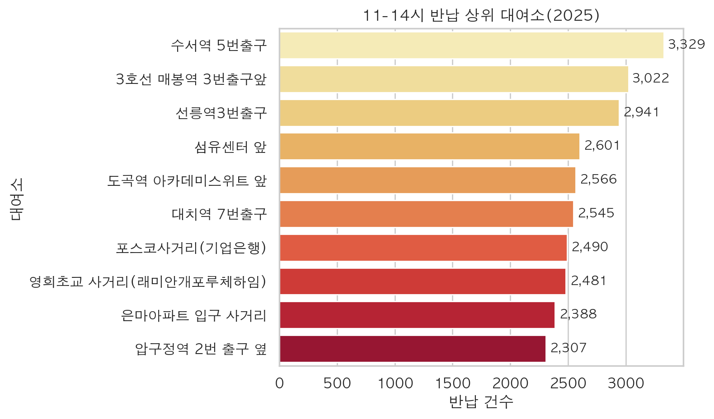
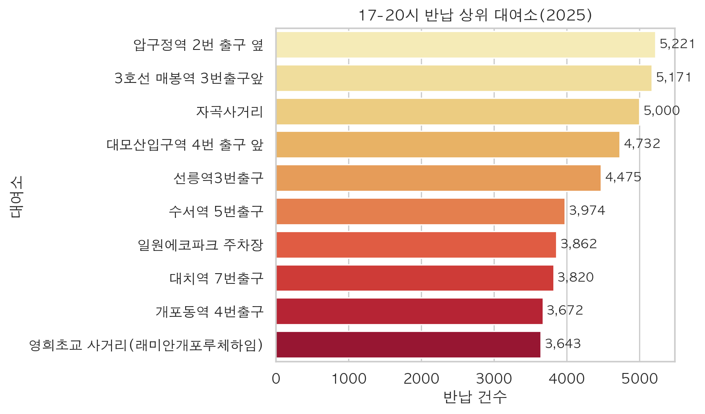
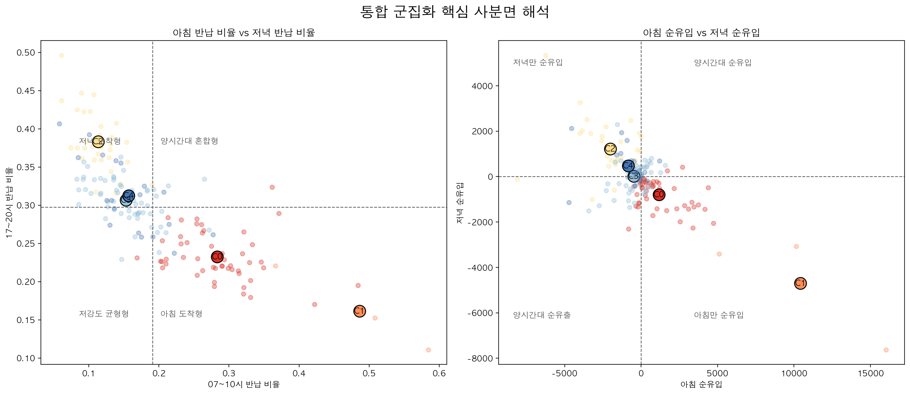

<!-- markdownlint-disable MD013 -->

<link rel="stylesheet" href="../ddri_presentation_a4_landscape.css">

# 강남구 따릉이 대여소 통합 군집화 분석

## 분석 목적

- 기초 이용 패턴 분석 위에 지구판단 중심 피처를 결합해 최종 통합 군집화 결과를 도출
- 이후 날씨·생활인구·고저차 등 환경 피처를 선별해 `station-day` 수요 예측으로 연결

## 핵심 결과

- 기준 기간: `2023~2024 학습`, `2025 테스트`
- 기본 통합 군집화: `k = 5`
- 해석 중심: `업무/상업형`, `주거형`, `생활·상권 혼합형`, `외곽 주거형`
- 환경 보강 실험은 해석 보강에는 유효했지만, 메인 군집 구조는 기본 통합 군집화가 더 안정적

군집화의 목표 = 지구 역할 분류 + 이후 수요 예측용 피처 선별

# 1. 분석 타겟과 피처 구성

## 이번 군집화의 타겟

- 타겟 단위: `station-level`
- 타겟 의미: 각 대여소를 `업무/상업형`, `주거형`, `생활·상권 혼합형`, `외곽형` 같은 공간 역할 기준으로 분류
- 활용 목적: 이후 `station-day` 수요 예측에서 군집별 환경 피처를 선별하는 기준으로 사용

## 메인 군집화 피처 7개

- `arrival_7_10_ratio` (07~10시 반납 비율)
- `arrival_11_14_ratio` (11~14시 반납 비율)
- `arrival_17_20_ratio` (17~20시 반납 비율)
- `morning_net_inflow` (아침 순유입)
- `evening_net_inflow` (저녁 순유입)
- `subway_distance_m` (최근접 지하철 거리)
- `bus_stop_count_300m` (300m 내 버스정류장 수)

## 환경 보강 실험 피처

- `station_elevation_m` (대여소 표고)
- `elevation_diff_nearest_subway_m` (최근접 지하철 대비 고도차)
- `nearest_park_area_sqm` (최근접 공원 면적)
- `distance_naturepark_m` (도시자연공원구역 거리)
- `distance_river_boundary_m` (최근접 하천경계 거리)

메인 군집화는 7개 지구판단 피처로 수행했고, 환경 보강 피처는 후속 실험으로 분리해 해석력만 비교했다.

# 2. 통합 군집화 접근

## 분석 고도화 흐름

- 기초 이용 패턴 분석으로 대여량과 시간대 기본 구조를 먼저 확인
- 반납 시간대 비율로 `도착 지구 역할`을 본다
- 순유입으로 `출발 거점 / 도착 거점`을 본다
- 교통 접근성으로 `환승/업무 접근성`을 본다

## 이번 통합 군집화의 핵심

- `수요 규모`만이 아니라 `업무지구`, `주거지구`, `상권`, `외곽 생활권` 같은 공간 역할을 함께 해석
- 이후 예측 모델에서 군집별 환경 피처를 선별하기 위한 기준을 만든다

기초 패턴 분석 위에 지구판단 피처를 더해, 대여소의 공간 역할을 설명하는 최종 통합 군집화를 구성했다.

# 3. 데이터 기준과 전처리

## 분석 범위

- 대여 이력: `서울 열린데이터광장 공공자전거 이용정보`
- 대여소 정보: `서울 열린데이터광장 공공자전거 대여소 정보`
- 기준 대여소: `2023~2025 공통 운영 대여소`

## 전처리 기준

- 필수값 결측 행 제거:
  - 아래 6개 항목 중 하나라도 비어 있으면 해당 이용 건(row)을 제거
  - `대여일시`, `반납일시`: 대여/반납 시각이 없으면 시간대 반납 비율과 순유입 계산 불가
  - `대여 대여소번호`, `반납대여소번호`: 출발/도착 대여소가 없으면 OD 흐름과 대여소별 집계 불가
  - `이용시간(분)`, `이용거리(M)`: 이용 유효성 판단과 이상치 제거 기준 적용 불가
- 이상치 제거:
  - `이용시간(분) <= 0`: 비정상 이용 로그로 간주
  - `이용거리(M) <= 0`: 비정상 이동 로그로 간주
  - `동일 대여소 반납 && 이용시간(분) <= 5`: 즉시 반납·미사용 가능성이 높아 제거
- 공통 기준 밖 대여소, 강남구 외 반납 제거

## 전처리 영향도

- 전체 원천 로그: `2,896,795건`
- 최종 분석 사용 로그: `2,663,938건`
- 전체 제외 행: `232,857건 (8.04%)`

### 세부 제외 사유

- 결측치 제거: `0건 (0.00%)`
- 이상치 제거
  - `이용시간/이용거리 <= 0`: `138,057건 (4.77%)`
  - `동일 대여소 반납 && 5분 이하`: `22,394건 (0.77%)`
- 분석 대상 제외
  - 공통 기준 밖 대여소: `72,406건 (2.50%)`
  - 강남구 외 반납: `0건(1차 정제 데이터)`

5분 이하 즉시 반납만 제거하고, 나머지 self-return은 유지했다.

# 4. 최종 군집화 입력과 원천

## 메인 입력 7개

- `arrival_7_10_ratio` (07~10시 반납 비율)
- `arrival_11_14_ratio` (11~14시 반납 비율)
- `arrival_17_20_ratio` (17~20시 반납 비율)
- `morning_net_inflow` (아침 순유입)
- `evening_net_inflow` (저녁 순유입)
- `subway_distance_m` (최근접 지하철 거리)
- `bus_stop_count_300m` (300m 내 버스정류장 수)

## 지표 원천

| 지표 | 원천 |
|---|---|
| `arrival_*_ratio` (시간대별 반납 비율) | `서울 열린데이터광장 공공자전거 이용정보`의 `반납일시`, `반납대여소번호` |
| `morning_net_inflow`, `evening_net_inflow` (시간대별 순유입) | `서울 열린데이터광장 공공자전거 이용정보`의 대여/반납 시각, 대여소번호 |
| `subway_distance_m` (최근접 지하철 거리) | `서울 열린데이터광장 서울시 역사마스터 정보` |
| `bus_stop_count_300m` (300m 내 버스정류장 수) | `서울 열린데이터광장 서울시 버스정류소 위치정보` |
| `life_pop_*` (시간대별 생활인구) | `서울 생활인구(내국인) 데이터` + `서울시 행정동코드 매핑표` |

핵심 입력은 수요 규모보다 도착 지구 역할을 설명하는 변수로 재구성했다.

# 5. 07~10시 반납 근거

  
  

  

    <h3>상위 반납 대여소</h3>
    <ul>
      <li>`포스코사거리(기업은행)`</li>
      <li>`수서역 5번출구`</li>
      <li>`3호선 매봉역 3번출구앞`</li>
    </ul>
  

  

    <h3>해석 포인트</h3>
    <ul>
      <li>`07~10시 반납 집중`은 출근 도착형으로, 업무/상업지구 후보 해석의 핵심 근거다.</li>
      <li>강남 중심 업무축과 수서권 거점이 함께 드러난다.</li>
    </ul>
  

# 6. 11~14시 반납 근거

  
  

  

    <h3>상위 반납 대여소</h3>
    <ul>
      <li>`수서역 5번출구`</li>
      <li>`3호선 매봉역 3번출구앞`</li>
      <li>`선릉역3번출구`</li>
    </ul>
  

  

    <h3>해석 포인트</h3>
    <ul>
      <li>`11~14시 반납 집중`은 점심 상권 또는 업무지 내부 이동 수요를 읽는 근거다.</li>
      <li>업무축 외에도 생활·상권 혼합형 분포가 넓어지는 특징이 보인다.</li>
    </ul>
  

# 7. 17~20시 반납 근거

  
  

  

    <h3>상위 반납 대여소</h3>
    <ul>
      <li>`압구정역 2번 출구 옆`</li>
      <li>`3호선 매봉역 3번출구앞`</li>
      <li>`자곡사거리`</li>
    </ul>
  

  

    <h3>해석 포인트</h3>
    <ul>
      <li>`17~20시 반납 집중`은 귀가 도착형으로, 주거지구 후보 해석의 핵심 근거다.</li>
      <li>외곽과 주거 밀집 축에서 저녁 반납 집중이 커지며 주거 도착형 군집 해석을 뒷받침한다.</li>
    </ul>
  

# 8. 군집 수 선택 결과

| 군집 개수 후보 k | silhouette |
|---|---:|
| 5 | 0.2033 |
| 6 | 0.1795 |
| 7 | 0.1708 |

  

<ul class="compact-list">
  <li>`k = 5`에서 silhouette가 가장 높음</li>
  <li>이번 군집화는 지구판단 해석력을 우선해 `k >= 5` 범위를 탐색함</li>
  <li>최종 메인 군집은 `k = 5`이므로 실제 군집 라벨은 `Cluster 0~4`만 사용함</li>
</ul>

# 9. 군집 결과와 분포

| 군집 | station 수 | 07-10 비율 | 11-14 비율 | 17-20 비율 | 해석 초안 |
|---|---:|---:|---:|---:|---|
| Cluster 0 | 49 | 0.283 | 0.187 | 0.233 | 업무/상업 혼합형 |
| Cluster 1 | 3 | 0.486 | 0.160 | 0.161 | 아침 도착 업무 집중형 |
| Cluster 2 | 32 | 0.113 | 0.150 | 0.383 | 주거 도착형 |
| Cluster 3 | 61 | 0.153 | 0.198 | 0.307 | 생활·상권 혼합형 |
| Cluster 4 | 19 | 0.157 | 0.159 | 0.312 | 외곽 주거형 |

  
  

# 10. 군집 프로파일

  

  

<ul class="compact-list">
  <li>왼쪽 사분면 차트는 `07~10시 반납 비율`과 `17~20시 반납 비율`의 상대적 강도를 비교한다. 오른쪽 아래로 갈수록 아침 도착형, 왼쪽 위로 갈수록 저녁 도착형 해석이 강해진다.</li>
  <li>Cluster 1은 `07~10시 반납 비율 0.486`, `17~20시 반납 비율 0.161`로 아침 도착형 사분면에 가장 뚜렷하게 위치한다.</li>
  <li>Cluster 2는 `07~10시 0.113`, `17~20시 0.383`으로 저녁 도착형이 가장 강하고, Cluster 4도 저녁 반납이 높아 외곽 주거형 해석을 뒷받침한다.</li>
  <li>오른쪽 사분면 차트는 `아침 순유입`과 `저녁 순유입`을 함께 보며, Cluster 1은 아침 순유입이 크고 저녁에는 순유출로 돌아서 업무 중심축 성격을 보인다.</li>
  <li>Cluster 3은 저녁 반납이 높으면서도 점심 비율이 상대적으로 높아 생활·상권 혼합형으로 읽을 수 있다.</li>
</ul>

# 11. 군집 대표 대여소와 군집 지도

  

배경 지도 위에 군집 마커와 범례를 함께 배치해, 강남구 내 공간 분포와 외곽 군집 위치를 한 장에서 확인할 수 있다.

## 대표 예시

- 업무/상업 혼합형: `SB타워 앞`, `역삼지하보도 7번출구 앞`
- 아침 도착 업무 집중형: `수서역 5번출구`, `포스코사거리(기업은행)`
- 주거 도착형: `청담역 13번 출구 앞`, `현대아파트 정문 앞`
- 외곽 주거형: `더시그넘하우스 앞`, `세곡동 사거리`

## 참고

- 군집 지도는 정적 이미지로 본문에 제시했고, 분석용 인터랙티브 HTML은 별도 산출물로 관리했다.

# 12. 환경 보강 실험

## 추가한 환경 피처와 원천

| 지표 | 원천 |
|---|---|
| `station_elevation_m` (대여소 표고) | `Open-Meteo Elevation API` |
| `elevation_diff_nearest_subway_m` (최근접 지하철 대비 고도차) | `Open-Meteo Elevation API` + `서울 열린데이터광장 서울시 역사마스터 정보` |
| `nearest_park_area_sqm` (최근접 공원 면적) | `강남구 공원 정보 공공데이터` |
| `distance_naturepark_m` (도시자연공원구역 거리) | 서울 열린데이터광장 `도시자연공원구역` https://data.seoul.go.kr/dataList/OA-21135/S/1/datasetView.do |
| `distance_river_boundary_m` (최근접 하천경계 거리) | 브이월드/국토정보지리원 `연속수치지형도 하천경계 데이터` https://www.vworld.kr/dtmk/dtmk_ntads_s002.do?svcCde=MK&dsId=30248 |

## 환경 보강 결과

- 환경 보강 실험은 별도 탐색에서 `k = 6`이 가장 높았고, 따라서 실험 군집 라벨은 `Cluster 0~5`가 될 수 있음
- 보강 군집화 최고 silhouette: `0.1577`
- 기본 통합 군집화(`0.2033`)보다 분리도는 낮음
- 다만 `외곽 주거형`, `녹지/하천 인접형` 해석은 더 강해짐

환경 피처는 메인 군집 구조를 대체하기보다 외곽성·녹지성 해석을 보강하는 근거로 유효했다.

# 13. 결론과 다음 단계

## 결론

- 기초 이용 패턴 분석과 지구판단 피처 결합을 통해 대여소의 공간 역할을 설명하는 통합 군집화를 완성했다
- 최종 발표 메인 결과는 `기본 통합 군집화(k=5)`를 사용한다
- 환경 보강 실험은 고저차·녹지·하천 접근성이 외곽형 해석을 보강한다는 점을 보여줬다

## 이후 계획

- 군집별로 날씨·생활인구·고저차 피처를 선별해 `station-day` 수요 예측으로 연결
- 최종 평가는 `RMSE`, `MAE`, `R²`로 수행

군집화의 최종 역할 = 예측 모델에 들어갈 환경 피처를 더 정교하게 고르는 기준을 제공하는 것

