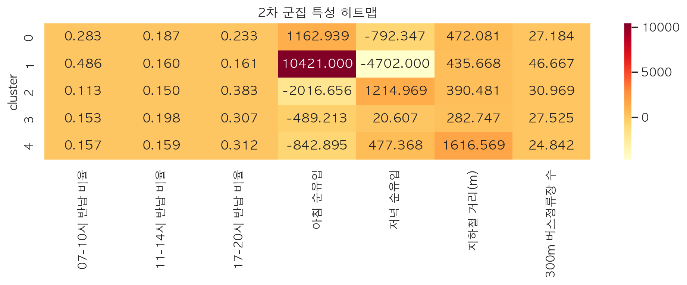
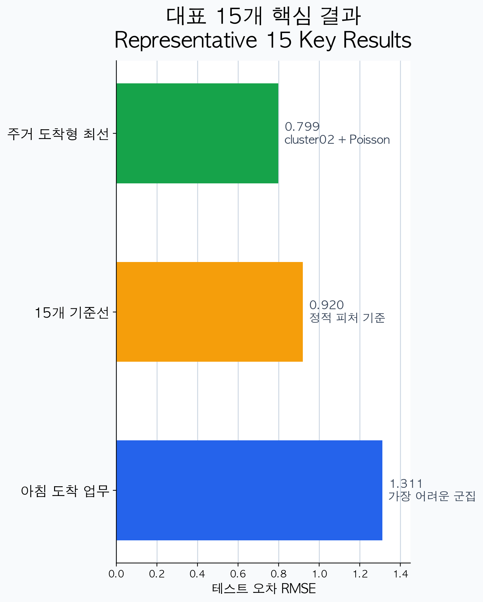
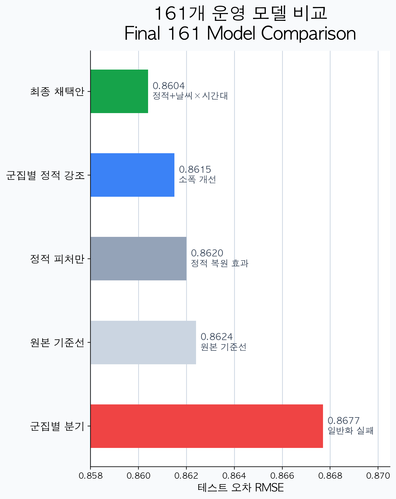
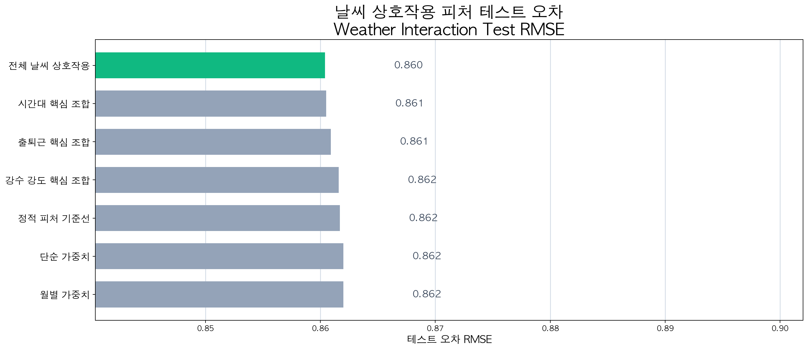
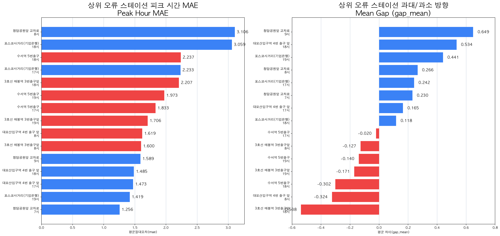
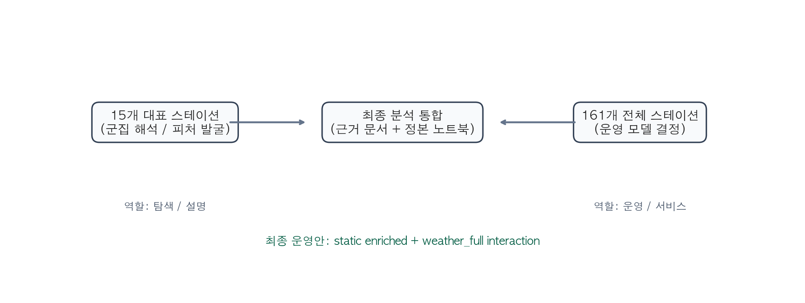

<!-- markdownlint-disable MD013 -->

<link rel="stylesheet" href="../ddri_presentation_a4_landscape.css">

# 강남구 따릉이 머신러닝 분석 보고서

## 보고서 목적

- 강남구 따릉이 스테이션별 자전거 수요 예측 실험 결과를 한 문서로 정리
- `대표 15개 스테이션` 실험과 `강남구 전체 161개 스테이션` 운영 기준선을 함께 설명
- 이후 웹/앱 연결 전 단계의 분석 정본으로 사용

## 현재 작성 상태

| 장 | 상태 | 비고 |
|---|---|---|
| 1. 프로젝트 개요 | 작성 | |
| 2. 문제 정의 | 작성 | |
| 3. 데이터 설명 | 작성 | |
| 4. 전처리 및 피처 엔지니어링 | 작성 | |
| 5. 군집화 분석 | 작성 | |
| 6. 예측 모델 설계 | 작성 | |
| 7. 대표 15개 스테이션 실험 | 작성 | |
| 8. 강남구 전체 161개 스테이션 실험 | 작성 | |
| 9. 오류 분석 | 작성 | |
| 10. 최종 모델 및 성능 요약 | 부분 작성 | 최종 요약 문장 보강 필요 |
| 11. 서비스 적용 방안 | 준비 중 | |
| 12. 결론 및 향후 과제 | 준비 중 | |

현재 기준: 1~9장은 실험 결과 반영 가능, 10장은 요약 보강 단계, 11~12장은 준비 중

# 01. 프로젝트 개요

## 주제

- 서울시 강남구 공통 운영 따릉이 스테이션의 시간대별 수요를 예측한다.

## 분석 범위

- 공간 범위: `강남구`
- 탐색용 대표셋: `군집별 대표 스테이션 15개`
- 운영 기준셋: `강남구 전체 공통 스테이션 161개`
- 기간 기준: `2023~2024 학습`, `2025 테스트`

## 기대 활용

- 사용자용 잔여 자전거 예측
- 재배치 관리자용 부족/과잉 대응 판단
- API 출력 및 운영 후처리 규칙 설계의 근거

## 프로젝트 진행 배경

- 중간 단계에서는 강남구 대여소를 군집화해 `공간 역할`을 먼저 정리했다.
- 이후 군집별 대표 스테이션 `15개`를 뽑아 군집별 피처 탐색과 모델 반응을 확인했다.
- 마지막으로 실제 운영 관점에서는 강남구 전체 공통 스테이션 `161개`를 기준으로 최종 모델을 선택했다.

이 보고서는 `군집화 -> 대표 15개 탐색 -> 161개 운영 기준선 선택`의 흐름을 하나로 묶는 정리본이다.

# 02. 문제 정의

## 예측 목표

- 예측 단위: `station-hour`
- 의미: 특정 대여소의 특정 시각 수요 또는 대여량을 예측해 운영 의사결정에 활용

## 왜 중요한가

- 강남구는 업무지구, 주거지구, 생활권, 외곽 생활권이 혼재해 시간대별 편차가 큼
- 동일 모델 하나로 모든 스테이션을 설명하기 어려워 군집 해석과 운영 기준선이 함께 필요함

## 평가 기준

- 주요 지표: `RMSE`, `MAE`, `R²`
- 최종 선택 기준: `2025 테스트 성능`과 운영 안정성

## 용어 정리

| 용어 | 쉬운 설명 |
|---|---|
| `RMSE`, `MAE`, `R²` | 모델 성능을 읽는 평가 지표 |
| `objective` (학습 목표 함수) | 모델이 무엇을 더 잘 맞추도록 학습할지 정하는 기준 |
| `RMSE objective` | 일반 회귀형 목표 함수 |
| `Poisson objective` | 수요량·건수 같은 count 데이터에 맞춘 목표 함수 |
| `subset` (축소 피처 조합) | 전체 후보 피처 중 일부만 골라 만든 피처 묶음 |
| `baseline` (기준선 모델) | 이후 개선 여부를 비교하기 위한 기본 모델 |
| `routing` (군집 분기 적용) | 군집별로 다른 모델이나 다른 피처 조합을 태우는 방식 |
| `interaction` (상호작용 피처) | 두 조건을 곱하거나 묶어서 함께 반응을 보게 만든 피처 |

## 현재 고정된 문제 해석

| 구분 | 현재 해석 |
|---|---|
| 분석/ML 1차 목표 | 대여소별 시간대 수요(`station-hour rental_count`) 예측 |
| 탐색용 데이터셋 | 군집별 대표 스테이션 `15개` |
| 운영용 데이터셋 | 강남구 전체 공통 스테이션 `161개` |
| 서비스 연결 방향 | 예측 대여량을 `잔여 자전거`, `부족 위험`, `재배치 우선순위`로 후처리 |

따라서 `15개`는 설명과 피처 탐색용, `161개`는 실제 운영 모델 선택용으로 역할을 나눠 해석한다.

# 03. 데이터 설명

## 주요 데이터

| 구분 | 설명 |
|---|---|
| 대여 이력 | 서울시 따릉이 대여/반납 이력 |
| 대여소 정보 | 대여소 위치, 운영 여부 |
| 날씨 데이터 | 기온, 습도, 강수량, 풍속 등 |
| 정적 입지 피처 | 지하철 거리, 버스정류장 수, 표고, 상권/생활권 주변 정보 |
| 군집 컬럼 | 별도 군집화 분석으로 생성된 `cluster` |

## 데이터셋 구분

- `대표 15개`: 군집별 대표 스테이션 중심 탐색용 데이터
- `전체 161개`: 실제 운영 기준선 선택용 데이터

## 분할 기준

- 학습: `2023~2024`
- 테스트: `2025`

## 데이터 운영 구조

| 구분 | 역할 |
|---|---|
| `대표 15개 raw_data` | 군집별 피처 탐색, 축소 피처 조합 실험, 오류 해석 |
| `161개 full_data` | 실제 운영 기준선 선택 |
| `정적 입지 피처` | 지하철, 버스, 표고, 상권, 생활권 구조 보강 |
| `군집 컬럼(cluster)` | 군집화 결과를 후속 예측 실험에 연결하는 공통 키 |

# 04. 전처리 및 피처 엔지니어링

## 시간 파생 피처

- `is_commute_hour` (출퇴근 시간 여부)
- `is_night_hour` (야간 시간 여부)
- `is_weekend` (주말 여부)
- `is_holiday_eve` (공휴일 전날 여부)

## 날씨 피처

- `precipitation` (강수량)
- `heavy_rain_flag` (강한 비 여부)
- `temperature` (기온)
- `humidity` (습도)

## 정적 입지 피처

- `subway_distance_m` (최근접 지하철 거리)
- `bus_stop_count_300m` (300m 내 버스정류장 수)
- `station_elevation_m` (대여소 표고)
- `restaurant_count_300m` (300m 내 음식점 수)
- `cafe_count_300m` (300m 내 카페 수)

## 상호작용 피처

- `rain_x_commute` (비 오는 출퇴근 시간대)
- `rain_x_night` (비 오는 야간 시간대)
- `precipitation_x_commute` (강수량이 있는 출퇴근 시간대)
- `precipitation_x_night` (강수량이 있는 야간 시간대)

## 전처리와 피처 설계의 핵심 판단

| 판단 | 이유 |
|---|---|
| 날씨만 단독으로 넣지 않음 | 비 자체보다 `비 오는 출퇴근/야간 시간대` 반응이 더 중요했음 |
| 정적 입지 피처를 별도 복원 | `161개` 데이터만으로는 군집 차이를 충분히 설명하기 어려웠음 |
| 군집 컬럼은 해석 축으로 유지 | 최종 모델이 단일 모델이어도 군집은 오류 해석과 피처 발굴의 핵심 기준 |

전체 161개 운영 모델에서는 `정적 피처 + weather_full interaction(날씨-시간대 상호작용 피처)` 조합이 가장 안정적이었다.

# 05. 군집화 분석

## 군집화 목적

- 대여소를 단순 수요 규모가 아니라 `공간 역할` 기준으로 분류
- 이후 예측 실험에서 군집별 피처 후보를 발굴하기 위한 기준 생성

## 군집 수와 해석

- 최종 군집 수: `5개`
- 해석 축:
  - `업무/상업 혼합형`
  - `아침 도착 업무 집중형`
  - `주거 도착형`
  - `생활·상권 혼합형`
  - `외곽 주거형`

## 대표 15개 선정

- 5개 군집별로 대표 스테이션 `Top 3`를 선정
- 총 `15개`를 실험용 대표셋으로 사용

## 참고 근거

- 군집 요약: `z_final_delivery` 기준 별도 근거 문서에서 확인 가능
- 이 보고서에서는 군집이 예측 실험의 출발점이라는 점만 요약해 반영

## 군집 요약표

| 군집 | station 수 | 07~10 반납 비율 | 11~14 반납 비율 | 17~20 반납 비율 | 해석 |
|---|---:|---:|---:|---:|---|
| `cluster00` | `49` | `0.2832` | `0.1874` | `0.2326` | 업무/상업 혼합형 |
| `cluster01` | `3` | `0.4863` | `0.1599` | `0.1614` | 아침 도착 업무 집중형 |
| `cluster02` | `32` | `0.1134` | `0.1497` | `0.3831` | 주거 도착형 |
| `cluster03` | `61` | `0.1532` | `0.1975` | `0.3066` | 생활·상권 혼합형 |
| `cluster04` | `19` | `0.1569` | `0.1589` | `0.3123` | 외곽 주거형 |

  

  

  

  

군집화는 최종 모델 자체를 고르는 단계가 아니라, `대여소의 공간 역할`을 해석하고 후속 예측 피처를 고르는 상위 기준을 만드는 단계였다.

# 06. 예측 모델 설계

## 비교한 학습 모델과 학습 목표 함수

- 비교 모델:
  - `LightGBM`
  - `CatBoost`
- 학습 목표 함수(objective):
  - `RMSE objective`
  - `Poisson objective`
- 추가 실험 축:
  - 군집별 `축소 피처 조합(subset)` 실험
  - 정적 피처 확장 실험
  - weather interaction(날씨-시간대 상호작용 피처) 실험
  - routing(군집 분기 적용) 실험

같은 `LightGBM`이라도 `RMSE objective`로 학습할지, `Poisson objective`로 학습할지에 따라 결과가 달라질 수 있다. 여기서 `objective`는 학습 목표 함수, `subset`은 축소 피처 조합을 뜻한다.

## 설계 원칙

- `대표 15개`는 군집별 피처 탐색과 해석에 집중
- `전체 161개`는 실제 운영 기준선 선택에 집중

## 실험 흐름

1. 대표 15개 군집별 실험
2. 161개 단일 baseline(기준선 모델)
3. 정적 피처 확장
4. 군집 라우팅 비교
5. weather interaction(상호작용 피처) / weighting(가중치) 비교

## 실험 프레임

| 축 | 대표 15개 | 전체 161개 |
|---|---|---|
| 목적 | 군집별 피처 탐색 | 실제 운영 기준선 선택 |
| 질문 | 어떤 군집이 어떤 피처에 반응하는가 | 전체 강남구에서 어떤 조합이 가장 안정적인가 |
| 결과 해석 | 군집별 권장안과 설명 근거 | 운영 모델 최종 선택 |

## 실험명·조합 용어표

| 용어 | 쉬운 설명 | 핵심 포함 피처 |
|---|---|---|
| `rep15_static_base` | 대표 15개 전체에 공통으로 적용한 정적 피처 기준선 모델 | 시간 피처, 날씨 기본 피처, 정적 입지 피처 |
| `rep15_static_weather_full` | 대표 15개 전체에 정적 피처 + 날씨-시간대 상호작용 피처를 같이 넣은 비교안 | `rep15_static_base` + `rain_x_commute`, `rain_x_night`, `precipitation_x_lunch` 등 |
| `subset_a_commute_transit + LightGBM_Poisson` | `cluster01` 출퇴근-교통 중심 경량 조합 + Poisson 기준 LightGBM | `is_commute_hour`, `commute_morning_flag`, `commute_evening_flag`, `subway_distance_m`, `bus_stop_count_300m` |
| `subset_d_current_compact_best + LightGBM_Poisson` | `cluster02`에서 가장 성능이 좋았던 경량 조합 + Poisson 기준 LightGBM | `is_night_hour`, `is_weekend`, `is_holiday_eve`, `heavy_rain_flag`, `station_elevation_m`, `bus_stop_count_300m` |
| `static enriched` | 전체 161개 데이터에 정적 입지 피처를 복원해 붙인 단일 모델 | 시간 피처, 날씨 기본 피처, 정적 입지 피처 |
| `cluster-aware static gating` | 군집별로 더 의미 있는 정적 피처만 강조해서 넣은 단일 모델 | 정적 입지 피처 + 군집별 gated 정적 피처 |
| `partial routing` | 군집별로 일부 설정만 나눠 적용한 초기 군집 분기 적용 비교안 | 군집별 학습 설정 일부 분기, 일부 시간/날씨 파생 피처 |
| `exact cluster routing` | 대표 15개에서 찾은 군집별 피처 조합을 161개 전체에 그대로 옮긴 군집 분기 적용 비교안 | 군집별 권장 피처 조합 |
| `exact routing + weather_full` | 대표 15개 군집 피처에 `weather_full`까지 함께 붙인 군집 분기 적용 비교안 | 군집별 권장 피처 + `weather_full` 상호작용 피처 |
| `weather_full` | 비/강수량과 출퇴근·점심·야간 시간대를 함께 묶은 전체 상호작용 피처 조합 | `rain_x_commute`, `rain_x_morning_commute`, `rain_x_evening_commute`, `rain_x_night`, `rain_x_lunch`, `precipitation_x_commute`, `precipitation_x_night`, `precipitation_x_lunch` |
| `weather_time_band_core` | 시간대 중심 핵심 상호작용 조합 | `rain_x_night`, `rain_x_lunch`, `precipitation_x_night`, `precipitation_x_lunch` 중심 |
| `weather_commute_core` | 출퇴근 시간대 중심 핵심 상호작용 조합 | `rain_x_commute`, `rain_x_morning_commute`, `rain_x_evening_commute`, `precipitation_x_commute` 중심 |
| `weather_precip_intensity_core` | 강수 강도 중심 핵심 상호작용 조합 | `heavy_rain_x_commute`, `heavy_rain_x_night`, `precipitation_x_commute`, `precipitation_x_night` 중심 |

# 07. 대표 15개 스테이션 실험

## 실험 목적

- 군집별로 어떤 피처와 어떤 `학습 목표 함수(objective)`가 잘 맞는지 확인
- 최종 운영 모델을 직접 결정하기보다 피처 발굴 근거를 확보

## 핵심 결과

- `cluster01`: `출퇴근+교통 축소 피처 조합(subset_a_commute_transit) + LightGBM_Poisson`, `test RMSE 1.3108`
- `cluster02`: `현재 최적 축소 피처 조합(current_compact_best) + LightGBM_Poisson`, `test RMSE 0.7990`
- 나머지 군집은 군집별 권장 피처를 유지하되, 현재 단계에서는 `해석 근거 강화` 수준으로 본다

## 해석

- `cluster01`은 출근 피크와 교통 접근성이 핵심
- `cluster02`는 야간/주말/공휴일전날과 주거형 특성이 핵심
- 대표 15개 실험은 군집별 피처 의미를 설명하는 데 유효

## 대표 15개 주요 비교 결과

| 구분 | 모델 | 테스트 RMSE | 해석 |
|---|---|---:|---|
| `cluster02` | `subset_d_current_compact_best + LightGBM_Poisson` | `0.7990` | 대표 15개 내 최선 |
| `대표 15개 기본안` | `rep15_static_base` | `0.9196` | 전체 대표셋 baseline(기준선 모델) |
| `대표 15개 weather_full` | `rep15_static_weather_full` | `0.9198` | weather_full 상호작용 피처는 대표셋에서 이득 없음 |
| `cluster01` | `subset_a_commute_transit + LightGBM_Poisson` | `1.3108` | 가장 어려운 군집이지만 개선 여지 큼 |

  

대표 15개 실험의 핵심 성과는 `군집별 최종 운영 모델 확정`이 아니라, `군집별로 유효한 피처 축을 발굴했다`는 데 있다.

# 08. 강남구 전체 161개 스테이션 실험

## 실험 목적

- 강남구 전체 운영 모델 기준선을 선택

## 비교 결과 요약

- `161 original baseline(기준선 모델)`: `0.8624`
- `161 static enriched`: `0.8620`
- `161 cluster-aware gating`: `0.8615`
- `161 static + weather_full interaction(상호작용 피처)`: `0.8604`, 현재 최선
- `161 routing(군집 분기 적용) 계열`: `0.8673 ~ 0.8681`, 테스트 기준 악화

## 핵심 결론

- 실제 운영 기준은 `단일 모델 + 정적 피처 + weather_full interaction(상호작용 피처)`
- `routing`(군집 분기 적용)은 검증셋 일부 개선이 있었지만 테스트셋에서 일반화 실패

## 161개 운영 모델 세부 비교

| 비교안 | 테스트 RMSE | 최선 대비 차이 x1000 | 해석 |
|---|---:|---:|---|
| `static enriched + weather_full interaction` | `0.8604` | `0.0` | 현재 최선 운영안 |
| `cluster-aware static gating` | `0.8615` | `1.1` | 소폭 개선이 있었지만 최선은 아님 |
| `static enriched single model` | `0.8620` | `1.6` | 정적 피처 복원 효과 확인 |
| `original baseline` | `0.8624` | `2.0` | 원본 기준선 모델 |
| `partial routing` | `0.8673` | `6.9` | routing 일반화 실패 |
| `exact routing + weather_full` | `0.8673` | `6.9` | weather_full 상호작용 피처도 routing을 살리지 못함 |
| `static routing` | `0.8681` | `7.7` | routing 계열 중 하위권 |
| `exact cluster routing` | `0.8681` | `7.7` | 15개 군집 피처가 161개에 그대로 일반화되지 않음 |

  

강남구 전체 운영 기준선은 `static enriched + weather_full interaction(상호작용 피처)`으로 고정한다.

# 09. 오류 분석

## 상위 오류 패턴

- 일부 상위 오류 스테이션은 `저녁 피크`에서 과대/과소 예측이 크게 발생
- `아침 피크` 또는 `출근/귀가 전환 시간대`에서 오차 집중 현상 확인

## 주요 해석

- 오류는 특정 시간대와 특정 공간 역할에서 집중됨
- 그래서 단순 날씨 피처보다 `날씨 x 시간대 interaction(상호작용 피처)`이 더 유효했음

## 활용 의미

- 오류 분석은 운영 모델 선택뿐 아니라 후처리 규칙 설계에도 연결됨

## weather interaction(상호작용 피처) 비교표

| 비교안 | 테스트 RMSE | 최선 대비 차이 x1000 | 해석 |
|---|---:|---:|---|
| `weather_full` | `0.8604` | `0.0` | 현재 최선 |
| `weather_time_band_core` | `0.8616` | `1.2` | 시간대 축소안 |
| `weather_commute_core` | `0.8617` | `1.3` | 출퇴근 축소안 |
| `weather_precip_intensity_core` | `0.8620` | `1.6` | 강수 강도 축소안 |
| `static_enriched_base` | `0.8620` | `1.6` | 정적 피처 기준선 |
| `weather_full_weight_simple` | `0.8609` | `0.5` | 단순 가중치 |
| `weather_full_weight_monthly` | `0.8605` | `0.1` | 월별 가중치 |

  

  

## 오류 분석이 남긴 판단

| 관찰 | 판단 |
|---|---|
| 상위 오류는 저녁 피크와 아침 피크에 집중 | 시간대 interaction을 강화할 필요가 있었음 |
| weather weighting(가중치)은 추가 개선이 거의 없음 | 단순 가중치보다 interaction(상호작용 피처)이 더 유효 |
| routing 계열은 테스트에서 일관되게 악화 | 운영 기준은 단일 모델로 고정 |

# 10. 최종 모델 및 성능 요약

## 현재 최종 채택안

- 모델: `LightGBM`
- 기준 데이터: `강남구 전체 161개`
- 최종 조합: `static enriched + weather_full interaction(상호작용 피처)`
- 최종 test RMSE: `0.8604`

## 최종 모델 카드

| 항목 | 내용 |
|---|---|
| 최종 선택 이유 | 강남구 전체 161개 기준 테스트 성능이 가장 안정적 |
| 입력 축 | 시간 파생 피처 + 날씨 피처 + 정적 입지 피처 + weather interaction(상호작용 피처) |
| 배제한 대안 | routing(군집 분기 적용) 계열, weighting(가중치) 계열 |
| 운영 해석 | `15개`는 설명용, `161개`는 운영용 |

## 최종 판단 요약

1. 군집화는 유효했다.
2. 대표 15개 실험도 유효했다.
3. 하지만 실제 운영 기준은 `161개 단일 모델`이 더 안정적이었다.
4. 그 단일 모델 안에서 가장 좋았던 조합이 `static enriched + weather_full interaction(상호작용 피처)`이었다.

## 단일 최종안 vs 라우팅 비교표

| 비교안 | 테스트 RMSE | 최선 대비 차이 x1000 | 해석 |
|---|---:|---:|---|
| `161 final operating baseline` | `0.8604` | `0.0` | 최종 운영안 |
| `161 partial routing` | `0.8673` | `6.9` | validation 개선, test 악화 |
| `161 exact routing + weather_full` | `0.8673` | `6.9` | weather_full을 붙여도 회복 실패 |
| `161 static routing` | `0.8681` | `7.7` | static enriched routing도 열세 |
| `161 exact cluster routing` | `0.8681` | `7.7` | 15개 군집 피처 일반화 실패 |

  

  

이 장은 현재 기준으로 실험 결론까지는 반영했다. 이후 `서비스 출력 컬럼`과 `후처리 규칙`이 확정되면 운영 카드 형식으로 한 번 더 압축한다.

# 11. 서비스 적용 방안

## 준비 중

- 현재 이 장은 준비 중이다.
- 이후 아래 내용을 채울 예정이다.
  - 예측 결과의 서비스 활용 방식
  - `predicted_remaining_bikes`, `stock_gap`, `risk_score` 정의
  - 사용자용/관리자용 분기 기준
  - API 출력 필드와 연결 방식

# 12. 결론 및 향후 과제

## 준비 중

- 현재 이 장은 준비 중이다.
- 이후 아래 내용을 채울 예정이다.
  - 핵심 결론 3줄 요약
  - 군집 실험과 운영 모델의 역할 분리
  - 향후 개선 과제
  - 웹/앱 반영 후 추가 검증 방향
