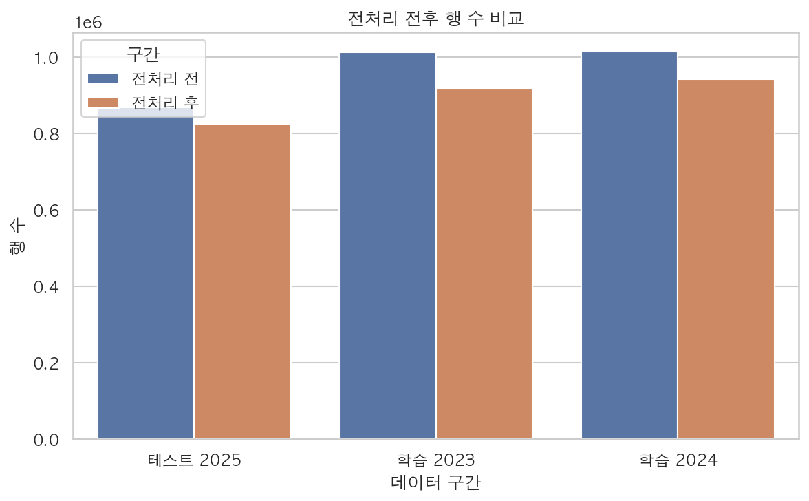
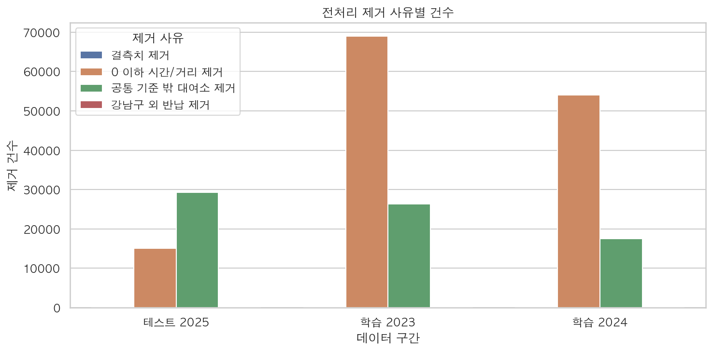
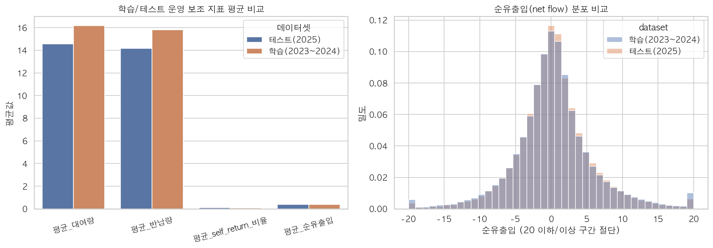
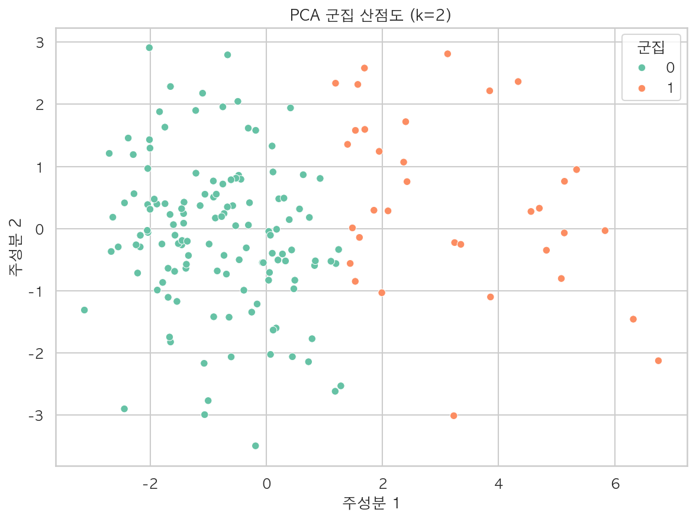
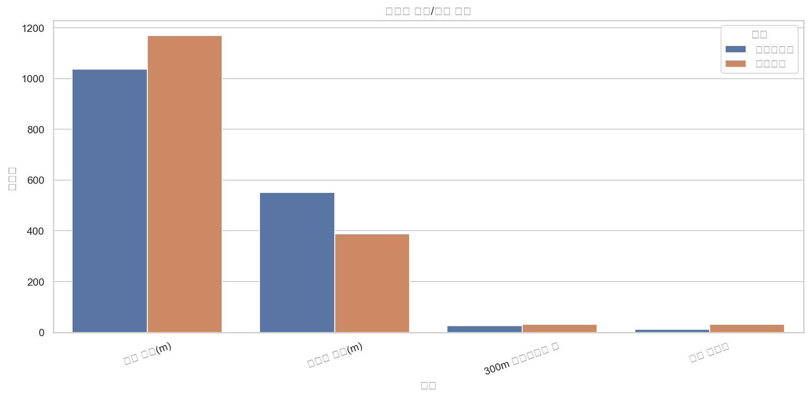

<!-- markdownlint-disable MD013 -->

<link rel="stylesheet" href="./ddri_presentation_a4_landscape.css">

# 강남구 따릉이 Station별 대여량 예측 프로젝트

## 발표 범위

- 기준 문서: `ddareungi_demand_project_canvas.md`
- 현재 진행 기준일: `2026-03-12`
- 공간 범위: `강남구`
- 학습 기간: `2023~2024`
- 테스트 기간: `2025`

## 현재 발표 목적

- 프로젝트 목표와 문제 정의를 캔버스 순서대로 정리
- 현재까지 완료한 분석/데이터셋 구축 결과 공유
- 군집화 성과와 예측 모델 준비 상태를 중간 점검

현재 발표 단계 = 기준 정의 확정 + 1차 분석 기반 공유

# 1. 프로젝트 목적

## 프로젝트 목표

- 강남구 Station별 하루 따릉이 대여량 예측
- 시간, 날씨, 공휴일, 주변 환경, 과거 수요를 함께 반영
- 예측 결과를 웹 지도 기반 서비스로 연결

## 현재까지 확정한 방향

- 1차 예측 target: `Station별 하루 대여량`
- 운영 해석 지표: `적정 보유 대수`는 예측 이후 해석 단계로 분리
- 웹 출력은 추후 Flutter 기반 지도 시각화와 연계 예정

# 2. 문제 정의

## 목표 문제

- 문제 유형: `회귀`
- target: `rental_count`
- grain: `station_id + date`

## 왜 일 단위 예측인가

- 내부 기획 문서와 웹 조회 흐름이 날짜 기준 조회와 가장 잘 맞음
- 현재 데이터 구조상 시간 단위보다 일 단위가 더 안정적
- 1차 baseline 구축과 해석에 적합

1차 target = Station별 하루 대여량, 적정 보유 대수 = 2차 운영 해석 지표

# 3. 데이터 구성

## 내부 데이터

- 강남구 따릉이 이용 이력
- 강남구 대여소 마스터
- target 생성용 station-day 집계 테이블

## 외부 데이터

- 날씨: Open-Meteo 및 기존 수집 자료
- 공휴일: 한국천문연구원 특일 정보 API
- 환경: 공원, 지하철, 버스정류장 위치 정보

## 현재 확보 산출물

- 학습 target: `ddri_station_day_target_train_2023_2024.csv`
- 테스트 target: `ddri_station_day_target_test_2025.csv`
- 학습/테스트 베이스라인: `ddri_station_day_train_baseline_dataset.csv`, `ddri_station_day_test_baseline_dataset.csv`

# 4. 데이터 전처리

## 전처리 기준

- 결측치 제거
- `이용시간(분) <= 0` 제거
- `이용거리(M) <= 0` 제거
- 공통 기준 밖 대여소 제거
- 강남구 기준 밖 반납 대여소 제거
- 동일 대여소 반납은 제거하지 않고 유지

## 추가 점검

- 원천 중복 로그 점검 완료
- feature 극단치 후보 점검 완료
- 극단치는 1차 군집화에서 임의 제거하지 않고 유지

  
  

<ul class="compact-list">
  <li>전처리 영향은 비정상 시간·거리 값과 기준 밖 대여소 제거가 가장 큼</li>
  <li>없는 값은 임의 보간하지 않고, 기준에 따라 제거 또는 보류</li>
  <li>같은 대여소로 반납된 건은 이상치가 아니라 재고 변동성 해석용 지표 후보로 유지</li>
</ul>

# 5. 탐색적 데이터 분석 (EDA)

## 현재 진행 상태

- 대여소별 평균 대여량 패턴 점검
- 군집화용 요약 feature 생성
- 대여소 분포와 수요 규모 차이 확인

## 1차 EDA 핵심 결과

- 강남구 대여소는 수요 규모 차이가 뚜렷함
- 일부 대여소는 평균 대여량과 변동성이 모두 높음
- 단순 평균 비교만으로도 유형화 필요성이 확인됨

EDA 1차 완료, 군집화와 feature 설계 근거 확보

# 6. Feature Engineering 및 도입 근거

## 현재 확정한 feature 그룹

- 시간 feature
- 날씨 feature
- 공휴일 feature
- 과거 수요 feature
- 정적 환경 feature
- 군집 label

## 현재 반영 완료 항목

- 날씨: 일 단위 집계 완료
- 공휴일: API 수집 및 일 단위 캘린더 생성 완료
- 환경: 공원 거리, 지하철 거리, 버스정류장 수 반영 완료
- 군집 label: 고수요형/일반수요형 반영 가능
- 운영 보조 지표: self-return 비율, 반납량, 순유출입(net flow) 생성 완료

## 운영 해석용 추가 지표

- `return_count`
- `same_station_return_count`
- `same_station_return_ratio`
- `net_flow`

<ul class="compact-list">
  <li>학습 데이터 기준 self-return 비율 평균: `9.28%`</li>
  <li>테스트 데이터 기준 self-return 비율 평균: `9.71%`</li>
  <li>같은 대여소 반납은 제거하지 않고, 재고 변동성 해석용 보조 지표로 유지</li>
  <li>즉 실제 수요와 재고 변동을 분리해서 보기 위한 운영 해석용 feature를 추가한 상태</li>
</ul>

  

## 보류 항목

- 생활인구
- 대기질
- 상업/업무 POI

상업지구·출퇴근형 해석 = POI와 시간대 지표 보강 후 확장

# 7. 머신러닝 모델 및 실험 설계

## 현재 설계 상태

- baseline target/grain 확정
- 학습/테스트 베이스라인 데이터셋 생성 완료
- 신규/소멸 스테이션 처리 원칙 확정

## 확정 원칙

- 기존 운영 스테이션: 메인 모델 대상
- 신규 스테이션: cold-start 예외 집합 분리
- 소멸 스테이션: 테스트 제외 또는 운영 이슈 기록

## 다음 실험 단계

- Linear Regression baseline
- Random Forest
- XGBoost
- LightGBM

현재 상태 = 모델 학습 직전, 메인 평가셋과 예외 처리 원칙 확정

# 8. 평가 지표

## 기준 지표

- `NMAE`

## 평가 설계 방향

- 메인 평가셋은 기존 운영 스테이션 기준
- 신규 스테이션은 별도 예외 목록으로 분리
- 동일 기준으로 모델별 성능 비교 예정

## 현재 준비 상태

- 메인 테스트 평가셋 생성 완료
- 예외 스테이션 목록 분리 완료

# 9. 시스템 구조

## 캔버스 기준 구조

1. 데이터 수집
2. 데이터 전처리
3. EDA 분석
4. Feature Engineering
5. 모델 학습
6. 예측 생성
7. API 제공
8. 웹 시각화

## 현재 완료 범위

- 데이터 수집
- 데이터 전처리
- 1차 EDA
- 군집화 및 환경 해석
- 예측용 베이스라인 데이터셋 구축

## 이후 범위

- 모델 학습 및 평가
- API 명세 구체화
- Flutter 웹 시각화 연결

# 10. 웹 시스템 구성

## 목표 기능

- Station 선택
- 날짜 입력
- 예측 대여량 조회
- 지도 기반 시각화

## 현재 준비된 선행 결과

- Folium 기반 군집 지도 HTML 생성 완료
- 발표용 정적 지도 및 지도 캡처 정리 완료
- 예측 결과를 지도에 연결할 수 있는 데이터 구조 정의 완료

## 향후 구현 방향

- `/predict` 형태 API 설계
- station-day 입력 기반 결과 반환
- Flutter 지도 위 예측값 표현

# 11. 프로젝트 일정

| 기간 | 캔버스 계획 | 현재 상태 |
|---|---|---|
| 3.11 ~ 3.12 | 데이터 구조 확인 및 수집 | 완료 |
| 3.13 ~ 3.14 | EDA 및 Feature Engineering | 진행 중 |
| 3.15 ~ 3.16 | 모델 개선 및 중간 발표 준비 | 예정 |
| 3.18 ~ 3.20 | 최종 모델 구축 및 웹 구현 | 예정 |
| 3.21 ~ 3.22 | 보고서 작성 및 영상 제작 | 예정 |
| 3.23 | 최종 제출 | 예정 |

## 오늘 기준 정리

- 군집화 발표 자료: 완료
- 예측용 베이스라인 데이터셋: 완료
- 모델 학습: 다음 단계

# 12. 최종 산출물

## 캔버스 기준 산출물

- 분석 및 ML 보고서
- 시스템 설계 문서
- 웹 프로젝트
- 시연 영상

## 현재까지 확보한 중간 산출물

- 군집화 노트북 및 스크립트
- 공휴일/날씨 수집 노트북
- 예측용 베이스라인 데이터셋
- 군집화 발표용 차트, 지도, 발표 문서

# 13. 기대 결과 및 현재 중간 결론

## 현재까지 확인한 결과

- 강남구 대여소는 1차 군집화에서 `일반수요형`과 `고수요형`으로 구조화됨
- 고수요형은 지하철·버스 접근성이 상대적으로 더 우수함
- 예측용 station-day 베이스라인 데이터셋까지 구축 완료

## 현재 단계의 의미

- 예측 문제 정의, 데이터셋 구조, 전처리 원칙이 확정됨
- 군집 label과 환경 feature를 예측 모델에 연결할 준비가 끝남
- 이후 단계는 모델 성능 비교와 웹 연결 구현에 집중 가능

현재 상태 = 분석 기준 확정 + 예측용 데이터 기반 구축 완료

# 부록. 군집화 핵심 결과

  
  

<ul class="compact-list">
  <li>`k = 2` 기준으로 일반수요형과 고수요형을 도출</li>
  <li>고수요형은 교통 접근성이 상대적으로 더 좋은 대여소군으로 해석</li>
  <li>상업지구·출퇴근형 해석은 추가 POI 보강 후 확장 예정</li>
</ul>
