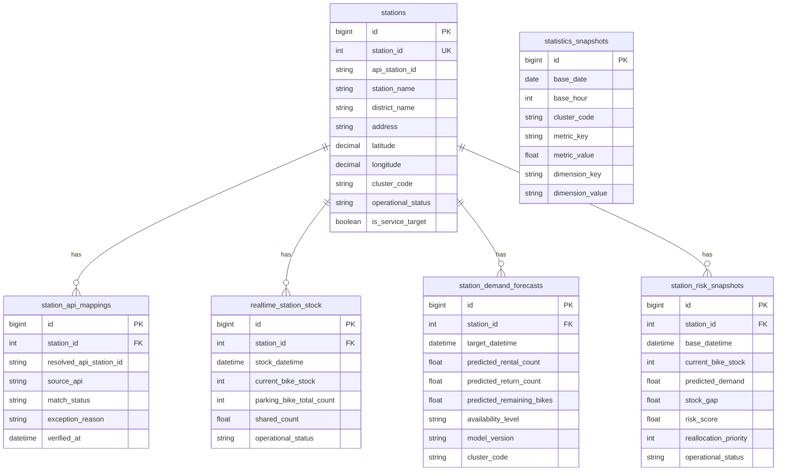

# DDRI 웹서비스 ERD 초안

작성일: 2026-03-16  
목적: 웹서비스의 최소 데이터 구조를 관계 중심으로 빠르게 공유하기 위한 ERD 초안을 정리한다.

## 1. 엔터티 목록

- `stations`
- `station_api_mappings`
- `realtime_station_stock`
- `station_demand_forecasts`
- `station_risk_snapshots`
- `statistics_snapshots`

## 2. 관계 설명

- 하나의 `station`은 하나 이상의 API 매핑 이력을 가질 수 있다
- 하나의 `station`은 여러 개의 실시간 재고 기록을 가진다
- 하나의 `station`은 여러 개의 예측 결과를 가진다
- 하나의 `station`은 여러 개의 위험도 스냅샷을 가진다
- 통계 스냅샷은 집계용 별도 테이블로 station 직접 참조 없이도 운영 가능하다

## 3. 텍스트 ERD

```text
stations
 - id PK
 - station_id UK
 - api_station_id
 - station_name
 - district_name
 - address
 - latitude
 - longitude
 - cluster_code
 - operational_status
 - is_service_target

station_api_mappings
 - id PK
 - station_id FK -> stations.station_id
 - resolved_api_station_id
 - source_api
 - match_status
 - exception_reason
 - verified_at

realtime_station_stock
 - id PK
 - station_id FK -> stations.station_id
 - stock_datetime
 - current_bike_stock
 - parking_bike_total_count
 - shared_count
 - operational_status

station_demand_forecasts
 - id PK
 - station_id FK -> stations.station_id
 - target_datetime
 - predicted_rental_count
 - predicted_return_count
 - predicted_remaining_bikes
 - availability_level
 - model_version
 - cluster_code

station_risk_snapshots
 - id PK
 - station_id FK -> stations.station_id
 - base_datetime
 - current_bike_stock
 - predicted_demand
 - stock_gap
 - risk_score
 - reallocation_priority
 - operational_status

statistics_snapshots
 - id PK
 - base_date
 - base_hour
 - cluster_code
 - metric_key
 - metric_value
 - dimension_key
 - dimension_value
```

## 4. Mermaid ERD



## 5. 현재 해석

이 ERD는 1차 서비스용 최소 구조다.  
향후 로그인, 즐겨찾기, 관리자 메모, 알림 기능이 들어가면 별도 사용자 관련 엔터티를 추가하면 된다.
